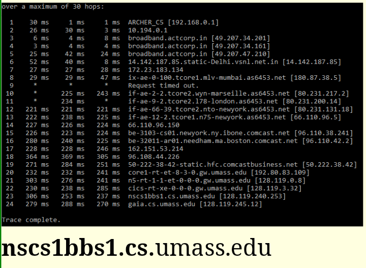
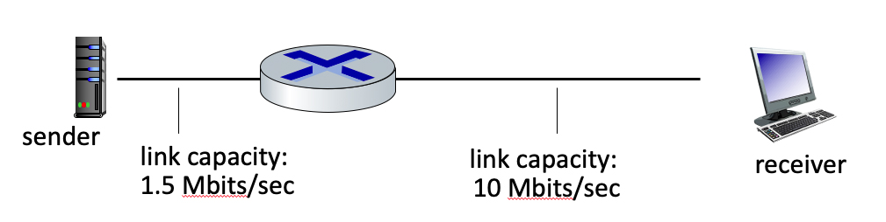
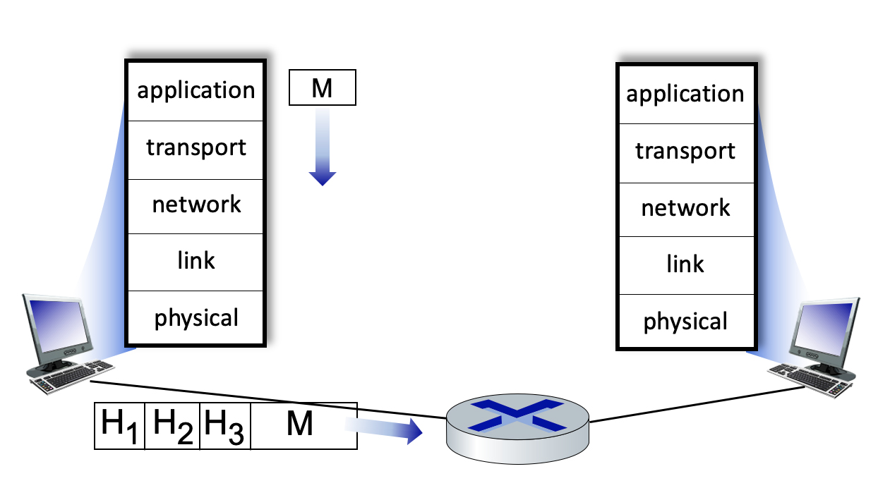

# 1.1-1 WHAT IS THE INTERNET? 

Which of the following descriptions below correspond to a "nuts-and-bolts" view of the Internet?

- A place I go for information, entertainment, and to communicate with people.
- [***A collection of hardware and software components executing protocols that define the format and the order of messages exchanged between two or more communicating entities, as well as the actions taken on the transmission and/or receipt of a message or other event.***]()
- [A collection of billions of computing devices, and packet switches interconnected by links.]()
- A platform for building network applications.
- [A "network of networks".]()


# 1.1-2 WHAT IS THE INTERNET (2)? 

Which of the following descriptions below correspond to a "services" view of the Internet?

- A collection of billions of computing devices, and packet switches interconnected by links.
- A collection of hardware and software components executing protocols that define the format and the order of messages exchanged between two or more communicating entities, as well as the actions taken on the transmission and/or receipt of a message or other event.
- ```A place I go for information, entertainment, and to communicate with people.```
- A "network of networks".
- ```A platform for building network applications.```


# 1.1-3 WHAT IS A PROTOCOL?

Which of the following human scenarios involve a protocol (recall: "Protocols define the format, order of messages sent and received among network entities, and actions taken on message transmission, receipt")?

- A person sleeping.
- ```Two people introducing themselves to each other.```
- A person reading a book.
- ```A student raising her/his hand to ask a really insightful question, followed by the teaching acknowledging the student, listening carefully to the question, and responding with a clear, insightful answer.  And then thanking the student for the question, since teachers love to get questions.```
- ```One person asking, and getting, the time to/from another person.```


# 1.2-1 ACCESS NETWORK PER-SUBSCRIBER SPEEDS.

Match the access network with the approximate speeds that a subscriber might experience. (Note: if you look these up, do so in the 8E textbook, slides,or video -- not in the 7E or earlier versions, since link access speeds are always increasing over the years).

- Ethernet 
    - ```Wired. Up to 100's Gbps per link.```
- 802.11 wifi
    - ```Wireless. 10’s to 100’s of Mbps per device.```
- Cable access network
    - ```Wired. Up to 10’s to 100’s of Mbps downstream per user.```
- Digital subscriber Line
    - ```Wired. Up to 10’s of Mbps downstream per user.```
- 4G cellular LTE
    - ```Wireless. Up to 10’s Mbps per device.```


# 1.2-2 LINK TRANSMISSION CHARACTERISTICS.

Which of the following physical layer technologies has the highest transmission rate and lowest bit error rate in practice?

- ```Fiber optic cable```
- Satellite channel
- Twisted pair (e.g., CAT5, CAT6)
- 4G/5G cellular
- 802.11 WiFi Channel
- Coaxial cable


# 1.3-1 ROUTING VERSUS FORWARDING. 

Choose one the following two definitions that makes the correct distinction between routing versus forwarding.

- Routing is the local action of moving arriving packets from router’s input link to appropriate router output link, while forwarding is the global action of determining the source-destination paths taken by packets.
- ```Forwarding is the local action of moving arriving packets from router’s input link to appropriate router output link, while routing is the global action of determining the source-destination paths taken by packets.```


# 1.3-2 PACKET SWITCHING VERSUS CIRCUIT SWITCHING (1). 

Which of the characteristics below are associated with the technique of packet switching?

- ```This technique is used in the Internet.```
- ```Congestion loss and variable end-end delays are possible with this technique.```
- ```Resources are used on demand, not reserved in advance.```
- Frequency Division Multiplexing (FDM) and Time Division Multiplexing (TDM) are two approaches for implementing this technique.
- This technique was the basis for the telephone call switching during the 20th century and into the beginning of this current century.
- Reserves resources needed for a call from source to destination.
- ```Data may be queued before being transmitted due to other user’s data that’s also queueing for transmission.```


# 1.3-3 PACKET SWITCHING VERSUS CIRCUIT SWITCHING (2).

Which of the characteristics below are associated with the technique of circuit switching?

- This technique is used in the Internet.
- Congestion loss and variable end-end delays are possible with this technique.
- ```Reserves resources needed for a call from source to destination.```
- ```This technique was the basis for the telephone call switching during the 20th century and into the beginning of this current century.```
- Data may be queued before being transmitted due to other user’s data that’s also queueing for transmission.
- Resources are used on demand, not reserved in advance.
- ```Frequency Division Multiplexing (FDM) and Time Division Multiplexing (TDM) are two approaches for implementing this technique.```


# 1.3-4 HOW MANY CALLS CAN BE CARRIED?

Consider the circuit-switched network shown in the figure below, with  four circuit switches A, B, C, and D. Suppose there are 20 circuits between A and B, 19 circuits between B and C, 15 circuits between C and D, and 16 circuits between D and A.


What is the maximum number of connections that can be ongoing in the network at any one time?

[Note: you can find more questions like this one here.

        Just add them all up

- 31
- 39
- 20
- 16
- ```70```


# 1.3-5 TRYING OUT TRACEROUTE. 

Perform a traceroute from your computer (on whatever network you happen to be on) to gaia.cs.umass.edu. Use traceroute (on Mac terminal) or tracert (on Windows command line) or tracepath (on a Linux command line). Enter the missing part of the name of the router just before the host gaia.cs.umass.edu is reached:
??.cs.umass.edu

Note: Routing may change, so the answer here may not be correct anymore.  Also, if you are a Verizon user, there are known problems using traceroute with Verizon - if traceroute shows you two hops only to gaia.cs.umass.edu or any destination, skip this question.



- ```nscs1bbs1```


# 1.3-6 WHAT IS A NETWORK OF NETWORKS?

When we say that the Internet is a “network of networks,” we mean? Check all that apply (hint: check two or more).

- The Internet is the fastest network ever built.
- ```The Internet is made up of access networks at the edge, tier-1 networks at the core, and interconnected regional and content provider networks as well.```
- ```The Internet is made up of a lot of different networks that are interconnected to each other.```
- The Internet is the largest network ever built.


# 1.3-7 PACKET SWITCHING OR CIRCUIT-SWITCHING?

Consider a scenario in which 5 users are being multiplexed over a channel of 10 Mbps.  Under the various scenarios below, match the scenario to whether circuit switching or packet switching is better.

- Each user generates traffic at an average rate of 2.1 Mbps, generating traffic at a rate of 15 Mbps when transmitting
    - ```Neither works well in this overload scenario```
- Each user generates traffic at an average rate of 2 Mbps, generating traffic at a rate of 2 Mbps when transmitting
    - ```Circuit switching```
- Each user generates traffic at an average rate of 0.21 Mbps, generating traffic at a rate of 15 Mbps when transmitting
    - ```Packet switching```


# 1.4-1 COMPONENTS OF PACKET DELAY.

Match the description of each component of packet delay to its name in the pull down list.

- Time needed to perform an integrity check, lookup packet information in a local table and move the packet from an input link to an output link in a router.
    - ```Processing delay```
- Time spent waiting in packet buffers for link transmission.
    - ```Queueing delay```
- Time spent transmitting packets bits into the link.
    - ```Transmission delay```
- Time need for bits to physically propagate through the transmission medium from end one of a link to the other.
    - ```Propagation delay```


# 1.4-2 COMPUTING PACKET TRANSMISSION DELAY(1).

Suppose a packet is L = 1500 bytes long (one byte = 8 bits), and link transmits at R = 1 Gbps (i.e., a link can transmit bits 1,000,000,000 bits per second).  What is the transmission delay for this packet? [Note: you can find more problems like this one here.]


        Equation = L/R
        L = 1500 * 8 bits
        R = 1,000,000,000 bps

- ```.000012 secs```
- .00012 secs
- .0000015 secs
- .0015 secs
- 666,666 secs


# 1.4-3 COMPUTING PACKET TRANSMISSION DELAY (2).

Suppose a packet is L = 1200 bytes long (one byte = 8 bits), and link transmits at R = 100 Mbps (i.e., a link can transmit bits 100,000,000 bits per second).  What is the transmission delay for this packet? [Note: you can find more problems like this one here.]


        Equation = L/R
        L = 1200 * 8 bits
        R = 100,000,000 bps


- .0012 secs
- ```.000096 secs```
- 8,333 secs
- .000015 secs
- .00096 secs


# 1.4-4 COMPUTING PACKET TRANSMISSION DELAY (3).

Consider the network shown in the figure below, with three links, each with the specified transmission rate and link length. Assume the length of a packet is 8000 bits.

What is the transmission delay at link 2?  [Note: you can find more problems like this one here.]


        Transmition delay
        L/R
        L = 8000 bits
        R = 100 Mbps

- .00096 secs
- 100 secs
- 12.5 secs
- ```8 x 10^(-5) secs```
- 12,500 secs


# 1.4-5 COMPUTING PROPAGATION DELAY.

Consider the network shown in the figure below, with three links, each with the specified transmission rate and link length. Assume the length of a packet is 8000 bits. The speed of light propagation delay on each link is 3x10^8 m/sec

What is the propagation delay at (along) link 2?


        Distance/Material delay
        (Make sure units match)
        Distance = 1000km
        Material = 3x10^8 m/sec
    
- 3 secs
- .33 secs
- 3 x 10^8 secs
- ```.0033 secs```


# 1.4-6 COMPUTING THROUGHPUT: A SIMPLE SCENARIO.

What is the maximum throughput achievable between sender and receiver in the scenario shown below?



    Throughput is the bottleneck

- 11.5 Mbps
- ```1.5 Mbps```
- 10 Mbps


# 1.4-7 COMPUTING THROUGHPUT. 

Consider the scenario shown below, with four different servers connected to four different clients over four three-hop paths. The four pairs share a common middle hop with a transmission capacity of R = 300 Mbps. The four links from the servers to the shared link have a transmission capacity of RS = 50 Mbps. Each of the four links from the shared middle link to a client has a transmission capacity of RC = 90 Mbps.

What is the maximum achievable end-end throughput (an integer value, in Mbps) for each of four client-to-server pairs, assuming that the middle link is fairly shared (divides its transmission rate equally) and all servers are trying to send at their maximum rate?
Your answer: [A] Mbps


    Throughput is the bottleneck
    Also the question asked each of server/client not altogether

- ```50```


# 1.4-8 COMPUTING UTLILIZATION (1).

Consider the scenario shown below, with four different servers connected to four different clients over four three-hop paths. The four pairs share a common middle hop with a transmission capacity of R = 300 Mbps. The four links from the servers to the shared link have a transmission capacity of RS = 50 Mbps. Each of the four links from the shared middle link to a client has a transmission capacity of RC = 90 Mbps.

Assuming that the servers are all sending at their maximum rate possible, what are the link utilizations for the server links (with transmission capacity RS)? Enter your answer in a decimal form of 1.00 (if the utilization is 1) or 0.xx (if the utilization is less than 1, rounded to the closest xx).

Your answer: The utilization of the server links is: [A]


    Bottleneck/(client/server link)
    bottleneck = 200
    server link = 200

- ```1.00```


# 1.4-9 COMPUTING UTILIZATION (2).

Consider the scenario shown below, with four different servers connected to four different clients over four three-hop paths. The four pairs share a common middle hop with a transmission capacity of R = 300 Mbps. The four links from the servers to the shared link have a transmission capacity of RS = 50 Mbps. Each of the four links from the shared middle link to a client has a transmission capacity of RC = 90 Mbps.

Assuming that the servers are all sending at their maximum rate possible, what are the link utilizations of the shared link (with transmission capacity R)? Enter your answer in a decimal form of 1.00 (if the utilization is 1) or 0.xx (if the utilization is less than 1, rounded to the closest xx).

Your answer: The utilization of shared link is: [A]


    Bottleneck send max(50*4) / shared
    Server send rate = 200Mbps
    shared link = 300Mbps
    
- ```0.67```


# 1.4-10 COMPUTING UTILIZATION (3).

Consider the scenario shown below, with four different servers connected to four different clients over four three-hop paths. The four pairs share a common middle hop with a transmission capacity of R = 300 Mbps. The four links from the servers to the shared link have a transmission capacity of RS = 50 Mbps. Each of the four links from the shared middle link to a client has a transmission capacity of RC = 90 Mbps.

Assuming that the servers are all sending at their maximum rate possible, what are the link utilizations of the client links (with transmission capacity RC)? Enter your answer in a decimal form of 1.00 (if the utilization is 1) or 0.xx (if the utilization is less than 1, rounded to the closest xx).


Your answer: The utilization of client link is: [A]


    Bottleneck / client
    bottleneck = 50
    client = 90

- ```0.56```


# 1.5-1 LAYERS IN THE INTERNET PROTOCOL STACK.

Match the function of a layer in the Internet protocol stack to its its name in the pulldown menu.

- Protocols that are part of a distributed network application
    - ```Application Layer```
- Transfer of data between one process and another process (typically on different hosts).
    -  ```Transport layer```
- Delivery of datagrams from a source host to a destination host (typically).
    -  ```Network layer```
- Transfer of data between neighboring network devices.
    -  ```Link layer```
- Transfer of a bit into and out of a transmission media.
    - ```Physical layer```


# 1.5-2 WHAT’S A “PACKET” REALLY CALLED?

Match the name of an Internet layer with unit of data that is exchanged among protocol entities at that layer, using the pulldown menu.

- Application layer
    - ```Message```
- Transport layer
    - ```Segment```
- Network layer
    - ```Datagram```
- Link layer
    - ```Frame```
- Physical layer
    - ```Bit```


# 1.5-3 PROTOCOL HEADERS.

Consider the figure below, showing a link-layer frame heading from a host to a router.  There are three header fields shown.  Match the name of a header with a header label shown in the figure.


- Header H<sub>1</sub>
    - ```Link layer```
- Header H<sub>2</sub>
    - ```Network layer```
- Header H<sub>3</sub>
    - ```Transport layer```


# 1.5-4 WHAT IS "ENCAPSULATION"?

Which of the definitions below describe what is meant by the term "encapsulation"?

- Determining the name of the destination host, translating that name to an IP address and then placing that value in a packet header field.
- ```Taking data from the layer above, adding header fields appropriate for this layer, and then placing the data in the payload field of the “packet” for that layer.```
- Receiving a “packet” from the layer below, extracting the payload field, and after some internal actions possibly delivering that payload to an upper layer protocol.
- Computing the sum of all of the bytes within a packet and placing that value in the packet header field.
- Starting a transport layer timer for a transmitted segment, and then if an ACK segment isn’t received before the timeout, placing that segment in a retransmission queue.


# 1.6-1 SECURITY DEFENSES.

Match the description of a security defense with its name.

- Specialized “middleboxes” filtering or blocking traffic, inspecting packet contents inspections
 - ```Firewall```
- Provides confidentiality by encoding contents
  - ```Encryption```
- Used to detect tampering/changing of message contents, and to identify the originator of a message.
    - ```Digital signatures```
- Limiting use of resources or capabilities to given users.
    - ```Access control```
- Proving you are who you say you are.
    - ```Authentication```


# 1.7-1 NETWORKING HISTORY - WHEN DID IT HAPPEN?

Match the networking event with the time frame when the event occurred.

- Early studies of packet switching by Baran, Davies, Kleinrock.
    - ```Early 1960's```
- First ARPAnet node operational.
    - ```Late 1960's```
- Internetting: DARPA researchers connect three networks together.
    - ```1970's```
- The Internet Protocol (IP) is standardized in RFC 791.
    - ```Early 1980's```
- Congestion control is added to the TCP protocol.
    - ```Late 1980's```
- The WWW starts up (note: the WWW design started at the end of previous decade).
    - ```1990's```
- Software-defined networking begins.
    - ```2000 - 2010```
- The number wireless Internet-connected devices surpasses the number of connected wired devices.
    - ```2010 - 2020```

# 1.8-1 "WHO CONTROLS THE INTERNET?"

Match an organization name below with the role of the organization in Internet governance. To answer this question you’ll need to watch the Chapter 1 supplemental video on “Who Controls the Internet?”.

- Internet Governance Forum (IGF)
    - ```A multistakeholder deliberation body, convened by the United Nations, that does not make decisions but informs and inspires those who do.```
- Internet Engineering Task Force (IETF)
    - ```Sets the technical standards for Internet infrastructure -- particularly protocols, device requirements, and data formats -- in more than 9000 Request for Comments (RFCs).```
- 3rd Generation Partnership Project (3GPP).
    - ```Sets the technical standards for 3G, 4G, and 5G mobile cellular system.```
- Internet Corporation for Assigned Names and Numbers (ICANN)
    - ```Handles (assigns, adjudicates) Internet names, and manages the root level of the DNS.```
- Institute for Electrical and Electronics Engineers
    - ```Sets the technical standard for Ethernet and WiFi link-layer standards.```


# 1.8-2 WHAT DOES IT MEAN TO "USE" THE INTERNET?

In 2021, the International Telecommunications Union (ITU) reported that 61.6% of the worlds’s population are “Internet users”.  What does it mean to be an “Internet user” according to the ITU? To answer this question you’ll need to watch the chapter 1 supplemental video on “Who Uses  the Internet?”

- That someone uses the Internet at least once a day, on average.
- ```That someone has used the Internet at least once in the last three months.```
- That someone has used the Internet at least once in the last one month
- That someone uses the Internet at least once a week, on average.


# 1.8-2 THE DIGITAL DIVIDE.

Between 2010 and 2018, which of the following digital divides has changed the least in the US? To answer this question you’ll need to watch the chapter 1 supplemental video on “Who Uses  the Internet?” To answer this question you’ll need to watch the chapter 1 supplemental video on “Who Uses  the Internet?”

- The gap in Internet use between rural populations versus urban populations in the US.
- ```The gap in Internet use between Black and Hispanic populations versus White populations in the US.```


# 2.1-1 THE CLIENT-SERVER PARADIGM.

Which of the characteristics below are associated with a client-server approach to structuring network applications (as opposed to a P2P approach)?

- A process requests service from those it contacts and will provide service to processes that contact it.
- There is not a server that is always on.
- ```There is a server that is always on.```
-  ```HTTP uses this application structure.```
-  ```There is a server with a well known server IP address.```


# 2.1-2 THE PEER-TO-PEER (P2P) PARADIGM.

Which of the characteristics below are associated with a P2P approach to structuring network applications (as opposed to a client-server approach)?

-  ```There is not a server that is always on.```
-  ```A process requests service from those it contacts and will provide service to processes that contact it.```
- HTTP uses this application structure.
- There is a server that is always on.
- There is a server with a well known server IP address.


# 2.1-3 UDP SERVICE.

When an application uses a UDP socket, what transport services are provided to the application by UDP? Check all that apply.

- Real-time delivery. The service will guarantee that data will be delivered to the receiver within a specified time bound.
- Congestion control.  The service will control senders so that the senders do not collectively send more data than links in the network can handle.
- Throughput guarantee. The socket can be configured to provide a minimum throughput guarantee between sender and receiver.
- Loss-free data transfer. The service will reliably transfer all data to the receiver, recovering from packets dropped in the network due to router buffer overflow.
- Flow Control. The provided service will ensure that the sender does not send so fast as to overflow receiver buffers.
-  ```Best effort service.  The service will make a best effort to deliver data to the destination but makes no guarantees that any particular segment of data will actually get there.```


# 2.1-4 TCP SERVICE.

When an application uses a TCP socket, what transport services are provided to the application by TCP?  Check all that apply.

- Throughput guarantee. The socket can be configured to provide a minimum throughput guarantee between sender and receiver.
-  ```Flow Control. The provided service will ensure that the sender does not send so fast as to overflow receiver buffers.```
- Best effort service.  The service will make a best effort to deliver data to the destination but makes no guarantees that any particular segment of data will actually get there.
-  ```Congestion control.  The service will control senders so that the senders do not collectively send more data than links in the network can handle.```
- Real-time delivery. The service will guarantee that data will be delivered to the receiver within a specified time bound.
-  ```Loss-free data transfer. The service will reliably transfer all data to the receiver, recovering from packets dropped in the network due to router buffer overflow.```


# 2.2-1 “HTTP IS STATELESS.” 

What do we mean when we say “HTTP is stateless”? In answering this question, assume that cookies are not used.  Check all answers that apply.

- We say this when an HTTP server is not operational.
- An HTTP client does not remember the identities of the servers with which  it has interacted.
-  ```An HTTP server does not remember anything about what happened during earlier steps in interacting with this HTTP client.```
- An HTTP client does not remember anything about what happened during earlier steps in interacting with any HTTP server.
- The HTTP protocol is not licensed in any country.


# 2.2-2 HTTP COOKIES. 

What is an HTTP cookie used for?

- A cookie is used to spoof client identity to an HTTP server.
- Like dessert, cookies are used at the end of a transaction, to indicate the end of the transaction.
-  ```A cookie is a code used by a server, carried on a client’s HTTP request, to access information the server had earlier stored about an earlier interaction with this Web browser. [Think about the distinction between a browser and a person.]```
- A cookie is a code used by a client to authenticate a person’s identity to an HTTP server.
- A cookies is a code used by a server, carried on a client’s HTTP request, to access information the server had earlier stored about an earlier interaction with this person. [Think about the distinction between a browser and a person.]


# 2.2-3 THE HTTP GET.

What is the purpose of the HTTP GET message?

- The HTTP GET request message is sent by a web server to a web client to get the identity of the web client.
- The HTTP GET request message is sent by a web server to a web client to get the next request from the web client.
- The HTTP GET request message is used by a web client to post an object on a web server.
-  ```The HTTP GET request message is used by a web client to request a web server to send the requested object from the server to the client.```


# 2.2-4 CONDITIONAL HTTP GET. 

What is the purpose of the conditional HTTP GET request message?

- To allow a server to only send the requested object to the client if the client is authorized to received that object.
- To allow a server to only send the requested object to the client if the server is not overloaded.
-  ```To allow a server to only send the requested object to the client if this object has changed since the server last sent this object to the client.```
- To allow a server to only send the requested object to the client if the client has never requested that object before.


# 2.2-5 A DETAILED LOOK AT AN HTTP GET (1).

Suppose a client is sending an HTTP GET request message to a web server, gaia.cs.umass.edu. Suppose the client-to-server HTTP GET message is the following:

GET /kurose_ross_sandbox/interactive/quotation2.htm ```HTTP/1.1```<br>
Host: gaia.cs.umass.edu<br>
Accept: text/plain, text/html, text/xml, image/jpeg, image/gif, audio/mpeg, audio/mp4, video/wmv, video/mp4,<br>
Accept-Language: en-us, en-gb;q=0.1, en;q=0.7, fr, fr-ch, da, de, fi<br>
If-Modified-Since: Wed, 09 Sep 2020 16:06:01 -0700<br>
User Agent: Mozilla/5.0 (Windows NT 6.1; WOW64) AppleWebKit/535.11 (KHTML, like Gecko) Chrome/17.0.963.56 Safari/535.11<br>

What version of HTTP is the client using?
[Note: you can find additional questions similar to this here.]

- 2
- 2.1
- ```1.1```
- 1


# 2.2-6 A DETAILED LOOK AT AN HTTP GET (2).

Again, suppose a client is sending an HTTP GET request message to a web server, gaia.cs.umass.edu.  The client-to-server HTTP GET message is the following (same as in previous problem):

GET /kurose_ross_sandbox/interactive/quotation2.htm HTTP/1.1<br>
Host: gaia.cs.umass.edu<br>
Accept: text/plain, text/html, text/xml, image/jpeg, image/gif, audio/mpeg, audio/mp4, video/wmv, video/mp4,<br>
Accept-Language: ```en-us, en-gb```;q=0.1, en;q=0.7, fr, fr-ch, da, de, fi<br>
If-Modified-Since: Wed, 09 Sep 2020 16:06:01 -0700<br>
User Agent: Mozilla/5.0 (Windows NT 6.1; WOW64) AppleWebKit/535.11 (KHTML, like Gecko) Chrome/17.0.963.56 Safari/535.11<br>

What is the language in which the client would least prefer to get a response?  [You may have to search around the Web a bit to answer this.]

[Note: you can find additional questions similar to this here.]

    Aprrently en-US does not equal US English

- ```United Kingdom English```
- Farsi
- US English
- Mandarin
- French
- Hindi
- Finnish
- Spanish


# 2.2-7 A DETAILED LOOK AT AN HTTP GET (3).

Again, suppose a client is sending an HTTP GET request message to a web server, gaia.cs.umass.edu. Suppose the client-to-server HTTP GET message is the following (same as in previous problem):

GET /kurose_ross_sandbox/interactive/quotation2.htm HTTP/1.1<br>
Host: gaia.cs.umass.edu<br>
Accept: text/plain, text/html, text/xml, image/jpeg, image/gif, audio/mpeg, audio/mp4, video/wmv, video/mp4,<br>
Accept-Language: en-us, en-gb;q=0.1, en;q=0.7, fr, fr-ch, da, de, fi<br>
```If-Modified-Since: Wed, 09 Sep 2020 16:06:01 -0700```<br>
User Agent: Mozilla/5.0 (Windows NT 6.1; WOW64) AppleWebKit/535.11 (KHTML, like Gecko) Chrome/17.0.963.56 Safari/535.11<br>

Does the client have a cached copy of the object being requested?

[Note: you can find additional questions similar to this here.]

- ```Yes, because this is a conditional GET, as evidenced by the If-Modified-Since field.```
- No, because a client would not request an object if it had that object in its cache.
- Yes, because HTTP 1.1 is being used.
- There's not enough information in the header to answer this question.


# 2.2-8 A DETAILED LOOK AT AN HTTP REPLY.

Suppose now the server sends the following HTTP response message the client:

```HTTP/1.0 200 OK```<br>
Date: Wed, 09 Sep 2020 23:46:21 +0000<br>
Server: Apache/2.2.3 (CentOS)<br>
Last-Modified: Wed, 09 Sep 2020 23:51:41 +0000<br>
ETag:17dc6-a5c-bf716880.<br>
Content-Length: 418<br>
Connection: Close<br>
Content-type: image/html<br>

Will the web server close the TCP connection after sending this message?
[Note: you can find more questions like this one here.]

- ```Yes, the server will close this connection because version 1.0 of HTTP is being used, and TCP connections do not stay open persistently.```
- There's not enough information in the response message to answer this question.
- No, the server will leave the connection open as a persistent HTTP connection.
- Yes, because the HTTP response indicated that only one object was requested in the HTTP GET request.


# 2.2-9 WHY WEB CACHING?

Which of the following are advantages of using a web cache? Sselect one or more answers.

- Caching allows an origin server to more carefully track which clients are requesting and receiving which web objects.
- ```Caching uses less bandwidth coming into an institutional network where the client is located, if the cache is also located in that institutional network.```
- Overall, caching requires  fewer  devices/hosts to satisfy a web request, thus saving on server/cache costs.
- ```Caching generally provides for a faster page load time at the client, if  the web cache is in the client’s institutional network, because the page is loaded from the nearby cache rather than from the distant server.```


# 2.2-10 HTTP/2 VERSUS HTTP/1.1.

Which of the following are changes between HTTP 1.1 and HTTP/2? Note: select one or more answers.

- ```HTTP/2 allows a large object to be broken down into smaller pieces, and the transmission of those pieces to be interleaved with transmission  other smaller objects, thus preventing a large object from forcing many smaller objects to wait their turn for transmission.```
- HTTP/2 provides enhanced security by using transport layer security (TLS).
- HTTP/2 has many new HTTP methods and status codes.
- ```HTTP/2 allows objects in a persistent connection to be sent in a client-specified priority order. ```


# 2.2-11 WHAT'S IN AN HTTP REPLY?

Which of the following pieces of information will appear in a server’s application-level HTTP reply message? (Check all that apply.)

- The server's IP address
- A sequence number
- ```A response code```
- ```A response phrase associated with a response code```
- A checksum
- The name of the Web server (e.g., gaia.cs.umass.edu)


# 2.2-12 IF-MODIFIED-SINCE.

What is the purpose of the If-Modified-Since field in a HTTP GET request message

- To indicate to the server that the client wishes to receive this object, and the time it until it which it will cache the returned object
- To indicate to the server that the server should replace this named object with the new version of the object attached to the GET, if the object has not been modified since the specified time
- To inform the HTTP cache that it (the cache) should retrieve the full object from the server, and then cache it until the specified time.
- ```To indicate to the server that the client has cached this object from a previous GET, and the time it was cached.```
- To allow the server to indicate to the client that it (the client) should cache this object.


# 2.2-13 COOKIES.

What is the purpose of a cookie value in the HTTP GET request?

- ```The cookie value itself doesn't mean anything.  It is just a value that was returned by a web server to this client during an earlier interaction.```
- The cookie value indicates whether the user wants to use HTTP/1, HTTP/1.1, or HTTP/2 for this GET request.
- The cookie value encodes the format of the reply preferred by the client in the response to this GET request.
- The cookie value encodes a default set of preferences that the user has previously specified for this web site.
- The cookie value is an encoding of a user email address associated with the GET request.


# 2.2-14 HTTP GET (EVEN MORE).

Suppose a client is sending an HTTP GET message to a web server, gaia.cs.umass.edu. Suppose the client-to-server HTTP GET message is the following:

GET /kurose_ross_sandbox/interactive/quotation2.htm HTTP/1.1<br>
Host: gaia.cs.umass.edu<br>
Accept: text/plain, text/html, text/xml, image/jpeg, image/gif, audio/mpeg, audio/mp4, video/wmv, video/mp4,<br>
Accept-Language: en-us, en-gb;q=0.1, en;q=0.7, fr, fr-ch, da, de, fi<br>
```If-Modified-Since: Wed, 09 Sep 2020 16:06:01 -0700```<br>
User Agent: Mozilla/5.0 (Windows NT 6.1; WOW64) AppleWebKit/535.11 (KHTML, like Gecko) Chrome/17.0.963.56 Safari/535.11<br>

Does the client have a cached copy of the object being requested?


- No, because the client would not request an object if it were cached.
- There’s not enough information to answer this question.
- ```Yes, because this is a conditional GET.```


# 2.2-15 WHAT HAPPENS AFTER AN HTTP REPLY?

Suppose an HTTP server sends the following HTTP response message a client:

```HTTP/1.0 200 OK```<br>
Date: Wed, 09 Sep 2020 23:46:21 +0000<br>
Server: Apache/2.2.3 (CentOS)<br>
Last-Modified: Wed, 09 Sep 2020 23:51:41 +0000<br>
ETag:17dc6-a5c-bf716880.<br>
Content-Length: 418<br>
Connection: Close<br>
Content-type: image/html<br>

Will the web server close the TCP connection after sending this message?

- No, this is a persistent connection, and so the server will keep the TCP connection open.
- ```Yes, because this is HTTP 1.0```
- There’s not enough information to answer this question.


# 2.3-1 E-MAIL DELAYS.

How many RTTs are there from when a client first contacts an email server (by initiating a TCP session) to when the client can begin sending the email message itself – that is following all initial TCP or SMTP handshaking required?
Recall the figure below from our class notes:


- 0
- 1
- 2
- 2.5
- ```3```


# 2.3-2 COMPARING AND CONTRASTING HTTP AND SMTP.

Which of the following characteristics apply to HTTP only (and do not apply to SMTP)?  Note: check one or more of the characteristics below.

- Uses server port 25.
- ```Uses a blank line (CRLF) to indicate end of request header.```
- Has ASCII command/response interaction, status codes.
- ```Operates mostly as a “client pull” protocol.```
- Operates mostly as a “client push” protocol.
- Uses CRLF.CRLF to indicate end of message.
- ```Uses server port 80.```
- Is able to use a persistent TCP connection to transfer multiple objects.


# 2.3-3 COMPARING AND CONTRASTING HTTP AND SMTP (2).

Which of the following characteristics apply to SMTP only (and do not apply to HTTP)?  Note: check one or more of the characteristics below.

- Uses a blank line (CRLF) to indicate end of request header.
- Uses server port 80.
- Has ASCII command/response interaction, status codes.
- ```Operates mostly as a “client push” protocol.```
- Operates mostly as a “client pull” protocol.
- ```Uses CRLF.CRLF to indicate end of message.```
- ```Uses server port 25.```
- Is able to use a persistent TCP connection to transfer multiple objects.


# 2.3-4 COMPARING AND CONTRASTING HTTP AND SMTP (3).

Which of the following characteristics apply to both HTTP and SMTP? Note: check one or more of the characteristics below.

- Operates mostly as a “client pull” protocol.
- Uses a blank line (CRLF) to indicate end of request header.
- ```Has ASCII command/response interaction, status codes.```
- ```Is able to use a persistent TCP connection to transfer multiple objects.```
- Operates mostly as a “client push” protocol.
- Uses CRLF.CRLF to indicate end of message.


# 2.3-5 WHICH E-MAIL PROTOCOL?

  Match the functionality of a protocol with the name of a the email protocol (if any) that implements that functionality.

- Pushes email from a mail client to a mail server.
    - ```SMTP```
- Pulls mail from one mail server to another mail server.
    - ```Neither SMTP nore IMAP does this```
- Pulls email to a mail client from a mail server.
    - ```IMAP```


# 2.4-1 DNS FUNCTIONS

. Match the function of a server to a given type of DNS server in the  DNS server hierarchy.

- Provides authoritative hostname to IP mappings for organization’s named hosts.
    - ```Authoritative DNS server```
- Replies to DNS query by local host, by contacting other DNS servers to answer the query.
    - ```Local DNS server```
- Responsible for a domain (e.g., *.com, *.edu); knows how to contact authoritative name servers.
    - ```Top Level Domain (TLD) servers```
- Highest level of the DNS hierarchy, knows how to reach servers responsible for a given domain (e.g., *.com, *.edu).
    - ```DNS root servers```


# 2.4-2 WHY DOES THE DNS PERFORM CACHING?

What is the value of caching in the local DNS name server? Check all that apply.

- DNS caching provides the ability to serve as authoritative name server for multiple organizations.
- ```DNS caching results in less load elsewhere in DNS, when the reply to a query is found in the local cache.```
- ```DNS caching provides for faster replies, if the reply to the query is found in the cache.```
- DNS caching provides prioritized access to the root servers, since the DNS request is from a local DNS cache.


# 2.4-3 WHAT'S IN THE DNS TYPE A RESOURCE RECORD?

What information does the type “A” resource record hold in the DNS database? Check all that apply.

- A domain name and the name of the authoritative name server for that domain.
- A name and the name of the SMTP server associated with that name.
- An alias name and a true name for a server.
- ```A hostname and an IP address.```


# 2.4-4 DNS IN ACTION (1).

Suppose that the local DNS server caches all information coming in from all root, TLD, and authoritative DNS servers for 20 time units. (Thus, for example, when a root server returns the name and address of a TLD server for .com, the cache remembers that this is the TLD server to use to resolve a .com name).  Assume also that the local cache is initially empty, that iterative DNS queries are always used, that DNS requests are just for name-to-IP-address translation, that 1 time unit is needed for each server-to-server or host-to-server (one way) request/response, and that there is only one authoritative name server (each) for any .edu or .com domain.


Consider the following DNS requests, made by the local host at the given times:

t=0, the local host requests that the name gaia.cs.umass.edu be resolved to an IP address. <br>
t=1, the local host requests that the name icann.org be resolved to an IP address. <br>
t=5, the local host requests that the name cs.umd.edu be resolved to an IP address. (Hint: be careful!)<br>
t=10, the local host again requests that the name gaia.cs.umass.edu be resolved to an IP address. <br>
t=12, the local host requests that the name cs.mit.edu be resolved to an IP address. <br>
t=30, the local host again requests that the name gaia.cs.umass.edu be resolved to an IP address. (Hint: be careful!)<br>
Which of the requests require 8 time units to be resolved?<br>

- The request at t=12.
- The request at t=10.
- ```The request at t=30.```
- The request at t=5.
- ```The request at t=0.```
- ```The request at t=1.```


# 2.4-5 DNS IN ACTION (2).

Suppose that the local DNS server caches all information coming in from all root, TLD, and authoritative DNS servers for 20 time units. (Thus, for example, when a root server returns the name and address of a TLD server for .com, the cache remembers that this is the TLD server to use to resolve a .com name).  Assume also that the local cache is initially empty, that iterative DNS queries are always used, that DNS requests are just for name-to-IP-address translation, that 1 time unit is needed for each server-to-server or host-to-server (one way) request/response, and that there is only one authoritative name server (each) for any .edu or .com domain.


Consider the following DNS requests, made by the local host at the given times:

t=0, the local host requests that the name gaia.cs.umass.edu be resolved to an IP address. <br>
t=1, the local host requests that the name icann.org be resolved to an IP address. <br>
t=5, the local host requests that the name cs.umd.edu be resolved to an IP address. (Hint: be careful!)<br>
t=10, the local host again requests that the name gaia.cs.umass.edu be resolved to an IP address. <br>
t=12, the local host requests that the name cs.mit.edu be resolved to an IP address. <br>
t=30, the local host again requests that the name gaia.cs.umass.edu be resolved to an IP address. (Hint: be careful!)<br>
Which of the requests require 6 time units to be resolved?<br>

- ```The request at t=12.```
- The request at t=10.
- The request at t=30.
- ```The request at t=5.```
- The request at t=0.
- The request at t=1.


# 2.4-6 DNS IN ACTION (3).

Suppose that the local DNS server caches all information coming in from all root, TLD, and authoritative DNS servers for 20 time units. (Thus, for example, when a root server returns the name and address of a TLD server for .com, the cache remembers that this is the TLD server to use to resolve a .com name).  Assume also that the local cache is initially empty, that iterative DNS queries are always used, that DNS requests are just for name-to-IP-address translation, that 1 time unit is needed for each server-to-server or host-to-server (one way) request/response, and that there is only one authoritative name server (each) for any .edu or .com domain.


Consider the following DNS requests, made by the local host at the given times:

t=0, the local host requests that the name gaia.cs.umass.edu be resolved to an IP address. <br>
t=1, the local host requests that the name icann.org be resolved to an IP address. <br>
t=5, the local host requests that the name cs.umd.edu be resolved to an IP address. (Hint: be careful!)<br>
t=10, the local host again requests that the name gaia.cs.umass.edu be resolved to an IP address. <br>
t=12, the local host requests that the name cs.mit.edu be resolved to an IP address. <br>
t=30, the local host again requests that the name gaia.cs.umass.edu be resolved to an IP address. (Hint: be careful!)<br>
Which of the requests require 2 time units to be resolved?<br>

- The request at t=12.
- ```The request at t=10.```
- The request at t=30.
- The request at t=5.
- The request at t=0.
- The request at t=1.


# 2.4-7 THE LOCAL DNS SERVER.

Check all of the phrases below that state a true property of a local DNS server.

- ```The local DNS server record for a remote host is sometimes different from that of the authoritative server for that host.```
- ```The local DNS server can decrease the name-to-IP-address resolution time experienced by a querying local host over the case when a DNS is resolved via querying into the DNS hierarchy.```
- The local DNS server holds hostname-to-IP translation records, but not other DNS records such as MX records.
- The local DNS server is only contacted by a local host if that local host is unable to resolve a name via iterative or recursive queries into the DNS hierarchy.


# 2.4-8 THE DNS AUTHORITATIVE NAME SERVER.

What is the role of an authoritative name server in the DNS? (Check all that apply)

- It is a local (to the querying host) server that caches name-to-IP address translation pairs, so it can answer authoritatively and can do so quickly.
- It provides a list of TLD servers that can be queried to find the IP address of the DNS server that can provide the definitive answer to this query.
- It provides the IP address of the DNS server that can provide the definitive answer to the query.
- ```It provides the definitive answer to the query with respect to a name in the authoritative name server's domain.```

# 2.4-9 DNS AND HTTP CACHING.

We learned that in HTTP web browser caching, HTTP local web server caching, and in local DNS caching, that a user benefits (e.g., shorter delays over the case of no caching) from finding a local/nearby copy of a requested item.  In which of the following forms of caching does a user benefit from its not only from its own recent requests (and cached replies) but also from recent requests made from other users?

- HTTP browser caching
- ```Local DNS server caching```
- HTTP local web caching


# 2.6-1 CONTENT DISTRIBUTION NETWORKS (CDNS).

What approach is taken by a CDN to stream content to hundreds of thousands of simultaneous users?

- Allow client devices to send requested content to each other, in order to offload the CDN infrastructure.
- ```Store/serve multiple copies of videos at multiple geographically distributed sites.```
- Proactively push videos to a client device before they’re requested, using machine learning to predict requested videos.
- Serve video from a single central “mega-server” with ultra-high-speed network connectivity, and high-speed storage.


# 2.6-2 STREAMING VIDEO DEFINITIONS

. Match the definition/function of an element or approach in a networked streaming video system, with its name.

- A unit of video, each of which may be encoded at multiple different rates, stored in different files.
    - ```Chunk```
- A file containing the location and encoding rate of files corresponding to video segments in a video.
    - ```Manifest```
- An approach that allows a client to adapt the encoding rate of retrieved video to network congestion conditions.
    - ```DASH```
- A CDN approach that stores content in access networks, close to clients.
    - ```Enter deep```


# 2.6-3 WHAT IS DASH?

In DASH (Dynamic, Adaptive Streaming over HTTP), a server divides a video file into chunks that ... (pick best completion from below)

- ... allow premium users to avoid watching chunks that contain commercials.
- ```... are stored, each encoded at multiple rates (video quality).  The client plays the video chunk-by-chunk, with each chunk requested at encoding rate that fits the available bandwidth at the time.```
- ... are download smallest-chunk-first in order to maximize the number of chunks received.
- ... are stored, each encoded at multiple rates (video quality).  The client receives multiple video chunks (encoded at different rates) and plays out the chunks that best fit the screen size.
- ... are downloaded just before their playout time.  Chunking is used primarily because a viewer may jump around (e.g., fast forward) in a video.


# 2.6-4 MANIFEST FILE.

Manifest file. What is the purpose of a manifest file in a streaming multimedia setting?

- To let a OTT (Over-the-top) video server know the video that the client wants to view.
- To allow a client to reserve bandwidth along a path from a server to that client, so the client can view a stream video without impairment.
- Allows a video service to log the video and the server from which a client streams a video.
- ```To let a client know where it can retrieve different video segments, encoded at different rates```


# 2.7-1 UDP SOCKETS.

Which of the following characteristics below are associated with a UDP socket? Check one or more that apply.

- ```socket(AF_INET, SOCK_DGRAM) creates this type of socket```
- a server can perform an accept() on this type of socket
- when contacted, the server will create a new server-side socket to communicate with that client
- ```the application must explicitly specify the IP destination address and port number for each group of bytes written into a socket```
- ```provides unreliable transfer of a groups of bytes (“a datagram”), from client to server```
- socket(AF_INET, SOCK_STREAM) creates this type of socket
- provides reliable, in-order byte-stream transfer (a “pipe”), from client to server
- ```data from different clients can be received on the same socket```


# 2.7-2 TCP SOCKETS.

Which of the following characteristics below are associated with a TCP socket? Check one or more that apply.

- provides unreliable transfer of a group of bytes (a “datagram”), from client to server
- ```when contacted, the server will create a new server-side socket to communicate with that client```
- ```socket(AF_INET, SOCK_STREAM) creates this type of socket```
- data from different clients can be received on the same socket
- socket(AF_INET, SOCK_DGRAM) creates this type of socket
- ```a server can perform an accept() on this type of socket```
- ```provides reliable, in-order byte-stream transfer (a “pipe”), from client to server```
- the application must explicitly specify the IP destination address and port number for each group of bytes written into a socket


# 2.7-3 SERVER REPLY (UDP).

How does the networked application running on a server know the client IP address and the port number to reply to in response to a received datagram?

- ```The  application code at the server determines client IP address and port # from the initial segment sent by client, and must explicitly specify these values when sending into a socket back to that client.```
- The server will know the port number being used by the client since all services have a well-known port number.
- The server will query the DNS to learn the IP address of the client.
- As the result of performing the accept() statement, the server has created a new socket that is bound to that specific client, and so sending into this new socket (without explicitly specifying the client IP address and port number) is sufficient to ensure that the sent data will be addressed to the correct client.


# 2.7-4 HOW MANY SOCKETS?

Suppose a Web server has five ongoing connections that use TCP receiver port 80, and assume there are no other TCP connections (open or being opened or closed) at that server.  How many TCP sockets are in use at this server?

- 5
- 1
- ```6```
- 4


# 2.7-5 SOCKET CONNECT().

What happens when a socket connect() procedure is called/invoked?

- This causes the client to reach out to a TCP server to establish a connection between that client and the server. If there is already one or more servers on this connection, this new server will also be added to this connection.
- This causes the client to reach out to a TCP server to establish a connection between that client and the server. There can be at most one server on the connection.
- ```This procedure creates a new socket at the client, and connects that socket to the specified server.```
- This causes the server to create a connection with a TCP client.  The server does so by creating a new socket for communication back to that client.


# 3.1-1 LOCATION OF TRANSPORT-LAYER FUNCTIONALITY.

Where is transport-layer functionality primarily implemented?

- Transport layer functions are implemented primarily at the routers and switches in the network.
- ```Transport layer functions are implemented primarily at the hosts at the “edge” of the network.```
- Transport layer functions are implemented primarily at each end of a physical link connecting one host/router/switch to another one host/router/switch.


# 3.1-2 TRANSPORT-LAYER FUNCTIONALITY.

True or False: The transport layer provides for host-to-host delivery service?

- ```True.```
- False


# 3.1-3 TRANSPORT LAYER SERVICES USING TCP.

Check all of the services below that are provided by the TCP protocol.

- ```A flow-control service that ensures that a sender will not send at such a high rate so as to overflow receiving host buffers.```
- ```Reliable data delivery.```
- ```In-order data delivery```
- ```A congestion control service to ensure that multiple senders do not overload network links.```
- ```A byte stream abstraction, that does not preserve boundaries between message data sent in different socket send calls at the sender.```
- A guarantee on the minimum amount of throughput that will be provided between sender and receiver.
- A guarantee on the maximum amount of time needed to deliver data from sender to receiver.
- A message abstraction, that preserves boundaries between message data sent in different socket send calls at the sender.


# 3.1-4 TRANSPORT-LAYER SERVICES USING UDP.

Check all of the services below that are provided by the UDP protocol.

- A guarantee on the maximum amount of time needed to deliver data from sender to receiver.
- Reliable data delivery.
- ```A message abstraction, that preserves boundaries between message data sent in different socket send calls at the sender.```
- A byte stream abstraction, that does not preserve boundaries between message data sent in different socket send calls at the sender.
- A guarantee on the minimum amount of throughput that will be provided between sender and receiver.
- A flow-control service that ensures that a sender will not send at such a high rate so as to overflow receiving host buffers.
- A congestion control service to ensure that multiple senders do not overload network links.
- In-order data delivery

# 3.1-5 NETWORK-LAYER FUNCTIONALITY.

The transport layer sits on top of the network layer, and provides its services using the services provided to it by the network layer.  Thus it’s important that we know what is meant by the network layer’s “best effort” delivery service.  True or False:

The network layer’s best-effort delivery service means that IP makes its “best effort” to deliver segments between communicating hosts, but it makes no guarantees. In particular, it does not guarantee segment delivery, it does not guarantee orderly delivery of segments, and it does not guarantee the integrity of the data in the segments.

- ```Correct!  The network layer’s best effort service doesn’t really provide much service at all, does it?```
- Nope. The network layer’s best effort service doesn’t really provide much service at all, does it?


# 3.2-1 TRANSPORT-LAYER DEMULTIPLEXING.

What is meant by transport-layer demultiplexing?

- Receiving a transport-layer segment from the network layer, extracting the payload, determining the destination IP address for the data, and then passing the segment and the IP address back down to the network layer.
- Taking data from one socket (one of possibly many sockets), encapsulating a data chuck with header information – thereby creating a transport layer segment – and eventually passing this segment to the network layer.
- ```Receiving a transport-layer segment from the network layer, extracting the payload (data) and delivering the data to the correct socket.```
- Taking data from multiple sockets, all associated with the same destination IP address, adding destination port numbers to each piece of data, and then concatenating these to form a transport-layer segment, and eventually passing this segment to the network layer.


# 3.2-2 TRANSPORT-LAYER MULTIPLEXING.

What is meant by transport-layer multiplexing?

- Receiving a transport-layer segment from the network layer, extracting the payload (data) and delivering the data to the correct socket.
- Taking data from multiple sockets, all associated with the same destination IP address, adding destination port numbers to each piece of data, and then concatenating these to form a transport-layer segment, and eventually passing this segment to the network layer.
- ```Taking data from one socket (one of possibly many sockets), encapsulating a data chuck with header information – thereby creating a transport layer segment – and eventually passing this segment to the network layer.```
- Receiving a transport-layer segment from the network layer, extracting the payload, determining the destination IP address for the data, and then passing the segment and the IP address back down to the network layer.


 # 3.2-2 MULTIPLEXING/DEMULTIPLEXING: UDP PORT NUMBERS.

True or False:  When multiple UDP clients send UDP segments to the same destination port number at a receiving host, those segments (from different senders) will always be directed to the same socket at the receiving host.

- False
- ```True```


# 3.2-3 MULTIPLEXING/DEMULTIPLEXING: TCP PORT NUMBERS.

True or False:  When multiple TCP clients send TCP segments to the same destination port number at a receiving host, those segments (from different senders) will always be directed to the same socket at the receiving host.

- True
- ```False```


# 3.2-4 MULTIPLEXING UDP WITH IDENTICAL PORT NUMBERS.

True or False:  It is possible for two UDP segments  to be sent from the same socket with source port 5723 at a server to two different clients.

- False
- ```True```


# 3.2-5 MULTIPLEXING TCP WITH IDENTICAL PORT NUMBERS.

True or False:  It is possible for two TCP segments with source port 80 to be sent by the sending host to different clients.

- False
- ```True```


# 3.3-1 DOES UDP PRESERVE APPLICATION-LAYER MESSAGE BOUNDARIES?

True or False:  On the sending side, the UDP sender will take each application-layer chunk of data written into a UDP socket and send it in a distinct UDP datagram. And then on the receiving side, UDP will deliver a segment’s payload into the appropriate socket, preserving the application-defined message boundary.

- False
- ```True```


# 3.3-2 UDP header fields. 

Which of the fields below are in a UDP segment header? [Hint: note the use of the word "header" in this question statement.]

- Source IP address
- ```Internet checksum```
- Data (payload)
- ```Destination port number```
- ```Length (of UDP header plus payload)```
- Upper layer protocol
- ```Source port number```
- Sequence number


# 3.3-3 UDP SEGMENT LENGTH FIELD.

Why is the UDP header length field needed?

- Because this field is needed in TCP as well.
- To make the header and even number of bytes
- ```Because the payload section can be of variable length, and this lets UDP know where the segment ends.```
- (a) and (b) above


# 3.3-4 INTERNET CHECKSUM AND UDP.

Over what set of bytes is the checksum field in the UDP header computed over?

- The entire UDP segment, except the checksum field itself.
- ```The entire UDP segment, except the checksum field itself, and the IP sender and receive address fields```
- Just the UDP header but not the payload.

# 3.3-5 WHAT IS A CHECKSUM? 

Which of the following statements are true about a checksum? Hint: more than one statement is true.

- ```A checksum is computed at a sender by considering each byte within a packet as a number, and then adding these numbers (each number representing a bytes) together to compute a sum (which is known as a checksum).```
- ```The receiver of a packet with a checksum field will add up the received bytes, just as the sender did, and compare this locally-computed checksum with the checksum value in the packet header.  If these two values are different  then the receiverknows  that one of the bits in the received packet has been changed during transmission from sender to receiver.```
- ```The sender-computed checksum value is often included in a checksum field within a packet header.```
- The receiver of a packet with a checksum will add up the received bytes, just as the sender did, and compare this locally-computed checksum with the checksum value in the packet header.  If these two values are the same then the receiver knowsthat all of the bits in the received packet are correct, i.e., that no bits have been changed during transmission from sender to receiver.


# 3.3-6 COMPUTING THE INTERNET CHECKSUM (1).

Compute the Internet checksum value for these two 16-bit words: 11110101 11010011 and 10110011 01000100
[Note: you can find more problems like this one here.]

    Just add them up and flip

- 01101110 11010101  
- 01011110 11000101  
- 01010110 11101000
- ```01010110 11100111```


# 3.3-7 COMPUTING THE INTERNET CHECKSUM (2).

Compute the Internet checksum value for these two 16-bit words: 01000001 11000100 and 00100000 00101011
[Note: you can find more problems like this one here.]

- 01101110 11010101  
- ```10011110 00010000```
- 10011110 00001111 
- 10011110 00010001


# 3.3-8 UDP CHECKSUM: HOW GOOD IS IT?

True or False:  When computing the Internet checksum for two numbers, a single flipped bit (i.e., in just one of the two numbers) will always result in a changed checksum.

- False
- ```True```


# 3.3-9 UDP CHECKSUM: HOW GOOD IS IT?

True or False: When computing the Internet checksum for two numbers, a single flipped bit in each of the two numbers will always result in a changed checksum.

- True
- ```False```


# 3.3-10 IP ADDRESSES AND PORT NUMBERS IN A UDP SEGMENT SENT IN REPLY. 

Suppose a UDP segment (A in the figure below) arrives at a host with an IP address of 128.119.40.186. The source port in the UDP segment is 4829 and the destination port is 3546. The IP address of the sending host is 60.54.75.24.


Now consider the UDP datagram (and the IP datagram that will encapsulate it) sent in reply by the application on host 128.119.40.186  to the original sender host, labeled B in the figure above.  Complete the sentences below ...

What are the source and destination port numbers and IP addresses? (Enter the integer port number or the 4-part dotted decimal IP address, included the period)

The source port number of the UDP segment (B) sent in reply is: 

The source IP address of the IP datagram containing the UDP segment (B) sent in reply is: 

The destination port number of the UDP segment (B) sent in reply  is:

The destination IP address of the IP datagram containing the UDP segment (B) sent in reply is: 

[Note: you can find more problems like this one here.]

- The source port number of the UDP segment (B) sent in reply is: 
    - ```3546```
- The source IP address of the IP datagram containing the UDP segment (B) sent in reply is: 
    - ```128.119.40.186```
- The destination port number of the UDP segment (B) sent in reply  is:
    - ```4829```
- The destination IP address of the IP datagram containing the UDP segment (B) sent in reply is: 
    - ```60.54.75.24```

# 3.4-1 RELIABLE DATA TRANSFER PROTOCOL MECHANISMS.


Consider the purposes/goals/use of different reliable data transfer protocol mechanisms. For the given purpose/goal/use match it to the RDT mechanism that is used to implement the given purpose/goal/use.

- Lets the sender know that a packet was NOT received correctly at the receiver.
    - ```NAK```
- Used by sender or receiver to detect bits flipped during a packet’s transmission.
    - ```Checksum```
- Allows for duplicate detection at receiver.
    - ```Sequence number```
- Lets the sender know that a packet was received correctly at the receiver.
    - ```ACK```
- Allows the receiver to eventually receive a packet that was corrupted or lost in an earlier transmission.
    - ```Retransmission```


# 3.4-2 THE RDT 2.0 PROTOCOL.

Consider the rdt 2.0 sender and receiver shown below, with FSM transitions at the sender labeled S1, S2, and S3; and receiver transitions labeled R1 and R2.

Which of the following sequences of transitions could possibly occur as a result of an initial rdt_send() call at the sender, and possible later message corruption and subsequent error recovery.


- S1, R1, S2, R1, S3
- ```S1, R1, S2```
- ```S1, R2, S3```
- S1, R1, S3
- S1, R2, S2
- S1, S2, S3
- ```S1, R1, S2, R2,S3```


# 3.4-3 THE RDT 2.1 PROTOCOL (A).

Consider the rdt2.1 sender and receiver FSMs shown below, with labeled transitions S1 through S6 at the sender, and transitions R1 through R6 at the receiver. The sender and receiver start in the “Wait for call 0 from above” and “Wait for 0 from below” states, respectively.


Suppose that no channel errors occur.  A sequence of interleaved sender and receiver transitions is given below. Transitions S1 and S4 are already provided.  Choose the sender or receiver transition for the unlabeled transitions x1, x2, x3, and x4 below to indicate the time-ordered sequence of transitions (interleaved sender and receiver transitions) that will result in two messages being delivered at the receiver, with the sender and receiver returning to their initial states (again, given that no channel errors occur). 

S1, x1, x2, S4, x3, x4

- transition x1
    - ```R1```
- transition x2
    - ```S3```
- transition x3
    - ```R4```
- transition x4
    - ```S6```


# 3.4-4 THE RDT 2.1 PROTOCOL (B).

Consider the rdt2.1 sender and receiver FSMs shown below, with labeled transitions S1 through S6 at the sender, and transitions R1 through R6 at the receiver. The sender and receiver start in the “Wait for call 0 from above” and “Wait for 0 from below” states, respectively.


Suppose that the initial message transmission by the sender is corrupted, but that no other message transmissions are corrupted.  Match the unlabeled transitions x1, x2, x3, x4, x5 in the time-ordered sequence of transitions below (interleaved sender and receiver transitions) that will occur following the initial S1 transition (which is corrupted), that will result in two messages being delivered at the receiver, with the sender and receiver returning to their initial states (again, given that the initial message transmission by the sender is corrupted). Note that transitions S1, S4, and S6 are already provided below.

S1 (message corrupted), x1, x2, x3, x4, S4, x5, S6.

- transition x1
    - ```R6```
- transition x2
    - ```S2```
- transition x3
    - ```R1```
- transition x4
    - ```S3```
- transition x5
    - ```R4```


# 3.4-5 THE RDT 2.1 PROTOCOL (C).

 Consider the rdt2.1 sender and receiver FSMs shown below, with labeled transitions S1 through S6 at the sender, and transitions R1 through R6 at the receiver. The sender and receiver start in the “Wait for call 0 from above” and “Wait for 0 from below” states, respectively.


Suppose that the first packet from the sender is correctly received at the receiver but that ACK message sent from receiver-to-sender is corrupted; all other messages (before or after that ACK) are transmitted error-free.  Match the unlabeled transitions x1, x2, x3, x4, x5 in the time-ordered sequence of transitions below (interleaved sender and receiver transitions) that will occur following the initial S1 transition, which is followed by a corrupted ACK transmission, that will result in a message being delivered at the receiver, with the sender and receiver returning to their initial states. Note that some transitions are already provided below.

S1, x1 (ACK corrupted), x2, x3, x4, S4, x5, S6.

- transition x1
    - ```R1```
- transition x2
    - ```S2```
- transition x3
    - ```R3```
- transition x4
    - ```S3```
- transition x5
    - ```R4```

# 3.4-6 CUMULATIVE ACK.

What is meant by a cumulative acknowledgment, ACK(n)?

- A cumulative ACK(n) allows the receiver to let the sender know that it has not yet received an ACK for packet with sequence number n.
- ```A cumulative ACK(n) acks all packets with a sequence number up to and including n as being received.```
- A cumulative ACK(n) allows the receiver to let the sender know that it has not received any packets with a new sequence number since the last cumulative ACK(n) was sent.


# 3.4-7 STOP-AND-WAIT: CHANNEL UTILIZATION.

Suppose a packet is 10K bits long, the channel transmission rate connecting a sender and receiver is 10 Mbps, and the round-trip propagation delay is 10 ms.  What is the maximum channel utilization of a stop-and-wait protocol for this channel?

- 1.0
- .001
- 10.0
- .01
- ```.1```


# 3.4-8 CHANNEL UTILIZATION WITH PIPELINING.

Suppose a packet is 10K bits long, the channel transmission rate connecting a sender and receiver is 10 Mbps, and the round-trip propagation delay is 10 ms.  What is the channel utilization of a pipelined protocol with an arbitrarily high level of pipelining for this channel?

- ```1.0```
- 0.01
- 10.0
- 0.001
- 0.1


# 3.4-9 CHANNEL UTILIZATION WITH PIPELINING (MORE).

Suppose a packet is 10K bits long, the channel transmission rate connecting a sender and receiver is 10 Mbps, and the round-trip propagation delay is 10 ms.  How many packets can the sender transmit before it starts receiving acknowledgments back?

- 1000
- 1
- 100
- 10,000
- ```10```


# 3.4-10 PIPELINING.

Which of the following statements about pipelining are true?  One or more statements may be true.

- With pipelining, a packet is only retransmitted if that packet, or its ACK, has been lost.
- ``With a pipelined sender, there may be transmitted packets “in flight” – propagating through the channel – packets that the sender has sent but that the receiver has not yet received.``
- ``A pipelined sender can have transmitted multiple packets for which the sender has yet to receive an ACK from the receiver. ``
- With pipelining, a receiver will have to send fewer acknowledgments as the degree of pipelining increases


# 3.4-11 PACKET BUFFERING IN GO-BACK-N.

What are some reasons for discarding received-but- out-of-sequence packets at the receiver in GBN? Indicate one or more of the following statements that are correct.

- Discarding an out of sequence packet will really force the sender to retransmit.

- ```The sender will resend that packet in any case.```
- If some packets are in error, then its likely that other packets are in error as well.
- ```The implementation at the receiver is simpler.```


# 3.4-12 PACKET BUFFERING IN GO-BACK-N (MORE).

What are some reasons for not discarding received-but- out-of-sequence packets at the receiver in GBN? Indicate one or more of the following statements that are correct.

- ```Even though that packet will be retransmitted, its next retransmission could be corrupted, so don’t discard a perfectly well-received packet, silly!```
- By not discarding, the receiver can implicitly let the sender know that it (the sender) does not necessarily have to retransmit that packet.
- Complex protocols are always better


# 3.4-13 RECEIVER OPERATION IN SELECTIVE REPEAT.

In the SR receiver window (see diagram below, taken from PPT slides and video), why haven’t the red packets been delivered yet? Check the one or more reasons below that apply.


- Red packets have a lower delivery priority up to the application.
- ```There is a packet with a lower sequence number than any of the red packets that has yet to be received, so in-order delivery of data in the red packets up to the application layer is not possible.```
- There is a packet with a higher sequence number than any of the red packets that has yet to be received, so in-order delivery of data in the red packets to the application layer is not yet possible.


# 3.4-14 RECEIVER OPERATION IN SELECTIVE REPEAT (MORE).

In SR, why does the receiver have to acknowledge packets with sequence numbers that are less than (and to the left of) those in its window, which starts at rcv_base.


- Actually, this ACK retransmission can be ignored and the protocol will still function correctly, but its performance won’t be as good.
- ```Because the sender may not have received an ACK for that packet yet.```
- Because, at the time of the data packet arrival at the receiver, the sender has definitely still not received an ACK for that packet.


# 3.5-1 TCP RELIABILITY SEMANTICS.

True or False:  On the sending side, the TCP sender will take each application-layer chunk of data written into a TCP socket and send it in a distinct TCP segment. And then on the receiving side, TCP will deliver a segment’s payload into the appropriate socket, preserving the application-defined message boundary.

- True.
- ```False.```


# 3.5-2 TCP SEGMENT FORMAT.

For the given function of a field in the TCP segment, select the name of that field from the pull-down list.

- This field contains the port number associated with the sending socket for this TCP segment.
    - ```Source port number```
- This field contains application data that was written into a socket by the sender of this TCP segment.
    - ```Data (or payload)```
- This field contains the index in the sender-to-receiver byte stream of the first byte of that data in the payload carried in this segment.
    - ```Sequence number```
- This field contains the index in the byte stream of the next in-order byte expected at the receiver
    - ```ACK number field```
- If set, this segment cumulatively ACKs all data bytes up to, but not including, the byte index in the ACK value field of this segment.
    - ```ACK bit```
- This field contains the number of available bytes in the TCP receiver’s buffer.
    - ```Receiver advertised window```
- This field contains the Internet checksum of the TCP segment and selected fields in the IP datagram header.
    - ```Checksum```
- This field contains the number of bytes in the TCP header.
    - ```Header length field```

# 3.5-3 TCP SEQUENCE NUMBERS AND ACKS (1).

Consider the TCP Telnet scenario below (from Fig. 3.31 in text). Why is it that the receiver sends an ACK that is one larger than the sequence number in the received datagram?


- ```Because the send-to receiver segment carries only one byte of data, and after that segment is received, the next expected byte of data is just the next byte (i.e., has an index that is one larger) in the data stream.```
- Because TCP sequence numbers always increase by 1, with every new segment, and the TCP receiver always send the sequence number of the next expected segment


# 3.5-4 TCP SEQUENCE NUMBERS AND ACKS (2).

Suppose that as shown in the figure below, a TCP sender is sending segments with 100 bytes of payload.  The TCP sender sends five segments with sequence numbers 100, 200, 300, 400, and 500.  Suppose that the segment with sequence number 300 is lost.  The TCP receiver will buffer correctly-received but not-yet-in-order segments for later delivery to the application layer (once missing segments are later received).


Complete the sentences below ....

- After receiving segment 100, the receiver responds with an ACK with value:
    - ```200```
- After receiving segment 200, the receiver responds with an ACK with value:
    - ```300```
- After receiving segment 500, the receiver responds with an ACK with value:
    - ```300, a duplicate ACK```
- After receiving the retransmitted segment 300, the receiver responds with an ACK with value:
    - ```600```
- The TCP receiver does not respond in the example, with an ACK with value:
    - ```400```


# 3.5-5 TCP RTT ESTIMATION: EWMA.

Consider TCP use of an exponentially weighted moving average (EWMA) to compute the nth value of the estimated RTT:

EstimatedRTTn = (1- a)*EstimatedRTTn-1 + a*SampleRTTn

True or False: with this EWMA algorithm the value of EstimatedRTTn  has no dependence on the earlier sample, SampleRTTn-1 

- True
- ```False```


# 3.5-6 TCP TIMER MANAGEMENT.

Consider the TCP Telnet scenario below (from Fig. 3.36 in text). What timer-related action does the sender take on the receipt of ACK 120?


- ```Cancels any running timers.```
- Leaves any currently-running timers running.
- Restarts a timer for the segment with sequence number 92.


# 3.5-7 TCP FLOW CONTROL.

True or False:  with TCP’s flow control mechanism, where the receiver tells the sender how much free buffer space it has (and the sender always limits the amount of outstanding, unACKed, in-flight data to less than this amount), it is not possible for the sender to send more data than the receiver has room to buffer.

- ```True```
- False


# 3.5-8 TCP CONNECTION MANAGEMENT.

Match the description of a TCP connection management message with the name of the message used to accomplish that function.

- A message from client to server initiating a connection request.
    - ```SYN message```
- A message from server to client ACKing receipt of a SYN message and indicating the willingness of the server to establish a TCP connection with the client.
    - ```SYNACK message```
- A message indicating that the sending side is initiating the protocol to terminate a connection.
    - ```FIN message```
- A message sent in response to a request to terminate a connection, ACKing that the side receiving this message is also willing to terminate the connection
    - ```FINACK message```
- A general purpose error message used during connection set up or tear down to let the other side know that an error has occurred, and that the referenced connection should be shut down.
    - ```RESET message```


# 3.5-9 TCP FAST RETRANSMIT.

Consider TCP’s Fast Retransmit optimization (see Figure 3.37 from the text, below).  Of course, the sender doesn't know for sure that the segment with sequence # 100 is actually lost (it can’t see into the channel). Can a sender get three duplicate ACKs for a segment that in fact has not been lost? Which of the following statements are true?  Suppose a channel can lose, but will not corrupt, messages.


        Both of them is the answer

- ```If the channel cannot reorder messages, a triple duplicate ACK indicates to the sender that a segment loss has happened for sure. Actually (again assuming the channel cannot corrupt or reorder messages), even a single duplicate ACK would indicate that a segment loss has happed for sure.```
- ```If the channel can reorder messages, a triple duplicate ACK can occur even though a message is not lost; since it's possible that a message has just been reordered and has not yet arrived when the three duplicate ACKs were generated.```


# 3.6-1 CONGESTION CONTROL VERSUS FLOW CONTROL.

Consider the five images below.  Indicate which of these images suggest the need for flow control (the others would suggest the need for congestion control).


- ```A glass overflowing```
- ```A talking head```
- A penguin crowd
- A crowd of people
- Car traffic


# 3.6-2 TWO CONGESTED SENDERS.

Consider the figure below, which shows the application-to-application throughput achieved when two senders are competing at a shared bottleneck link.  Suppose that when the overall arrival rate,  lambdain' (for each sender) is close to R/2, the throughput to the application layer (at each receiver), lambdaout, is equal to 0.8 *  lambdain'.


What fraction of the packets transmitted at the sender are retransmissions?

- ```.20```
- .80
- .50
- 0


# 3.6-3 NETWORK-ASSISTED OR END-END CONGESTION CONTROL?

Which of the following actions are used in network-assisted congestion control (say versus end-end congestion control) to signal congestion. Check all that apply.

- ```A router marks a field in the datagram header at a congested router.```
- ```A router sends an ICMP message to a host telling it to slow down its sending rate.```
- The transport-layer receiver informs sender of the size of its (transport-payer receiver) receive window.
- A router drops a packet at a congested router.
- The sender decreases its sending rate in response to a measured increase in the RTT.
- A datagram experiences delay at a congested network router, which is then measured by the sender and used to decrease the sending rate.
- A sender decreases its sending rate in response to packet loss detected via its transport-layer ACKing.


# 3.6-4 NETWORK-ASSISTED OR END-END CONGESTION CONTROL (2)?

Which of the following actions are associated with end-end congestion control (say versus network-assisted congestion control). Check all that apply.

- ```A sender decreases its sending rate in response to packet loss detected via its transport-layer ACKing.```
- ```The transport-layer sender decreases its sending rate in response to a measured increase in the RTT.```
- ```A router drops a packet at a congested router, which causes the transport-layer sender to infer that there is congestion due to the missing ACK for the lost packet.```
- ```A datagram experiences delay at a congested network router, which is then measured by the sender and used to decrease the sending rate.```
- The transport-layer receiver informs sender of the size of its (transport-payer receiver) receive window.
- A router marks a field in the datagram header at a congested router.
- A router sends an ICMP message to a host telling it to slow down its sending rate.


# 3.6-5 DIFFERENT APPROACHES TOWARDS CONGESTION CONTROL.

Use the pulldown menu to match a congestion control approach to how the sender detects congestion.

- The sender infers segment loss from the absence of an ACK from the receiver.
    - ```end-end```
- Bits are set at a congested router in a sender-to-receiver datagram, and bits are in the returned to the sender in a receiver-to sender ACK, to indicate congestion to the sender.
    - ```network-assisted```
- The sender measures RTTs and uses the current RTT measurement to infer the level of congestion.
    - ```delay-based```


# 3.7-1 TCP’S AIMD ALGORITHM.

Which of the following statements about TCP’s Additive-increase-multiplicative-decrease (AIMD) algorithm are true?  Check all that are true.

- AIMD always cuts the congestion window size, cwnd, in half whenever loss is detected.
- ```AIMD cuts the congestion window size, cwnd, in half whenever loss is detected by a triple duplicate ACK.```
- AIMD uses observed packet loss to detect congestion.
- ```AIMD is a end-end approach to congestion control.```
- AIMD is a network-assisted approach to congestion control.
- AIMD uses the measured RTT delay to detect congestion.
- ```AIMD cuts the congestion window size,cwnd, i  to 1 whenever a timeout occurs.```


# 3.7-2 TCP’S AIMD ALGORITHM (2).

How is the sending rate typically regulated in a TCP implementation?

- By using the retransmission timeout timer and counting the number of bytes sent since the last timeout to compute the sending rate since that last timeout,  and then making sure its sending rate never exceed the rate set by AIMD.
- ```By keeping a window of size cwnd over the sequence number space, and making sure that no more than cwnd bytes of data are outstanding (i.e, unACKnowledged).  The size of cwnd is regulated by AIMD.```


# 3.7-3 TCP’S SLOWSTART ALGORITHM.

Which of the following best completes this sentence: "In the absence of loss, TCP slow start increases the sending rate ... "

- ... slower than AIMD, that’s why it’s called Slowstart."
- ```" ... faster than AIMD.  In fact, slowstart increases the sending rate exponentially fast per RTT."```
- "... at the same rate as AIMD."


# 3.7-4 UNCONTROLLED TRANSPORT-LAYER SENDERS.

Consider the transport-layer flows interacting at a congested link.  In the face of such congestion, what happens at this link to a transport-layer flow that does not cut back on its sending rate?

- The router will send a signal to the TCP sender that would force the TCP sender to cut its rate in half.
- ```Nothing different from the other flows crossing the congested link.```
- That sender’s datagrams will be preferentially dropped at the congested link.


# 3.7-5 TCP CUBIC.

Assuming that the congestion window size,cwnd, has not yet reached Wmax, TCP CUBIC will ... (check all that apply)

- ```... always have a window size, cwnd, and hence a sending rate, higher than that of AIMD (assuming a given window size, Wmax, at which loss would occur).```
- ... have a sending rate that always increases faster than that of AIMD.
- ```... increase its sending rate faster than AIMD when cwnd is  far away from Wmax, but increase slower than AIMD when cwnd is closer to Wmax```


# 3.7-6 DELAY-BASED CONGESTION CONTROL. 

For delay-based congestion control, match the sender action to the relationship  of the currently measured throughput to the value of cwnd/RTTmin

- The currently measured throughput is greater than cwnd/RTTmin
    - ```This should never happen```
- The currently measured throughput is equal to or a bit less than than cwnd/RTTmin
    - ```increase the sending rate```
- The currently measured throughput is much less that than cwnd/RTTmin
    - ```decrease the sending rate```


# 3.8-1 QUIC STREAMS.

What are advantages of the streams concept in QUIC? Select all that apply.

- With N streams, the overall throughput can be increased by a factor of N, since each stream has its own separate congestion control.
- ```Since each stream has its own error control, if one stream experiences an error (e.g., lost or damaged segment), the other streams are unaffected.```
- ```Streams allow concurrent retrieval of web objects, while avoiding Head of the Line (HOL) blocking.```


# 3.8-2 QUIC: AN APPLICATION-LAYER PROTOCOL.

What are advantages of implementing transport-layer functionality in QUIC at the application layer? Select all that apply.

- ```As an application-layer protocol, QUIC can be updated/modified at “app frequency” rather than at the frequency of operating system updates.```
- QUIC performs both congestion control and error recovery different from TCP, leveraging all of the knowledge that has built up since TCP was first standardized, and therefore has better performance than TCP.
- QUIC’s performance can be better optimized at the application-layer, so it will have better performance than if these functions were implremented in the operating system.
- ```QUIC can establish all connection parameters (security, reliability, flow and congestion control)in just one handshake rather than separately in two.```


# 4.1-1 THE NETWORK LAYER - WHERE IS IT?

Check all of the statements below about where (in the network) the network layer is implemented that are true.

- The network layer is implemented in wired Internet-connected devices but not wireless Internet-connected devices.
- ```The network layer is implemented in routers in the network core.```
- The network layer is implemented in Ethernet switches in a local area network.
- ```The network layer is implemented in hosts at the network's edge.```


# 4.1-2 FORWARDING VERSUS ROUTING.

Consider the travel analogy discussed in the textbook - some actions we take on a trip correspond to forwarding and other actions we take on a trip correspond to routing.  Which of the following travel actions below correspond to forwarding? The other travel actions that you don't select below then correspond to routing.  

- A climber decides to take the South Col Route to the top of Mt Everest rather than the Northeast Ridge route.
- A traveler decides to fly to Sydney through Singapore rather that Dubai.
- ```A car takes the 3rd exit from a roundabout.```
- A car takes highway 80 between New York and Chicago, rather than highway 87 to Albany and from there take Interstate 90 to Chicago.
- ```A car stops at an intersection to “gas-up” and take a “bathroom break”```
- ```A car waits at light and then turns left at the intersection.```


# 4.1-3 THE CONTROL PLANE VERSUS THE DATA PLANE.

For each of the actions below, select those actions below that are primarily in the network-layer data plane. The other actions that you don't select below then correspond to control-plane actions. 

- ```Moving an arriving datagram from a router’s input port to output port```
- Monitoring and managing the configuration and performance of an network device.
- Computing the contents of the forwarding table.
- ```Dropping a datagram due to a congested (full) output buffer.```
- ```Looking up address bits in an arriving datagram header in the forwarding table.```


# 4.1-4 WHAT TYPE OF CONTROL PLANE?

We've seen that there are two approaches towards implementing the network control plane - a per-router control-plane approach and a software-defined networking (SDN) control-plane approach.  Which of the following actions occur in a per-router control-plane approach? The other actions that you don't select below then correspond to actions in an SDN control plane.  

- ```A router exchanges messages with another router, indicating the cost for it (the sending router) to reach a destination host.```
- ```Routers send information about their incoming and outgoing links to other routers in the network.```
- All routers in the network send information about their incoming and outgoing links to a logically centralized controller.
- A control agent in router receives a complete forwarding table, which it installs and
uses to locally control datagram forwarding.


# 4.1-5 BEST EFFORT SERVICE.

Which of the following quality-of-service guarantees are part of the Internet’s best-effort service model? Check all that apply.

- Guaranteed delivery time from sending host to receiving host.
- ```None of the other services listed here are part of the best-effort service model. Evidently, best-effort service really means no guarantees at all!```
- Guaranteed delivery from sending host to receiving host.
- A guaranteed minimum bandwidth is provided to a source-to-destination flow of packets
- In-order datagram payload delivery to the transport layer of those datagrams arriving to the receiving host


# 4.2-1 WHAT'S INSIDE A ROUTER?

Match the names of the principal router components (A,B,C,D below) with their function and whether they are in the network-layer data plane or control plane.


- (A) are
    - ```input ports, operating primarily in the data plane.```
- (B) is
    - ```the switching fabric, operating primarily in the data plane.```
- (C) are
    - ```output ports, operating primarily in the data plane.```
- (D) is
    - ```the routing processor, operating primarily in the control plane.```

# 4.2-2 WHERE DOES DESTINATION ADDRESS LOOKUP HAPPEN?

Where in a router is the destination IP address looked up in a forwarding table to determine the appropriate output port to which the datagram should be directed?

- Within the routing processor.
- Within the switching fabric.
- ```At the input port where a packet arrives.```
- At the output port leading to the next hop towards the destination.


# 4.2-3 WHERE DOES "MATCH+ACTION" HAPPEN?

Where in a router does "match plus action" happen to determine the appropriate output port to which the arriving datagram should be directed?

- Within the routing processor.
- Within the switching fabric.
- At the output port leading to the next hop towards the destination.
- ```At the input port where a packet arrives.```


# 4.2-4 LONGEST PREFIX MATCHING.

Consider the following forwarding table below. Indicate the output to link interface to which a datagram with the destination addresses below will be forwarded under longest prefix matching. (Note: The list of addresses is ordered below. If two addresses map to the same output link interface, map the first of these two addresses to the first  instance of that link interface.) [Note: You can find more examples of problems similar to this here.]


```
Note:
    Since this is in order, just set which ever come first at the top to be first destination.
```

- 11001000 00010111 00010010 10101101
    - ```This is the first destination address in the list that maps to output port 0 ```
- 11001000 00010111 00011000 00001101
    - ```This is the first destination address in the list that maps to output port 1. ```
- 11001000 00010111 00011001 11001101
    - ```This is the first destination address in the list that maps to output port 2. ```
- 10001000 11100000 00011000 00001101
    - ```This is the first destination address in the list that maps to output port 3. ```
- 11001000 00010111 00011000 11001111
    - ```This is the second destination address in the list that maps to output port 1. ```
- 11001000 00010111 00010001 01010101
    - ```This is the second destination address in the list that maps to output port 0. ```
- 11001000 00010111 00011101 01101101
    - ```This is the second destination address in the list that maps to output port 2. ```


# 4.2-5 PACKET DROPPING.

Suppose a datagram is switched through the switching fabric and arrives to its appropriate output to find that there are no free buffers.  In this case:

- The packet will be sent back to the input port.
- The packet will be dropped (lost).
- ```The packet will either be dropped or another packet will be removed (lost) from the buffer to make room for this packet, depending on policy.  But the packet will definitely not be be sent back to the input port.```
- Another packet will be removed (lost) from the buffer to make room for this packet.


# 4.2-6 HOL BLOCKING.

What is meant by Head of the Line (HOL) blocking?

- ```A queued datagram waiting for service at the front of a queue prevents other datagrams in queue from moving forward in the queue.```
- In a block error code, the first bytes of the code indicate the type of coding being used.
- A queued datagram receiving service at the front of a queue prevents other datagrams in queue from receiving service.


# 4.2-7 SCHEDULING.

Consider the pattern of red and green packet arrivals to a router’s output port queue, shown below. Suppose each packet takes one time slot to be transmitted, and can only begin transmission at the beginning of a time slot after its arrival.  Indicate the sequence of departing packet numbers (at t = 1, 2, 3, 4, 5, 7, 8) under FCFS scheduling. Give your answer as 7 ordered digits (each corresponding to the packet number of a departing packet), with a single space between each digit, and no spaces before the first or after the last digit, e.g., in a form like 7 6 5 4 3 2 1).
[Note: You can find more examples of problems similar to this here.]


```
Note:
    First come first serve
```

- ``` 1 2 3 4 5 6 7 ```


# 4.2-8 SCHEDULING.

Consider the pattern of red and green packet arrivals to a router’s output port queue, shown below. Suppose each packet takes one time slot to be transmitted, and can only begin transmission at the beginning of a time slot after its arrival.  Indicate the sequence of departing packet numbers (at t = 1, 2, 3, 4, 5, 7, 8) under priority scheduling, where red packets have higher priority.
Give your answer as 7 ordered digits (each corresponding to the packet number of a departing packet), with a single space between each digit, and no spaces before the first or after the last digit, e.g., in a form like 7 6 5 4 3 2 1).


```
Note:
    Red has more priority than green
```

- ``` 1 2 3 5 4 7 6 ```


# 4.2-9 SCHEDULING.

Consider the pattern of red and green packet arrivals to a router’s output port queue, shown below. Suppose each packet takes one time slot to be transmitted, and can only begin transmission at the beginning of a time slot after its arrival.  Indicate the sequence of departing packet numbers (at t = 1, 2, 3, 4, 5, 7, 8) under round robin scheduling, where red starts a round if there are both red and green packets ready to transmit after an empty slot.
Give your answer as 7 ordered digits (each corresponding to the packet number of a departing packet), with a single space between each digit, and no spaces before the first or after the last digit, e.g., in a form like 7 6 5 4 3 2 1).


```
Note:
    Alternate between red and green
```

- ``` 1 3 2 4 5 7 6 ```


# 4.2-10 PACKET SCHEDULING.

Consider the pattern of red and green packet arrivals to a router’s output port queue, shown below. Suppose each packet takes one time slot to be transmitted, and can only begin transmission at the beginning of a time slot after its arrival.  Indicate the sequence of departing packet numbers (at t = 1, 2, 3, 4, 5, 7, 8) under FCFS scheduling. Give your answer as 7 ordered digits (each corresponding to the packet number of a departing packet), with a single space between each digit, and no spaces before the first or after the last digit, e.g., in a form like 7 6 5 4 3 2 1).


- ``` 1 2 3 4 5 6 7 ```


# 4.2-11 PACKET SCHEDULING.

Consider the pattern of red and green packet arrivals to a router’s output port queue, shown below. Suppose each packet takes one time slot to be transmitted, and can only begin transmission at the beginning of a time slot after its arrival.  Indicate the sequence of departing packet numbers (at t = 1, 2, 3, 4, 5, 7, 8) under priority scheduling, where red packets have higher priority.
Give your answer as 7 ordered digits (each corresponding to the packet number of a departing packet), with a single space between each digit, and no spaces before the first or after the last digit, e.g., in a form like 7 6 5 4 3 2 1).


- ``` 1 2 4 3 5 6 7 ```


# 4.2-12 PACKET SCHEDULING.

Consider the pattern of red and green packet arrivals to a router’s output port queue, shown below. Suppose each packet takes one time slot to be transmitted, and can only begin transmission at the beginning of a time slot after its arrival.  Indicate the sequence of departing packet numbers (at t = 1, 2, 3, 4, 5, 7, 8) under round robin scheduling, where red starts a round if there are both red and green packets ready to transmit after an empty slot.
Give your answer as 7 ordered digits (each corresponding to the packet number of a departing packet), with a single space between each digit, and no spaces before the first or after the last digit, e.g., in a form like 7 6 5 4 3 2 1).


- ``` 1 2 4 3 5 6 7 ```


# 4.3-1 WHAT IS THE INTERNET PROTOCOL?

What are the principal components of the IPv4 protocol (check all that apply)?

- Routing algorithms and protocols like OSPF and BGP.
- ```IPv4 datagram format.```
- ICMP (Internet Control Message Protocol)
- SDN controller protocols.
- ```Packet handling conventions at routers (e.g., segmentation/reassembly)```
- ```IPv4 addressing conventions```


# 4.3-2 THE IPV4 HEADER.

Match each of the following fields in the IP header with its description, function or use.

- Version field
    - ``` This field contains the IP protocol version number. ```
- Type-of-service field
    - ``` This field contains ECN and differentiated service bits. ```
- Fragmentation offset field
    - ``` This field is used for datagram fragmentation/reassembly. ```
- Time-to-live field
    - ``` The value in this field is decremented at each router; when it reaches zero, the packet must be dropped. ```
- Header checksum field
    - ``` This field contains the Internet checksum of this datagram's header fields. ```
- Upper layer field
    - ``` This field contains the "protocol number" for the transport-layer protocol to which this datagram's payload will be demultiplexed - UDP or TCP, for example ```
- Payload/data field
    - ``` This field _contains_ a UDP or TCP segment, for example ```
- Datagram length field.
    - ``` This field indicates the total number of bytes in datagram. ```


# 4.3-3 WHAT IS AN IP ADDRESS ACTUALLY ASSOCIATED WITH?

Which of the following statements is true regarding an IP address? (Zero, one or more of the following statements is true).

- It is not necessary for a device using the IP protocol to actually have an IP address associated with it.
- ```If a router has more than one interface, then it has more that one IP address at which it can be reached.```
- ```An IP address is associated with an interface.```
- ```If a host has more than one interface, then it has more that one IP address at which it can be reached```


# 4.3-4 WHAT IS A SUBNET?

What is meant by an IP subnet? (Check zero, one or more of the following characteristics of an IP subnet).

- A set of devices that always have a common first 16 bits in their IP address.
- ```A set of devices that have a common set of leading high order bits in their IP address.```
- A set of devices all manufactured by the same equipment maker/vendor.
- ```A set of device interfaces that can physically reach each other without passing through an intervening router.```


# 4.3-5 SUBNETTING.

Consider the three subnets in the diagram below.


What is the maximum # of interfaces in the 223.1.2/24 network?

- 128
- 2**32
- Two hosts, as shown in the figure.
- ```256```
- There's no a priori limit on the number of interfaces in this subnet.


# 4.3-6 SUBNETTING.

Consider the three subnets in the diagram below.


What is the maximum # of interfaces in the 223.1.3/29 network?

- Three hosts, as shown in the figure.
- There's no a priori limit on the number of interfaces in this subnet.
- ```8```
- 2**32
- 128


# 4.3-7 SUBNETTING.

Consider the three subnets in the diagram below.


Which of the following addresses can not be used by an interface in the 223.1.3/29 network? Check all that apply.

- ```223.1.2.6```
- 223.1.3.6
- 223.1.3.2
- ```223.1.3.16```
- ```223.1.3.28```


# 4.3-8 PLUG-AND-PLAY.

What is meant by saying that DHCP is a "plug and play" protocol?

- ```No manual configuration is needed for the host to join the network.```
- The host needs to “plug” (by wire or wirelessly) into the local network in order to access (“play” in) the Internet
- The network provides an Ethernet jack for a host’s Ethernet adapter.


# 4.3-9 DHCP REQUEST MESSAGE.

Which of the following statements about a DHCP request message are true (check all that are true). Hint: check out Figure 4.24 in the 7th and 8th edition of our textbook.

- ```The transaction ID in a DHCP request message will be used to associate this message with future DHCP messages sent from, or to, this client.```
- ```A DHCP request message may contain the IP address that the client will use.```
- The transaction ID in a DCHP request message is used to associate this message with previous messages sent by this client.
- ```A DHCP request message is sent broadcast, using the 255.255.255.255 IP destination address.```
- A DHCP request message is sent from a DHCP server to a DHCP client.
- A DHCP request message is optional in the DHCP protocol.


# 4.3-10 IPV4 VERSUS IPV6. 

Which of the following fields occur ONLY in the IPv6 datagram header (i.e., appear in the IPv6 header but not in the IPv4 header)?  Check all that apply.

- The time-to-live (or hop limit) field.
- The header length field.
- The options field.
- ```The flow label field.```
- ```128-bit source and destination IP addresses.```
- The header checksum field.
- The IP version number field.
- The upper layer protocol (or next header) field.


# 4.3-11 PURPOSE OF DHCP. 

What is the purpose of the Dynamic Host Configuration Protocol?

- ```To obtain an IP address for a host attaching to an IP network.```
- To configure the interface speed to be used, for hardware like Ethernet, which can be used at different speeds.
- To get the 48-bit link-layer MAC address associated with a network-layer IP address.
- To configure the set of available open ports (and hence well-known services) for a server.


# 4.4-1 DESTINATION-BASED MATCH+ACTION.

Destination-based forwarding, which we studied in section 4.2, is a specific instance of match+action and generalized forwarding.  Select the phrase below which best completes the following sentence:
"In destination-based forwarding, ..."

- ... after matching on the source and destination IP address in the datagram header, the action taken is to forward the datagram to the output port associated with that source and destination IP address pair.
-  ... after matching on the port number in the segment's header, the action taken is to decide whether or not to drop the datagram containing that segment.
- ``` ... after matching on the destination IP address in the datagram header, the action taken is to forward the datagram to the output port associated with that destination IP address.```
- ... after matching on the port number in the segment's header, the action taken is to forward the datagram to the output port associated with that port number.
- ... after matching on the 48-bit link-layer destination MAC address, the action taken is to forward the datagram to the output port associated with that link-layer address.
-  ... after matching on the destination IP address in the datagram header, the action taken is to decide whether or not to drop that datagram.
- ... after matching on the URL contained in an HTTP GET request in the TCP segment within the IP datagram, the action taken is to determine the IP address of the server associated with that URL, and to forward the datagram to the output port associated with that destination IP address.


# 4.4-2 GENERALIZED MATCH+ACTION.

Which of the following match+actions can be taken in the generalized OpenFlow 1.0 match+action paradigm that we studied in Section 4.4?  Check all that apply.


# 4.4-3 WHAT FIELDS CAN BE MATCHED IN GENERALIZED MATCH+ACTION.

Which of the following fields in the frame/datagram/segment/application-layer message can be matched in OpenFlow 1.0? Check all that apply.

- ```IP destination address```
- URL in HTTP message
- ```IP source address```
- ```IP type-of-service field```
- ```Upper layer protocol field```
- ```Source and/or destination port number```
- Number of bytes in the datagram
- Time-to-live field


# 4.4-4 MATCH+ACTION IN OPENFLOW 1.0.

Consider the figure below that shows the generalized forwarding table in a router.  Recall that a * represents a wildcard value. Now consider an arriving datagram with the IP source and destination address fields indicated below.  For each source/destination IP address pair, indicate which rule is matched. Note: assume that a rule that is earlier in the table takes priority over a rule that is later in the table and that a datagram that matches none of the table entries is dropped.


- Source: 1.2.56.32 Destination:128.116.40.186
    - ```Rule 2, with action _drop_```

- Source: 65.92.15.27 Destination: 3.4.65.76
    - ```Rule 1, with action _forward(2)_```

- Source: 10.1.2.3 Destination: 7.8.9.2
    - ```Rule 3, with action _send to controller_```

- Source: 10.1.34.56 Destination: 54.72.29.90
    - ```No match to any rule.```


# 4.4-5 CRAFTING NETWORK-WIDE FORWARDING USING FLOW TABLES.

Consider the network below.  We want to specify the match+action rules at s3 so that only the following network-wide behavior is allowed:
traffic from 128.119/16 and destined to 137.220/16 is forwarded on the direct link from s3 to s1;
traffic from 128.119/16 and destined to 67.56/16 is forwarded on the direct link from s3 to s2;
incoming traffic via port 2 or 3, and destined to 128.119/16 is forwarded to 128.119/16 via local port 1. 
No other forwarding should be allowed.  In particular s3 should not forward traffic arriving from 137.220/16 and destined for 67.56/16 and vice versa.
From the list of match+action rules below, select the rules to include in s3's flow table to implement this forwarding behavior. Assume that if a packet arrives and finds no ddmatch rule, it is dropped.


- Input port:1 ; Dest: 137.220/16      Action: forward(3)


- Input port:1 ; Dest: 137.220/16      Action: forward(2)


- Input port: 2; Dest: 67.56/16         Action: forward(3)


- Input port: 3; Dest: 128.119/16     Action: forward(1)


- Input port: 1; Dest: 67.56/16         Action: forward(3)


- Input port: 1; Dest: 67.56/16         Action: forward(2)


- Input port: 2; Dest: 128.119/16     Action: forward(1)


- Input port: 3; Dest: 137.220/16     Action: forward(2)


# 4.4-6 CRAFTING NETWORK-WIDE FORWARDING USING FLOW TABLES (MORE).

Consider the network below.  We want to specify the match+action rules at s3 so that s3 acts only as a relay for traffic between 137.220/16 and 67.56/16.  In particular s3 should not accept/forward and traffic to/from 128.119/16.
From the list of match+action rules below, select the rules to include in s3's flow table to implement this forwarding behavior. Assume that if a packet arrives and finds no ddmatch rule, it is dropped.


# 4.5-1 WHAT'S A "MIDDLEBOX"? 

Which of the following network devices can be thought of as a "middlebox"? Check all that apply.

- SDN controller
- IP router
- WiFi base station
- ```Network Address Translation box```
- ```HTTP load balancer```
- ```HTTP cache```


# 4.5-2 THE "THIN WAIST" OF THE INTERNET.

What protocol (or protocols) constitutes the "thin waist" of the Internet protocol stack? Check all that apply.

- ```IP```
- HTTP
- TCP
- DNS
- WiFi
- Ethernet


# 4.5-3 THE END-TO-END PRINCIPLE.

Which of the statements below are true statements regarding  the "end-to-end principle"? Check all that apply.

- The end-to-end argument advocates placing functionality at the network edge to optimize performance, such as end-end delay.
- ```The end-to-end argument advocates placing functionality at the network edge because some functionality cannot be completely and correctly implemented in the network, and so needs to be placed at the edge in any case, making in-network implementation redundant.```
- ```The end-to-end argument allows that some redundant functionality might be placed both in-network and at the network edge in order to enhance performance.```


# 5.1-1 ROUTING VERSUS FORWARDING.

Which of the following statements correctly identify the differences between routing and forwarding. Select one or more statements.
 
- ```Forwarding refers to moving packets from a router’s input to appropriate router output, and is implemented in the data plane.    ```
- Forwarding refers to determining the route taken by packets from source to destination, and is implemented in the control plane.  
- Routing refers to determining the route taken by packets from source to destination, and is implemented in the data plane.  
- Routing refers to moving packets from a router’s input to appropriate router output, and is implemented in the control plane.  
- ```Routing refers to determining the route taken by packets from source to destination, and is implemented in the control plane.  ```
- Forwarding refers to moving packets from a router’s input to appropriate router output, and is implemented in the control plane.  
- Forwarding refers to determining the route taken by packets from source to destination, and is implemented in the data plane.  
- Routing refers to moving packets from a router’s input to appropriate router output, and is implemented in the data plane.  


# 5.1-2 APPROACHES TOWARDS IMPLEMENTING THE CONTROL PLANE.

Match the name of the approach towards implementing a control plane with a description of how this approach works.

- Per-router control plane.
    - ```Individual routing algorithm components - with a component operating in each and every router - interact with each  other in the control plane.  The individual routing algorithm component executing in a given router computes the local fowarding table fir that router.```
- Software-defined networking (SDN).
    - ```A (typically) remote controller gathers information from routers, and then computes and installs the forwarding tables in routers.```


# 5.2-1 WHAT’S A “GOOD” PATH?

What is the definition of a “good” path for a routing protocol? Chose the best single answer.

- ```Routing algorithms typically work with abstract link weights that could represent any of, or combinations of, all of the other answers.```
- A high bandwidth path.
- A low delay path.
- A path that has little or no congestion.
- A path that has a minimum number of hops.


# 5.2-2 DIJKSTRA’S LINK-STATE ROUTING ALGORITHM.

Consider Dijkstra’s link-state routing algorithm that is computing a least-cost path from node a to other nodes b, c, d, e,  f.  Which of the following statements is true.  (Refer to Section 5.2 in the text for notation.)

- ```The values computed in the vector D(v), the currently known least cost of a path from a to any node v, will never increase following an iteration.```
- ```In the initialization step, the initial cost from a to each of these destinations is initialized to either the cost of a link directly connecting a to a direct neighbor, or infinity otherwise.```
- The values computed in the vector D(v), the currently known least cost of a path from a to any node v, will always decrease following an iteration.
- ```Suppose nodes b, c, and d are in the set N’.  These nodes will remain in N’ for the rest of the algorithm, since the least-cost paths from a to b, c, and d are known.```
- Following the initialization step, if nodes b and c are directly connected to a, then the least cost path to b and c will never change from this initial cost.


# 5.2-3 WHAT TYPE OF ROUTING?

Match the name of a general approach to routing with characteristics of that approach.

- Centralized, global routing.
    - ```All routers have complete topology, and link cost information.```
- Decentralized routing.
    - ```An iterative process of computation, exchange of informatoin with neighbors. Routers may initially only know link costs to directly-attached neighbors.```
- Static routing.
    - ```Routes change slowly over time.```
- Dynamic routing.
    - ```Routing changes quickly over time.```


# 5.2-4 DIJKSTRA’S LINK-STATE ROUTING ALGORITHM (PART 1).

Consider the graph shown below and the use of Dijkstra’s algorithm to compute a least cost path from a to all destinations.  Suppose that nodes b and d have already been added to N’. What is the next node to be added to N' (refer to the text for an explanation of notation).


- c
- ```e```
- f


# 5.2-5 DIJKSTRA’S LINK-STATE ROUTING ALGORITHM (PART 2).

Consider the graph shown below and the use of Dijkstra’s algorithm to compute a least cost path from a to all destinations.  Suppose that nodes b and d have already been added to N’. What is the path cost to the next node to be added to N' (refer to the text for an explanation of notation).


- 5
- 6
- 7
- ```4```


# 5.3-1 ROUTING WITHIN OR AMONG NETWORKS.

Match the terms "interdomain routing" and intradomain routing" with their definitions. Recall that in Internet parlance, an “AS” refers to “Autonomous System” – a network under the control of a single organization.

- Interdomain routing.
    - ```Routing among different ASes (“networks”).```
- Intradomain routing.
    - ```Routing among routers within same AS (“network”).```


# 5.3-2 OPEN SHORTEST PATH FIRST (OSPF).

Check the one or more of the following statements about the OSPF protocol that are true.

- The Open Shortest Path First (OSPF) Internet routing protocol implements a Bellman-Ford distance-vector routing algorithm.
- ```OSPF implements hierarchical routing```
- OSPF is an interdomain routing protocol.
- ```OSFP uses a Dijkstra-like algorithm to implement least cost path routing.```
- ```OSPF is an intra-domain routing protocol.```


# 5.3-3 OPEN SHORTEST PATH FIRST (OSPF).

Consider the OSPF routing protocol.  Which of the following characteristics are associated with OSPF (as opposed to BGP)?

- Is an inter-domain routing protocol.
- Policy, rather than performance (e.g., least cost path), determines paths that used.
- ```Finds a least cost path from source to destination.```
- ```Is an intra-domain routing protocol.```
- ```Floods link state control information.```


# 5.4-1 ROUTING WITHIN NETWORKS?

Among the following protocols, terminology or considerations, indicate those that are associated with "routing within a single network (typically owned and operated by one organization)."  

- ```intra-AS routing```
- Driven more by routing policy than end-end routing performance
- inter-domain routing
- ```intra-domain routing```
- ```OSPF```
- BGP
- ```Driven more by performance than by routing policy```
- inter-AS routing


# 5.4-2 PATH ADVERTISEMENT AND POLICY (PART 1).

Suppose a provider network only wants to carry traffic to/from its customer networks (i.e., to provide no transit service), and customer networks only want to carry traffic to/from itself. Consider the figure below. To implement this policy, to which of the following networks would network C advertise the path Cy?


- w
- ```B```
- ```A```
- ```x```


# 5.4-3 PATH ADVERTISEMENT AND POLICY (PART 2).

Again, suppose a provider network only wants to carry traffic to/from its customer networks (i.e., to provide no transit service), and customer networks only want to carry traffic to/from itself.  Suppose C has advertised path Cy to A. To implement this policy, to which of the following networks would network A advertise the path ACy?


- x
- C
- ```w```
- B


# 5.4-4 PATH ADVERTISEMENT AND POLICY (PART 3).

Again, suppose a provider network only wants to carry traffic to/from its customer networks (i.e., to provide no transit service), and customer networks only want to carry traffic to/from itself.  Suppose C has advertised path Cy to x. To implement this policy, to which of the following networks would network x advertise the path xCy?


- B
- ```None of these other networks```
- C
- w
- A


# 5.4-5 EBGP OR IBGP?

Consider routers 2c and 2d in Autonomous System AS2 in the figure below. Indicate the flavor of BGP and the router from which each of 2c and 2d learns about the path to destination x


- How does router 2c learn of the path AS3, X to destination network X?
    - ```From 3a via eBGP.```
- How does router 2d learn of the path AS3, X to destination network X?
    - ```From 2c via iBGP.```


# 5.5-1 SDN LAYERS.

Consider the SDN layering shown below.  Match each layer name below with a layer label (a), (b) or (c) as shown in the diagram


- SDN Controller (network operating system)
    - ```(b)```
- SDN-controlled switches
    - ```(c)```
- Network-control applications
    - ```(a)```


# 5.5-2 INTERNAL STRUCTURE OF THE SDN CONTROLLER (1).

Which of the functions below belong in the controller layer labeled "Interface, abstractions for network control apps"?  Check all below that apply.


- Statistics
- ```Network graph```
- Link-state information
- OpenFlow protocol
- ```Intent```
- Flow tables
- Switch information
- Host information


# 5.5-3 INTERNAL STRUCTURE OF THE SDN CONTROLLER (2).

Which of the functions below belong in the controller layer labeled "Network-wide distributed, robust state management"?  Check all below that apply


- Intent
-  Link-state information
-  Host information
-  Flow tables
-  Switch information
-  OpenFlow protocol
-  Statistics
-  Network graph


# 5.5-4 INTERNAL STRUCTURE OF THE SDN CONTROLLER (3).

Which of the functions below belong in the controller layer labeled "Communication to/from controlled device"?  Check all below that apply.


- Intent
-  Link-state information
-  Host information
-  Flow tables
-  Switch information
-  OpenFlow protocol
-  Statistics
-  Network graph


# 5.6-1 ICMP: INTERNET CONTROL MESSAGE PROTOCOL.

Which of the statements below about ICMP are true?

- ICMP communicates information between hosts and routers by marking bits in the IP header.
- ```ICMP is used by hosts and routers to communicate network-level information.```
- ICMP messages are carried in UDP segments using port number 86.
- ```The TTL-expired message type in ICMP is used by the traceroute program.```
- ```ICMP messages are carried directly in IP datagrams rather than as payload in UDP or TCP segments.```

