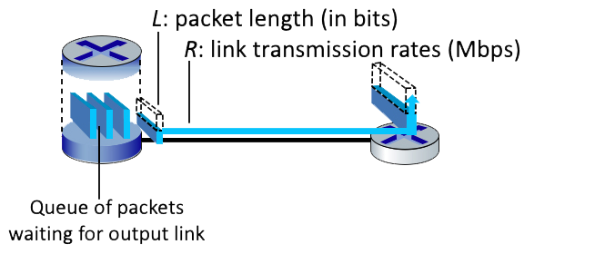

# 1.1
# WHAT IS THE INTERNET? 

Which of the following descriptions below correspond to a "nuts-and-bolts" view of the Internet?


- A place I go for information, entertainment, and to communicate with people.


-       ```A collection of hardware and software components executing protocols that define the format and the order of messages exchanged between two or more communicating entities, as well as the actions taken on the transmission and/or receipt of a message or other event.```


-       ```A collection of billions of computing devices, and packet switches interconnected by links.```


- A platform for building network applications.


-       ```A "network of networks".```

# WHAT IS THE INTERNET (2)? 


Which of the following descriptions below correspond to a "services" view of the Internet?


- A collection of billions of computing devices, and packet switches interconnected by links.


- A collection of hardware and software components executing protocols that define the format and the order of messages exchanged between two or more communicating entities, as well as the actions taken on the transmission and/or receipt of a message or other event.


- ```A place I go for information, entertainment, and to communicate with people.```


- A "network of networks".


- ```A platform for building network applications.```

# WHAT IS A PROTOCOL?


Which of the following human scenarios involve a protocol (recall: "Protocols define the format, order of messages sent and received among network entities, and actions taken on message transmission, receipt")?


- A person sleeping.


- ```Two people introducing themselves to each other.```


- A person reading a book.


- ```A student raising her/his hand to ask a really insightful question, followed by the teaching acknowledging the student, listening carefully to the question, and responding with a clear, insightful answer.  And then thanking the student for the question, since teachers love to get questions.```


- ```One person asking, and getting, the time to/from another person.```

# 1.2
# ACCESS NETWORK PER-SUBSCRIBER SPEEDS.


Match the access network with the approximate speeds that a subscriber might experience. (Note: if you look these up, do so in the 8E textbook, slides,or video -- not in the 7E or earlier versions, since link access speeds are always increasing over the years).

- Ethernet 
    - ```Wired. Up to 100's Gbps per link.```
- 802.11 wifi
    - ```Wireless. 10’s to 100’s of Mbps per device.```
- Cable access network
    - ```Wired. Up to 10’s to 100’s of Mbps downstream per user.```
- Digital subscriber Line
    - ```Wired. Up to 10’s of Mbps downstream per user.```
- 4G cellular LTE
    - ```Wireless. Up to 10’s Mbps per device.```

# LINK TRANSMISSION CHARACTERISTICS.


Which of the following physical layer technologies has the highest transmission rate and lowest bit error rate in practice?


- ```Fiber optic cable```


- Satellite channel


- Twisted pair (e.g., CAT5, CAT6)


- 4G/5G cellular


- 802.11 WiFi Channel


- Coaxial cable

# 1.3
# ROUTING VERSUS FORWARDING. 


Choose one the following two definitions that makes the correct distinction between routing versus forwarding.


- Routing is the local action of moving arriving packets from router’s input link to appropriate router output link, while forwarding is the global action of determining the source-destination paths taken by packets.


- ```Forwarding is the local action of moving arriving packets from router’s input link to appropriate router output link, while routing is the global action of determining the source-destination paths taken by packets.```

# PACKET SWITCHING VERSUS CIRCUIT SWITCHING (1). 


Which of the characteristics below are associated with the technique of packet switching?


- ```This technique is used in the Internet.```


- ```Congestion loss and variable end-end delays are possible with this technique.```


- ```Resources are used on demand, not reserved in advance.```


- Frequency Division Multiplexing (FDM) and Time Division Multiplexing (TDM) are two approaches for implementing this technique.


- This technique was the basis for the telephone call switching during the 20th century and into the beginning of this current century.


- Reserves resources needed for a call from source to destination.


- ```Data may be queued before being transmitted due to other user’s data that’s also queueing for transmission.```

# PACKET SWITCHING VERSUS CIRCUIT SWITCHING (2).


  Which of the characteristics below are associated with the technique of circuit switching?


- This technique is used in the Internet.


- Congestion loss and variable end-end delays are possible with this technique.


- ```Reserves resources needed for a call from source to destination.```


- ```This technique was the basis for the telephone call switching during the 20th century and into the beginning of this current century.```


- Data may be queued before being transmitted due to other user’s data that’s also queueing for transmission.


- Resources are used on demand, not reserved in advance.


- ```Frequency Division Multiplexing (FDM) and Time Division Multiplexing (TDM) are two approaches for implementing this technique.```

# HOW MANY CALLS CAN BE CARRIED?


Consider the circuit-switched network shown in the figure below, with  four circuit switches A, B, C, and D. Suppose there are 20 circuits between A and B, 19 circuits between B and C, 15 circuits between C and D, and 16 circuits between D and A.


What is the maximum number of connections that can be ongoing in the network at any one time?

[Note: you can find more questions like this one here.

        Just add them all up

- 31


- 39


- 20


- 16


- ```70```

# TRYING OUT TRACEROUTE. 


Perform a traceroute from your computer (on whatever network you happen to be on) to gaia.cs.umass.edu. Use traceroute (on Mac terminal) or tracert (on Windows command line) or tracepath (on a Linux command line). Enter the missing part of the name of the router just before the host gaia.cs.umass.edu is reached:
??.cs.umass.edu

Note: Routing may change, so the answer here may not be correct anymore.  Also, if you are a Verizon user, there are known problems using traceroute with Verizon - if traceroute shows you two hops only to gaia.cs.umass.edu or any destination, skip this question.


- ```nscs1bbs1```

# WHAT IS A NETWORK OF NETWORKS?


  When we say that the Internet is a “network of networks,” we mean? Check all that apply (hint: check two or more).


- The Internet is the fastest network ever built.


- ```The Internet is made up of access networks at the edge, tier-1 networks at the core, and interconnected regional and content provider networks as well.```


- ```The Internet is made up of a lot of different networks that are interconnected to each other.```


- The Internet is the largest network ever built.

# PACKET SWITCHING OR CIRCUIT-SWITCHING?


Consider a scenario in which 5 users are being multiplexed over a channel of 10 Mbps.  Under the various scenarios below, match the scenario to whether circuit switching or packet switching is better.

- Each user generates traffic at an average rate of 2.1 Mbps, generating traffic at a rate of 15 Mbps when transmitting
    - ```Neither works well in this overload scenario```
- Each user generates traffic at an average rate of 2 Mbps, generating traffic at a rate of 2 Mbps when transmitting
    - ```Circuit switching```
- Each user generates traffic at an average rate of 0.21 Mbps, generating traffic at a rate of 15 Mbps when transmitting
    - ```Packet switching```

# 1.4
# COMPONENTS OF PACKET DELAY.


Match the description of each component of packet delay to its name in the pull down list.

- Time needed to perform an integrity check, lookup packet information in a local table and move the packet from an input link to an output link in a router.
    - ```Processing delay```
- Time spent waiting in packet buffers for link transmission.
    - ```Queueing delay```
- Time spent transmitting packets bits into the link.
    - ```Transmission delay```
- Time need for bits to physically propagate through the transmission medium from end one of a link to the other.
    - ```Propagation delay```

# COMPUTING PACKET TRANSMISSION DELAY(1).


Suppose a packet is L = 1500 bytes long (one byte = 8 bits), and link transmits at R = 1 Gbps (i.e., a link can transmit bits 1,000,000,000 bits per second).  What is the transmission delay for this packet? [Note: you can find more problems like this one here.]


        Equation = L/R
        L = 1500 * 8 bits
        R = 1,000,000,000 bps
- ```.000012 secs```


- .00012 secs


- .0000015 secs


- .0015 secs


- 666,666 secs

# COMPUTING PACKET TRANSMISSION DELAY (2).


Suppose a packet is L = 1200 bytes long (one byte = 8 bits), and link transmits at R = 100 Mbps (i.e., a link can transmit bits 100,000,000 bits per second).  What is the transmission delay for this packet? [Note: you can find more problems like this one here.]


        Equation = L/R
        L = 1200 * 8 bits
        R = 100,000,000 bps


- .0012 secs


- ```.000096 secs```


- 8,333 secs


- .000015 secs


- .00096 secs

# COMPUTING PACKET TRANSMISSION DELAY (3).


Consider the network shown in the figure below, with three links, each with the specified transmission rate and link length. Assume the length of a packet is 8000 bits.

What is the transmission delay at link 2?  [Note: you can find more problems like this one here.]


        Transmition delay
        L/R
        L = 8000 bits
        R = 100 Mbps

- .00096 secs


- 100 secs


- 12.5 secs


- ```8 x 10^(-5) secs```


- 12,500 secs

# COMPUTING PROPAGATION DELAY.


Consider the network shown in the figure below, with three links, each with the specified transmission rate and link length. Assume the length of a packet is 8000 bits. The speed of light propagation delay on each link is 3x10^8 m/sec

What is the propagation delay at (along) link 2?


        Distance/Material delay
        (Make sure units match)
        Distance = 1000km
        Material = 3x10^8 m/sec
    
- 3 secs


- .33 secs


- 3 x 10^8 secs


- ```.0033 secs```

# COMPUTING THROUGHPUT: A SIMPLE SCENARIO.


What is the maximum throughput achievable between sender and receiver in the scenario shown below?


    Throughput is the bottleneck

- 11.5 Mbps


- ```1.5 Mbps```


- 10 Mbps

# COMPUTING THROUGHPUT. 


Consider the scenario shown below, with four different servers connected to four different clients over four three-hop paths. The four pairs share a common middle hop with a transmission capacity of R = 300 Mbps. The four links from the servers to the shared link have a transmission capacity of RS = 50 Mbps. Each of the four links from the shared middle link to a client has a transmission capacity of RC = 90 Mbps.

What is the maximum achievable end-end throughput (an integer value, in Mbps) for each of four client-to-server pairs, assuming that the middle link is fairly shared (divides its transmission rate equally) and all servers are trying to send at their maximum rate?
Your answer: [A] Mbps


    Throughput is the bottleneck
    Also the question asked each of server/client not altogether

- ```50```


# COMPUTING UTLILIZATION (1).


Consider the scenario shown below, with four different servers connected to four different clients over four three-hop paths. The four pairs share a common middle hop with a transmission capacity of R = 300 Mbps. The four links from the servers to the shared link have a transmission capacity of RS = 50 Mbps. Each of the four links from the shared middle link to a client has a transmission capacity of RC = 90 Mbps.

Assuming that the servers are all sending at their maximum rate possible, what are the link utilizations for the server links (with transmission capacity RS)? Enter your answer in a decimal form of 1.00 (if the utilization is 1) or 0.xx (if the utilization is less than 1, rounded to the closest xx).

Your answer: The utilization of the server links is: [A]


    Bottleneck/(client/server link)
    bottleneck = 200
    server link = 200

- ```1.00```

# COMPUTING UTILIZATION (2).


Consider the scenario shown below, with four different servers connected to four different clients over four three-hop paths. The four pairs share a common middle hop with a transmission capacity of R = 300 Mbps. The four links from the servers to the shared link have a transmission capacity of RS = 50 Mbps. Each of the four links from the shared middle link to a client has a transmission capacity of RC = 90 Mbps.

Assuming that the servers are all sending at their maximum rate possible, what are the link utilizations of the shared link (with transmission capacity R)? Enter your answer in a decimal form of 1.00 (if the utilization is 1) or 0.xx (if the utilization is less than 1, rounded to the closest xx).

Your answer: The utilization of shared link is: [A]


    Bottleneck send max(50*4) / shared
    Server send rate = 200Mbps
    shared link = 300Mbps
    
- ```0.67```

# COMPUTING UTILIZATION (3).


Consider the scenario shown below, with four different servers connected to four different clients over four three-hop paths. The four pairs share a common middle hop with a transmission capacity of R = 300 Mbps. The four links from the servers to the shared link have a transmission capacity of RS = 50 Mbps. Each of the four links from the shared middle link to a client has a transmission capacity of RC = 90 Mbps.

Assuming that the servers are all sending at their maximum rate possible, what are the link utilizations of the client links (with transmission capacity RC)? Enter your answer in a decimal form of 1.00 (if the utilization is 1) or 0.xx (if the utilization is less than 1, rounded to the closest xx).


Your answer: The utilization of client link is: [A]


    Bottleneck / client
    bottleneck = 50
    client = 90

- ```0.56```

# 1.5
# LAYERS IN THE INTERNET PROTOCOL STACK.


Match the function of a layer in the Internet protocol stack to its its name in the pulldown menu.

- Protocols that are part of a distributed network application
    - ```Application Layer```
- Transfer of data between one process and another process (typically on different hosts).
    -  ```Transport layer```
- Delivery of datagrams from a source host to a destination host (typically).
    -  ```Network layer```
- Transfer of data between neighboring network devices.
    -  ```Link layer```
- Transfer of a bit into and out of a transmission media.
    - ```Physical layer```

# WHAT’S A “PACKET” REALLY CALLED?


Match the name of an Internet layer with unit of data that is exchanged among protocol entities at that layer, using the pulldown menu.

- Application layer
    - ```Message```
- Transport layer
    - ```Segment```
- Network layer
    - ```Datagram```
- Link layer
    - ```Frame```
- Physical layer
    - ```Bit```

# PROTOCOL HEADERS.


Consider the figure below, showing a link-layer frame heading from a host to a router.  There are three header fields shown.  Match the name of a header with a header label shown in the figure.


- Header H<sub>1</sub>
    - ```Link layer```
- Header H<sub>2</sub>
    - ```Network layer```
- Header H<sub>3</sub>
    - ```Transport layer```

# WHAT IS "ENCAPSULATION"?


Which of the definitions below describe what is meant by the term "encapsulation"?


- Determining the name of the destination host, translating that name to an IP address and then placing that value in a packet header field.


- ```Taking data from the layer above, adding header fields appropriate for this layer, and then placing the data in the payload field of the “packet” for that layer.```


- Receiving a “packet” from the layer below, extracting the payload field, and after some internal actions possibly delivering that payload to an upper layer protocol.


- Computing the sum of all of the bytes within a packet and placing that value in the packet header field.


- Starting a transport layer timer for a transmitted segment, and then if an ACK segment isn’t received before the timeout, placing that segment in a retransmission queue.

# 1.6
# SECURITY DEFENSES.


  Match the description of a security defense with its name.

  - Specialized “middleboxes” filtering or blocking traffic, inspecting packet contents inspections
    - ```Firewall```
  - Provides confidentiality by encoding contents
    - ```Encryption```
- Used to detect tampering/changing of message contents, and to identify the originator of a message.
    - ```Digital signatures```
- Limiting use of resources or capabilities to given users.
    - ```Access control```
- Proving you are who you say you are.
    - ```Authentication```

# 1.7
# NETWORKING HISTORY - WHEN DID IT HAPPEN?


Match the networking event with the time frame when the event occurred.

- Early studies of packet switching by Baran, Davies, Kleinrock.
    - ```Early 1960's```
- First ARPAnet node operational.
    - ```Late 1960's```
- Internetting: DARPA researchers connect three networks together.
    - ```1970's```
- The Internet Protocol (IP) is standardized in RFC 791.
    - ```Early 1980's```
- Congestion control is added to the TCP protocol.
    - ```Late 1980's```
- The WWW starts up (note: the WWW design started at the end of previous decade).
    - ```1990's```
- Software-defined networking begins.
    - ```2000 - 2010```
- The number wireless Internet-connected devices surpasses the number of connected wired devices.
    - ```2010 - 2020```
