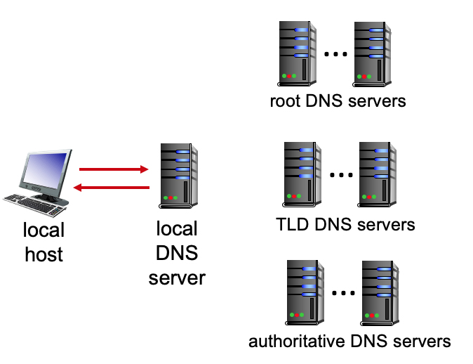

# 2.1
# THE CLIENT-SERVER PARADIGM.


Which of the characteristics below are associated with a client-server approach to structuring network applications (as opposed to a P2P approach)?


- A process requests service from those it contacts and will provide service to processes that contact it.


- There is not a server that is always on.


- ```There is a server that is always on.```


-  ```HTTP uses this application structure.```


-  ```There is a server with a well known server IP address.```

# THE PEER-TO-PEER (P2P) PARADIGM.


Which of the characteristics below are associated with a P2P approach to structuring network applications (as opposed to a client-server approach)?


-  ```There is not a server that is always on.```


-  ```A process requests service from those it contacts and will provide service to processes that contact it.```


- HTTP uses this application structure.


- There is a server that is always on.


- There is a server with a well known server IP address.

# UDP SERVICE.


When an application uses a UDP socket, what transport services are provided to the application by UDP? Check all that apply.


- Real-time delivery. The service will guarantee that data will be delivered to the receiver within a specified time bound.


- Congestion control.  The service will control senders so that the senders do not collectively send more data than links in the network can handle.


- Throughput guarantee. The socket can be configured to provide a minimum throughput guarantee between sender and receiver.


- Loss-free data transfer. The service will reliably transfer all data to the receiver, recovering from packets dropped in the network due to router buffer overflow.


- Flow Control. The provided service will ensure that the sender does not send so fast as to overflow receiver buffers.


-  ```Best effort service.  The service will make a best effort to deliver data to the destination but makes no guarantees that any particular segment of data will actually get there.```

# TCP SERVICE.


When an application uses a TCP socket, what transport services are provided to the application by TCP?  Check all that apply.


- Throughput guarantee. The socket can be configured to provide a minimum throughput guarantee between sender and receiver.


-  ```Flow Control. The provided service will ensure that the sender does not send so fast as to overflow receiver buffers.```


- Best effort service.  The service will make a best effort to deliver data to the destination but makes no guarantees that any particular segment of data will actually get there.


-  ```Congestion control.  The service will control senders so that the senders do not collectively send more data than links in the network can handle.```


- Real-time delivery. The service will guarantee that data will be delivered to the receiver within a specified time bound.


-  ```Loss-free data transfer. The service will reliably transfer all data to the receiver, recovering from packets dropped in the network due to router buffer overflow.```

# 2.2
# “HTTP IS STATELESS.” 


What do we mean when we say “HTTP is stateless”? In answering this question, assume that cookies are not used.  Check all answers that apply.


- We say this when an HTTP server is not operational.


- An HTTP client does not remember the identities of the servers with which  it has interacted.


-  ```An HTTP server does not remember anything about what happened during earlier steps in interacting with this HTTP client.```


- An HTTP client does not remember anything about what happened during earlier steps in interacting with any HTTP server.


- The HTTP protocol is not licensed in any country.

# HTTP COOKIES. 


What is an HTTP cookie used for?


- A cookie is used to spoof client identity to an HTTP server.


- Like dessert, cookies are used at the end of a transaction, to indicate the end of the transaction.


-  ```A cookie is a code used by a server, carried on a client’s HTTP request, to access information the server had earlier stored about an earlier interaction with this Web browser. [Think about the distinction between a browser and a person.]```


- A cookie is a code used by a client to authenticate a person’s identity to an HTTP server.


- A cookies is a code used by a server, carried on a client’s HTTP request, to access information the server had earlier stored about an earlier interaction with this person. [Think about the distinction between a browser and a person.]

# THE HTTP GET.


  What is the purpose of the HTTP GET message?


- The HTTP GET request message is sent by a web server to a web client to get the identity of the web client.


- The HTTP GET request message is sent by a web server to a web client to get the next request from the web client.


- The HTTP GET request message is used by a web client to post an object on a web server.


-  ```The HTTP GET request message is used by a web client to request a web server to send the requested object from the server to the client.```

# CONDITIONAL HTTP GET. 


What is the purpose of the conditional HTTP GET request message?


- To allow a server to only send the requested object to the client if the client is authorized to received that object.


- To allow a server to only send the requested object to the client if the server is not overloaded.


-  ```To allow a server to only send the requested object to the client if this object has changed since the server last sent this object to the client.```


- To allow a server to only send the requested object to the client if the client has never requested that object before.

# A DETAILED LOOK AT AN HTTP GET (1).


Suppose a client is sending an HTTP GET request message to a web server, gaia.cs.umass.edu. Suppose the client-to-server HTTP GET message is the following:

GET /kurose_ross_sandbox/interactive/quotation2.htm ```HTTP/1.1```<br>
Host: gaia.cs.umass.edu<br>
Accept: text/plain, text/html, text/xml, image/jpeg, image/gif, audio/mpeg, audio/mp4, video/wmv, video/mp4,<br>
Accept-Language: en-us, en-gb;q=0.1, en;q=0.7, fr, fr-ch, da, de, fi<br>
If-Modified-Since: Wed, 09 Sep 2020 16:06:01 -0700<br>
User Agent: Mozilla/5.0 (Windows NT 6.1; WOW64) AppleWebKit/535.11 (KHTML, like Gecko) Chrome/17.0.963.56 Safari/535.11<br>

What version of HTTP is the client using?
[Note: you can find additional questions similar to this here.]


- 2


- 2.1


- ```1.1```


- 1

# A DETAILED LOOK AT AN HTTP GET (2).


Again, suppose a client is sending an HTTP GET request message to a web server, gaia.cs.umass.edu.  The client-to-server HTTP GET message is the following (same as in previous problem):

GET /kurose_ross_sandbox/interactive/quotation2.htm HTTP/1.1<br>
Host: gaia.cs.umass.edu<br>
Accept: text/plain, text/html, text/xml, image/jpeg, image/gif, audio/mpeg, audio/mp4, video/wmv, video/mp4,<br>
Accept-Language: ```en-us, en-gb```;q=0.1, en;q=0.7, fr, fr-ch, da, de, fi<br>
If-Modified-Since: Wed, 09 Sep 2020 16:06:01 -0700<br>
User Agent: Mozilla/5.0 (Windows NT 6.1; WOW64) AppleWebKit/535.11 (KHTML, like Gecko) Chrome/17.0.963.56 Safari/535.11<br>

What is the language in which the client would least prefer to get a response?  [You may have to search around the Web a bit to answer this.]

[Note: you can find additional questions similar to this here.]

    Aprrently en-US does not equal US English

- ```United Kingdom English```


- Farsi


- US English


- Mandarin


- French


- Hindi


- Finnish


- Spanish

#A DETAILED LOOK AT AN HTTP GET (3).


Again, suppose a client is sending an HTTP GET request message to a web server, gaia.cs.umass.edu. Suppose the client-to-server HTTP GET message is the following (same as in previous problem):

GET /kurose_ross_sandbox/interactive/quotation2.htm HTTP/1.1<br>
Host: gaia.cs.umass.edu<br>
Accept: text/plain, text/html, text/xml, image/jpeg, image/gif, audio/mpeg, audio/mp4, video/wmv, video/mp4,<br>
Accept-Language: en-us, en-gb;q=0.1, en;q=0.7, fr, fr-ch, da, de, fi<br>
```If-Modified-Since: Wed, 09 Sep 2020 16:06:01 -0700```<br>
User Agent: Mozilla/5.0 (Windows NT 6.1; WOW64) AppleWebKit/535.11 (KHTML, like Gecko) Chrome/17.0.963.56 Safari/535.11<br>

Does the client have a cached copy of the object being requested?

[Note: you can find additional questions similar to this here.]


- ```Yes, because this is a conditional GET, as evidenced by the If-Modified-Since field.```


- No, because a client would not request an object if it had that object in its cache.


- Yes, because HTTP 1.1 is being used.


- There's not enough information in the header to answer this question.


# A DETAILED LOOK AT AN HTTP REPLY.


Suppose now the server sends the following HTTP response message the client:

```HTTP/1.0 200 OK```<br>
Date: Wed, 09 Sep 2020 23:46:21 +0000<br>
Server: Apache/2.2.3 (CentOS)<br>
Last-Modified: Wed, 09 Sep 2020 23:51:41 +0000<br>
ETag:17dc6-a5c-bf716880.<br>
Content-Length: 418<br>
Connection: Close<br>
Content-type: image/html<br>

Will the web server close the TCP connection after sending this message?
[Note: you can find more questions like this one here.]


- ```Yes, the server will close this connection because version 1.0 of HTTP is being used, and TCP connections do not stay open persistently.```


- There's not enough information in the response message to answer this question.


- No, the server will leave the connection open as a persistent HTTP connection.


- Yes, because the HTTP response indicated that only one object was requested in the HTTP GET request.

# WHY WEB CACHING?


Which of the following are advantages of using a web cache? Sselect one or more answers.


- Caching allows an origin server to more carefully track which clients are requesting and receiving which web objects.


- ```Caching uses less bandwidth coming into an institutional network where the client is located, if the cache is also located in that institutional network.```


- Overall, caching requires  fewer  devices/hosts to satisfy a web request, thus saving on server/cache costs.


- ```Caching generally provides for a faster page load time at the client, if  the web cache is in the client’s institutional network, because the page is loaded from the nearby cache rather than from the distant server.```

# HTTP/2 VERSUS HTTP/1.1.


  Which of the following are changes between HTTP 1.1 and HTTP/2? Note: select one or more answers.


- ```HTTP/2 allows a large object to be broken down into smaller pieces, and the transmission of those pieces to be interleaved with transmission  other smaller objects, thus preventing a large object from forcing many smaller objects to wait their turn for transmission.```


- HTTP/2 provides enhanced security by using transport layer security (TLS).


- HTTP/2 has many new HTTP methods and status codes.


- ```HTTP/2 allows objects in a persistent connection to be sent in a client-specified priority order. ```

# WHAT'S IN AN HTTP REPLY?


Which of the following pieces of information will appear in a server’s application-level HTTP reply message? (Check all that apply.)


- The server's IP address


- A sequence number


- ```A response code```


- ```A response phrase associated with a response code```


- A checksum


- The name of the Web server (e.g., gaia.cs.umass.edu)


# IF-MODIFIED-SINCE.


What is the purpose of the If-Modified-Since field in a HTTP GET request message


- To indicate to the server that the client wishes to receive this object, and the time it until it which it will cache the returned object


- To indicate to the server that the server should replace this named object with the new version of the object attached to the GET, if the object has not been modified since the specified time


- To inform the HTTP cache that it (the cache) should retrieve the full object from the server, and then cache it until the specified time.


- ```To indicate to the server that the client has cached this object from a previous GET, and the time it was cached.```


- To allow the server to indicate to the client that it (the client) should cache this object.

# COOKIES.


What is the purpose of a cookie value in the HTTP GET request?


- ```The cookie value itself doesn't mean anything.  It is just a value that was returned by a web server to this client during an earlier interaction.```


- The cookie value indicates whether the user wants to use HTTP/1, HTTP/1.1, or HTTP/2 for this GET request.


- The cookie value encodes the format of the reply preferred by the client in the response to this GET request.


- The cookie value encodes a default set of preferences that the user has previously specified for this web site.


- The cookie value is an encoding of a user email address associated with the GET request.

# HTTP GET (EVEN MORE).


Suppose a client is sending an HTTP GET message to a web server, gaia.cs.umass.edu. Suppose the client-to-server HTTP GET message is the following:

GET /kurose_ross_sandbox/interactive/quotation2.htm HTTP/1.1<br>
Host: gaia.cs.umass.edu<br>
Accept: text/plain, text/html, text/xml, image/jpeg, image/gif, audio/mpeg, audio/mp4, video/wmv, video/mp4,<br>
Accept-Language: en-us, en-gb;q=0.1, en;q=0.7, fr, fr-ch, da, de, fi<br>
```If-Modified-Since: Wed, 09 Sep 2020 16:06:01 -0700```<br>
User Agent: Mozilla/5.0 (Windows NT 6.1; WOW64) AppleWebKit/535.11 (KHTML, like Gecko) Chrome/17.0.963.56 Safari/535.11<br>

Does the client have a cached copy of the object being requested?


- No, because the client would not request an object if it were cached.


- There’s not enough information to answer this question.


- ```Yes, because this is a conditional GET.```

# WHAT HAPPENS AFTER AN HTTP REPLY?


Suppose an HTTP server sends the following HTTP response message a client:

```HTTP/1.0 200 OK```<br>
Date: Wed, 09 Sep 2020 23:46:21 +0000<br>
Server: Apache/2.2.3 (CentOS)<br>
Last-Modified: Wed, 09 Sep 2020 23:51:41 +0000<br>
ETag:17dc6-a5c-bf716880.<br>
Content-Length: 418<br>
Connection: Close<br>
Content-type: image/html<br>

Will the web server close the TCP connection after sending this message?


- No, this is a persistent connection, and so the server will keep the TCP connection open.


- ```Yes, because this is HTTP 1.0```


- There’s not enough information to answer this question.

# 2.3
# E-MAIL DELAYS.


How many RTTs are there from when a client first contacts an email server (by initiating a TCP session) to when the client can begin sending the email message itself – that is following all initial TCP or SMTP handshaking required?
Recall the figure below from our class notes:


- 0


- 1


- 2


- 2.5


- ```3```


# COMPARING AND CONTRASTING HTTP AND SMTP.


Which of the following characteristics apply to HTTP only (and do not apply to SMTP)?  Note: check one or more of the characteristics below.


- Uses server port 25.


- ```Uses a blank line (CRLF) to indicate end of request header.```


- Has ASCII command/response interaction, status codes.


- ```Operates mostly as a “client pull” protocol.```


- Operates mostly as a “client push” protocol.


- Uses CRLF.CRLF to indicate end of message.


- ```Uses server port 80.```


- Is able to use a persistent TCP connection to transfer multiple objects.

# COMPARING AND CONTRASTING HTTP AND SMTP (2).


Which of the following characteristics apply to SMTP only (and do not apply to HTTP)?  Note: check one or more of the characteristics below.


- Uses a blank line (CRLF) to indicate end of request header.


- Uses server port 80.


- Has ASCII command/response interaction, status codes.


- ```Operates mostly as a “client push” protocol.```


- Operates mostly as a “client pull” protocol.


- ```Uses CRLF.CRLF to indicate end of message.```


- ```Uses server port 25.```


- Is able to use a persistent TCP connection to transfer multiple objects.


# COMPARING AND CONTRASTING HTTP AND SMTP (3).


Which of the following characteristics apply to both HTTP and SMTP? Note: check one or more of the characteristics below.


- Operates mostly as a “client pull” protocol.


- Uses a blank line (CRLF) to indicate end of request header.


- ```Has ASCII command/response interaction, status codes.```


- ```Is able to use a persistent TCP connection to transfer multiple objects.```


- Operates mostly as a “client push” protocol.


- Uses CRLF.CRLF to indicate end of message.

# WHICH E-MAIL PROTOCOL?


  Match the functionality of a protocol with the name of a the email protocol (if any) that implements that functionality.

- Pushes email from a mail client to a mail server.
    - ```SMTP```
- Pulls mail from one mail server to another mail server.
    - ```Neither SMTP nore IMAP does this```
- Pulls email to a mail client from a mail server.
    - ```IMAP```

# 2.4
# DNS FUNCTIONS


. Match the function of a server to a given type of DNS server in the  DNS server hierarchy.

- Provides authoritative hostname to IP mappings for organization’s named hosts.
    - ```Authoritative DNS server```
- Replies to DNS query by local host, by contacting other DNS servers to answer the query.
    - ```Local DNS server```
- Responsible for a domain (e.g., *.com, *.edu); knows how to contact authoritative name servers.
    - ```Top Level Domain (TLD) servers```
- Highest level of the DNS hierarchy, knows how to reach servers responsible for a given domain (e.g., *.com, *.edu).
    - ```DNS root servers```

# WHY DOES THE DNS PERFORM CACHING?


What is the value of caching in the local DNS name server? Check all that apply.


- DNS caching provides the ability to serve as authoritative name server for multiple organizations.


- ```DNS caching results in less load elsewhere in DNS, when the reply to a query is found in the local cache.```


- ```DNS caching provides for faster replies, if the reply to the query is found in the cache.```


- DNS caching provides prioritized access to the root servers, since the DNS request is from a local DNS cache.

# WHAT'S IN THE DNS TYPE A RESOURCE RECORD?


What information does the type “A” resource record hold in the DNS database? Check all that apply.


- A domain name and the name of the authoritative name server for that domain.


- A name and the name of the SMTP server associated with that name.


- An alias name and a true name for a server.


- ```A hostname and an IP address.```

# DNS IN ACTION (1).


Suppose that the local DNS server caches all information coming in from all root, TLD, and authoritative DNS servers for 20 time units. (Thus, for example, when a root server returns the name and address of a TLD server for .com, the cache remembers that this is the TLD server to use to resolve a .com name).  Assume also that the local cache is initially empty, that iterative DNS queries are always used, that DNS requests are just for name-to-IP-address translation, that 1 time unit is needed for each server-to-server or host-to-server (one way) request/response, and that there is only one authoritative name server (each) for any .edu or .com domain.


Consider the following DNS requests, made by the local host at the given times:

t=0, the local host requests that the name gaia.cs.umass.edu be resolved to an IP address. <br>
t=1, the local host requests that the name icann.org be resolved to an IP address. <br>
t=5, the local host requests that the name cs.umd.edu be resolved to an IP address. (Hint: be careful!)<br>
t=10, the local host again requests that the name gaia.cs.umass.edu be resolved to an IP address. <br>
t=12, the local host requests that the name cs.mit.edu be resolved to an IP address. <br>
t=30, the local host again requests that the name gaia.cs.umass.edu be resolved to an IP address. (Hint: be careful!)<br>
Which of the requests require 8 time units to be resolved?<br>


- The request at t=12.


- The request at t=10.


- ```The request at t=30.```


- The request at t=5.


- ```The request at t=0.```


- ```The request at t=1.```

# DNS IN ACTION (2).


Suppose that the local DNS server caches all information coming in from all root, TLD, and authoritative DNS servers for 20 time units. (Thus, for example, when a root server returns the name and address of a TLD server for .com, the cache remembers that this is the TLD server to use to resolve a .com name).  Assume also that the local cache is initially empty, that iterative DNS queries are always used, that DNS requests are just for name-to-IP-address translation, that 1 time unit is needed for each server-to-server or host-to-server (one way) request/response, and that there is only one authoritative name server (each) for any .edu or .com domain.


Consider the following DNS requests, made by the local host at the given times:

t=0, the local host requests that the name gaia.cs.umass.edu be resolved to an IP address. <br>
t=1, the local host requests that the name icann.org be resolved to an IP address. <br>
t=5, the local host requests that the name cs.umd.edu be resolved to an IP address. (Hint: be careful!)<br>
t=10, the local host again requests that the name gaia.cs.umass.edu be resolved to an IP address. <br>
t=12, the local host requests that the name cs.mit.edu be resolved to an IP address. <br>
t=30, the local host again requests that the name gaia.cs.umass.edu be resolved to an IP address. (Hint: be careful!)<br>
Which of the requests require 6 time units to be resolved?<br>

- ```The request at t=12.```


- The request at t=10.


- The request at t=30.


- ```The request at t=5.```


- The request at t=0.


- The request at t=1.

# DNS IN ACTION (3).


Suppose that the local DNS server caches all information coming in from all root, TLD, and authoritative DNS servers for 20 time units. (Thus, for example, when a root server returns the name and address of a TLD server for .com, the cache remembers that this is the TLD server to use to resolve a .com name).  Assume also that the local cache is initially empty, that iterative DNS queries are always used, that DNS requests are just for name-to-IP-address translation, that 1 time unit is needed for each server-to-server or host-to-server (one way) request/response, and that there is only one authoritative name server (each) for any .edu or .com domain.


Consider the following DNS requests, made by the local host at the given times:

t=0, the local host requests that the name gaia.cs.umass.edu be resolved to an IP address. <br>
t=1, the local host requests that the name icann.org be resolved to an IP address. <br>
t=5, the local host requests that the name cs.umd.edu be resolved to an IP address. (Hint: be careful!)<br>
t=10, the local host again requests that the name gaia.cs.umass.edu be resolved to an IP address. <br>
t=12, the local host requests that the name cs.mit.edu be resolved to an IP address. <br>
t=30, the local host again requests that the name gaia.cs.umass.edu be resolved to an IP address. (Hint: be careful!)<br>
Which of the requests require 2 time units to be resolved?<br>

- The request at t=12.


- ```The request at t=10.```


- The request at t=30.


- The request at t=5.


- The request at t=0.


- The request at t=1.

# THE LOCAL DNS SERVER.


Check all of the phrases below that state a true property of a local DNS server.


- ```The local DNS server record for a remote host is sometimes different from that of the authoritative server for that host.```


- ```The local DNS server can decrease the name-to-IP-address resolution time experienced by a querying local host over the case when a DNS is resolved via querying into the DNS hierarchy.```


- The local DNS server holds hostname-to-IP translation records, but not other DNS records such as MX records.


- The local DNS server is only contacted by a local host if that local host is unable to resolve a name via iterative or recursive queries into the DNS hierarchy.

# THE DNS AUTHORITATIVE NAME SERVER.


What is the role of an authoritative name server in the DNS? (Check all that apply)


- It is a local (to the querying host) server that caches name-to-IP address translation pairs, so it can answer authoritatively and can do so quickly.


- It provides a list of TLD servers that can be queried to find the IP address of the DNS server that can provide the definitive answer to this query.


- It provides the IP address of the DNS server that can provide the definitive answer to the query.


- ```It provides the definitive answer to the query with respect to a name in the authoritative name server's domain.```

# No 2.5
# 2.6
# .6-4


Manifest file. What is the purpose of a manifest file in a streaming multimedia setting?


- To let a OTT (Over-the-top) video server know the video that the client wants to view.


- To allow a client to reserve bandwidth along a path from a server to that client, so the client can view a stream video without impairment.


- Allows a video service to log the video and the server from which a client streams a video.


- ```To let a client know where it can retrieve different video segments, encoded at different rates```

# CDNS.


What approach is taken by a CDN to stream content to hundreds of thousands of simultaneous users?


- Allow client devices to send requested content to each other, in order to offload the CDN infrastructure.


- ```Store/serve multiple copies of videos at multiple geographically distributed sites.```


- Proactively push videos to a client device before they’re requested, using machine learning to predict requested videos.


- Serve video from a single central “mega-server” with ultra-high-speed network connectivity, and high-speed storage.

# STREAMING VIDEO DEFINITIONS


. Match the definition/function of an element or approach in a networked streaming video system, with its name.

- A unit of video, each of which may be encoded at multiple different rates, stored in different files.
    - ```Chunk```
- A file containing the location and encoding rate of files corresponding to video segments in a video.
    - ```Manifest```
- An approach that allows a client to adapt the encoding rate of retrieved video to network congestion conditions.
    - ```DASH```
- A CDN approach that stores content in access networks, close to clients.
    - ```Enter deep```

# WHAT IS DASH?


In DASH (Dynamic, Adaptive Streaming over HTTP), a server divides a video file into chunks that ... (pick best completion from below)


- ... allow premium users to avoid watching chunks that contain commercials.


- ```... are stored, each encoded at multiple rates (video quality).  The client plays the video chunk-by-chunk, with each chunk requested at encoding rate that fits the available bandwidth at the time.```


- ... are download smallest-chunk-first in order to maximize the number of chunks received.


- ... are stored, each encoded at multiple rates (video quality).  The client receives multiple video chunks (encoded at different rates) and plays out the chunks that best fit the screen size.


- ... are downloaded just before their playout time.  Chunking is used primarily because a viewer may jump around (e.g., fast forward) in a video.

# 2.7
# UDP SOCKETS.


Which of the following characteristics below are associated with a UDP socket? Check one or more that apply.


- ```socket(AF_INET, SOCK_DGRAM) creates this type of socket```


- a server can perform an accept() on this type of socket


- when contacted, the server will create a new server-side socket to communicate with that client


- ```the application must explicitly specify the IP destination address and port number for each group of bytes written into a socket```


- ```provides unreliable transfer of a groups of bytes (“a datagram”), from client to server```


- socket(AF_INET, SOCK_STREAM) creates this type of socket


- provides reliable, in-order byte-stream transfer (a “pipe”), from client to server


- ```data from different clients can be received on the same socket```

# TCP SOCKETS.


Which of the following characteristics below are associated with a TCP socket? Check one or more that apply.


- provides unreliable transfer of a group of bytes (a “datagram”), from client to server


- ```when contacted, the server will create a new server-side socket to communicate with that client```


- ```socket(AF_INET, SOCK_STREAM) creates this type of socket```


- data from different clients can be received on the same socket


- socket(AF_INET, SOCK_DGRAM) creates this type of socket


- ```a server can perform an accept() on this type of socket```


- ```provides reliable, in-order byte-stream transfer (a “pipe”), from client to server```


- the application must explicitly specify the IP destination address and port number for each group of bytes written into a socket

# SERVER REPLY (UDP).


How does the networked application running on a server know the client IP address and the port number to reply to in response to a received datagram?


- ```The  application code at the server determines client IP address and port # from the initial segment sent by client, and must explicitly specify these values when sending into a socket back to that client.```


- The server will know the port number being used by the client since all services have a well-known port number.


- The server will query the DNS to learn the IP address of the client.


- As the result of performing the accept() statement, the server has created a new socket that is bound to that specific client, and so sending into this new socket (without explicitly specifying the client IP address and port number) is sufficient to ensure that the sent data will be addressed to the correct client.

# HOW MANY SOCKETS?


Suppose a Web server has five ongoing connections that use TCP receiver port 80, and assume there are no other TCP connections (open or being opened or closed) at that server.  How many TCP sockets are in use at this server?


- 5


- 1


- ```6```


- 4

# SOCKET CONNECT().


What happens when a socket connect() procedure is called/invoked?


- This causes the client to reach out to a TCP server to establish a connection between that client and the server. If there is already one or more servers on this connection, this new server will also be added to this connection.


- This causes the client to reach out to a TCP server to establish a connection between that client and the server. There can be at most one server on the connection.


- ```This procedure creates a new socket at the client, and connects that socket to the specified server.```


- This causes the server to create a connection with a TCP client.  The server does so by creating a new socket for communication back to that client.

