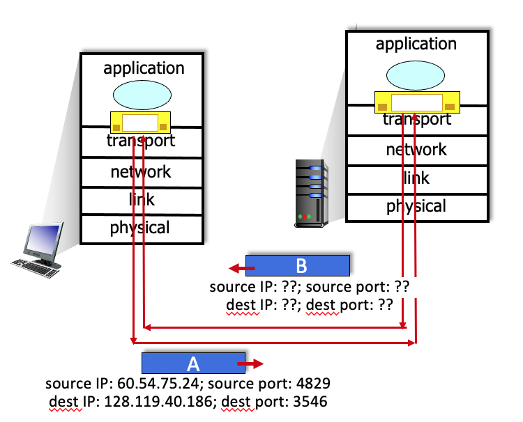
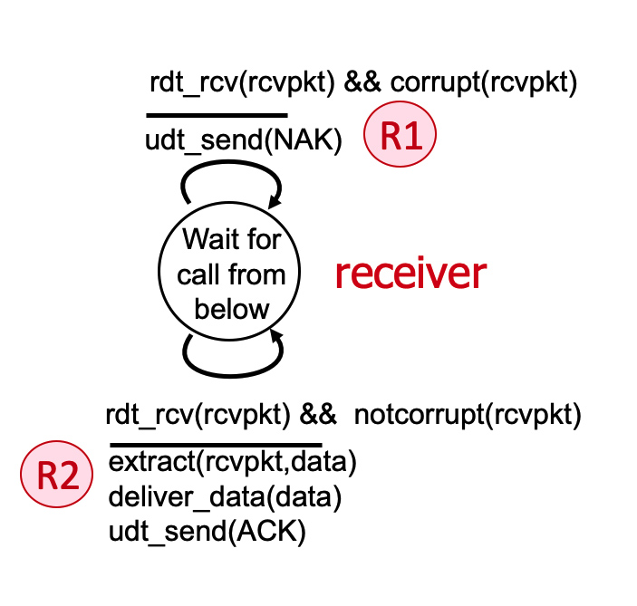
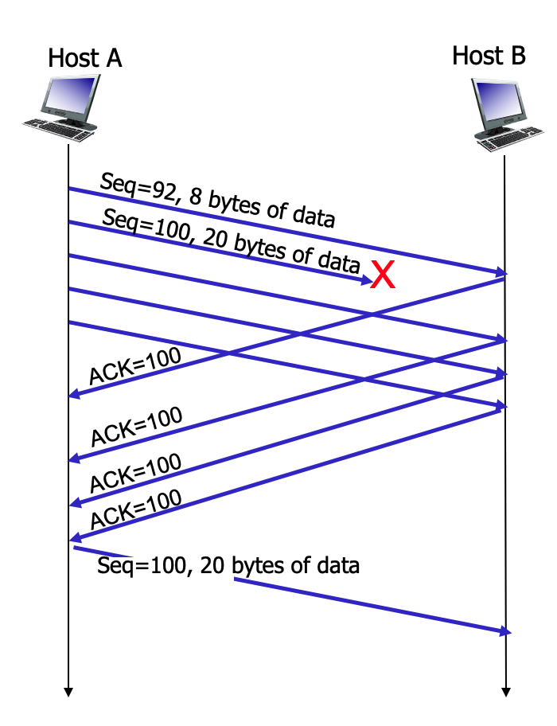
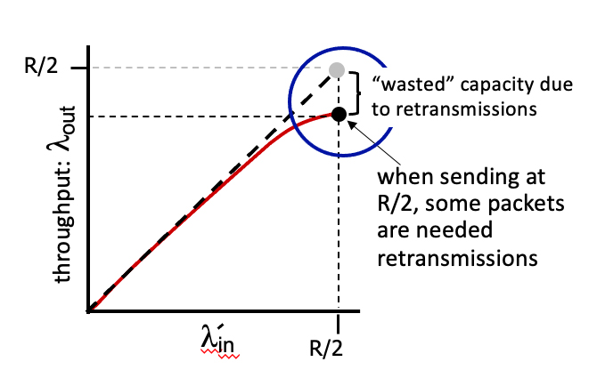

# 3.1-1 LOCATION OF TRANSPORT-LAYER FUNCTIONALITY.


Where is transport-layer functionality primarily implemented?


- Transport layer functions are implemented primarily at the routers and switches in the network.


- ```Transport layer functions are implemented primarily at the hosts at the “edge” of the network.```


- Transport layer functions are implemented primarily at each end of a physical link connecting one host/router/switch to another one host/router/switch.

# 3.1-2 TRANSPORT-LAYER FUNCTIONALITY.


True or False: The transport layer provides for host-to-host delivery service?


- ```True.```


- False


# 3.1-3 TRANSPORT LAYER SERVICES USING TCP.


  Check all of the services below that are provided by the TCP protocol.


- ```A flow-control service that ensures that a sender will not send at such a high rate so as to overflow receiving host buffers.```


- ```Reliable data delivery.```


- ```In-order data delivery```


- ```A congestion control service to ensure that multiple senders do not overload network links.```


- ```A byte stream abstraction, that does not preserve boundaries between message data sent in different socket send calls at the sender.```


- A guarantee on the minimum amount of throughput that will be provided between sender and receiver.


- A guarantee on the maximum amount of time needed to deliver data from sender to receiver.


- A message abstraction, that preserves boundaries between message data sent in different socket send calls at the sender.

# 3.1-4 TRANSPORT-LAYER SERVICES USING UDP.


  Check all of the services below that are provided by the UDP protocol.


- A guarantee on the maximum amount of time needed to deliver data from sender to receiver.


- Reliable data delivery.


- ```A message abstraction, that preserves boundaries between message data sent in different socket send calls at the sender.```


- A byte stream abstraction, that does not preserve boundaries between message data sent in different socket send calls at the sender.


- A guarantee on the minimum amount of throughput that will be provided between sender and receiver.


- A flow-control service that ensures that a sender will not send at such a high rate so as to overflow receiving host buffers.


- A congestion control service to ensure that multiple senders do not overload network links.


- In-order data delivery


# 3.1-5 NETWORK-LAYER FUNCTIONALITY.


The transport layer sits on top of the network layer, and provides its services using the services provided to it by the network layer.  Thus it’s important that we know what is meant by the network layer’s “best effort” delivery service.  True or False:

The network layer’s best-effort delivery service means that IP makes its “best effort” to deliver segments between communicating hosts, but it makes no guarantees. In particular, it does not guarantee segment delivery, it does not guarantee orderly delivery of segments, and it does not guarantee the integrity of the data in the segments.


- ```Correct!  The network layer’s best effort service doesn’t really provide much service at all, does it?```


- Nope. The network layer’s best effort service doesn’t really provide much service at all, does it?

# 3.2-1 TRANSPORT-LAYER DEMULTIPLEXING.


What is meant by transport-layer demultiplexing?


- Receiving a transport-layer segment from the network layer, extracting the payload, determining the destination IP address for the data, and then passing the segment and the IP address back down to the network layer.


- Taking data from one socket (one of possibly many sockets), encapsulating a data chuck with header information – thereby creating a transport layer segment – and eventually passing this segment to the network layer.


- ```Receiving a transport-layer segment from the network layer, extracting the payload (data) and delivering the data to the correct socket.```


- Taking data from multiple sockets, all associated with the same destination IP address, adding destination port numbers to each piece of data, and then concatenating these to form a transport-layer segment, and eventually passing this segment to the network layer.

#TRANSPORT-LAYER MULTIPLEXING.


What is meant by transport-layer multiplexing?


- Receiving a transport-layer segment from the network layer, extracting the payload (data) and delivering the data to the correct socket.


- Taking data from multiple sockets, all associated with the same destination IP address, adding destination port numbers to each piece of data, and then concatenating these to form a transport-layer segment, and eventually passing this segment to the network layer.


- ```Taking data from one socket (one of possibly many sockets), encapsulating a data chuck with header information – thereby creating a transport layer segment – and eventually passing this segment to the network layer.```


 -Receiving a transport-layer segment from the network layer, extracting the payload, determining the destination IP address for the data, and then passing the segment and the IP address back down to the network layer.

 # 3.2-2 MULTIPLEXING/DEMULTIPLEXING: UDP PORT NUMBERS.


True or False:  When multiple UDP clients send UDP segments to the same destination port number at a receiving host, those segments (from different senders) will always be directed to the same socket at the receiving host.


- False


- ```True```


# 3.2-3 MULTIPLEXING/DEMULTIPLEXING: TCP PORT NUMBERS.


True or False:  When multiple TCP clients send TCP segments to the same destination port number at a receiving host, those segments (from different senders) will always be directed to the same socket at the receiving host.


- True


- ```False```

# 3.2-4 MULTIPLEXING UDP WITH IDENTICAL PORT NUMBERS.


True or False:  It is possible for two UDP segments  to be sent from the same socket with source port 5723 at a server to two different clients.


- False


- ```True```

# 3.2-5 MULTIPLEXING TCP WITH IDENTICAL PORT NUMBERS.


True or False:  It is possible for two TCP segments with source port 80 to be sent by the sending host to different clients.


- False


- ```True```

# 3.3-1 DOES UDP PRESERVE APPLICATION-LAYER MESSAGE BOUNDARIES?


True or False:  On the sending side, the UDP sender will take each application-layer chunk of data written into a UDP socket and send it in a distinct UDP datagram. And then on the receiving side, UDP will deliver a segment’s payload into the appropriate socket, preserving the application-defined message boundary.


- False


- ```True```

# 3.3-2 UDP header fields. Which of the fields below are in a UDP segment header? [Hint: note the use of the word "header" in this question statement.]


- Source IP address


- ```Internet checksum```


- Data (payload)


- ```Destination port number```


- ```Length (of UDP header plus payload)```


- Upper layer protocol


- ```Source port number```


- Sequence number


# 3.3-3 UDP SEGMENT LENGTH FIELD.


Why is the UDP header length field needed?


- Because this field is needed in TCP as well.


- To make the header and even number of bytes


- ```Because the payload section can be of variable length, and this lets UDP know where the segment ends.```


- (a) and (b) above

# 3.3-4 INTERNET CHECKSUM AND UDP.


Over what set of bytes is the checksum field in the UDP header computed over?


- The entire UDP segment, except the checksum field itself.


- ```The entire UDP segment, except the checksum field itself, and the IP sender and receive address fields```


- Just the UDP header but not the payload.


# 3.3-5COMPUTING THE INTERNET CHECKSUM (1).


Compute the Internet checksum value for these two 16-bit words: 11110101 11010011 and 10110011 01000100
[Note: you can find more problems like this one here.]

    Just add them up and flip

- 01101110 11010101  


- 01011110 11000101  


- 01010110 11101000


- ```01010110 11100111```


# 3.3-6 COMPUTING THE INTERNET CHECKSUM (2).


Compute the Internet checksum value for these two 16-bit words: 01000001 11000100 and 00100000 00101011
[Note: you can find more problems like this one here.]


- 01101110 11010101  


- ```10011110 00010000```


- 10011110 00001111 


- 10011110 00010001

# 3.3-7 UDP CHECKSUM: HOW GOOD IS IT?


True or False:  When computing the Internet checksum for two numbers, a single flipped bit (i.e., in just one of the two numbers) will always result in a changed checksum.


- False


- ```True```

# 3.3-8 UDP CHECKSUM: HOW GOOD IS IT?


True or False: When computing the Internet checksum for two numbers, a single flipped bit in each of the two numbers will always result in a changed checksum.


- True


- ```False```

# 3.3-9 IP ADDRESSES AND PORT NUMBERS IN A UDP SEGMENT SENT IN REPLY. 


Suppose a UDP segment (A in the figure below) arrives at a host with an IP address of 128.119.40.186. The source port in the UDP segment is 4829 and the destination port is 3546. The IP address of the sending host is 60.54.75.24.



Now consider the UDP datagram (and the IP datagram that will encapsulate it) sent in reply by the application on host 128.119.40.186  to the original sender host, labeled B in the figure above.  Complete the sentences below ...

What are the source and destination port numbers and IP addresses? (Enter the integer port number or the 4-part dotted decimal IP address, included the period)

The source port number of the UDP segment (B) sent in reply is: 

The source IP address of the IP datagram containing the UDP segment (B) sent in reply is: 

The destination port number of the UDP segment (B) sent in reply  is:

The destination IP address of the IP datagram containing the UDP segment (B) sent in reply is: 

[Note: you can find more problems like this one here.]


- The source port number of the UDP segment (B) sent in reply is: 
    - ```3546```
- The source IP address of the IP datagram containing the UDP segment (B) sent in reply is: 
    - ```128.119.40.186```
- The destination port number of the UDP segment (B) sent in reply  is:
    - ```4829```
- The destination IP address of the IP datagram containing the UDP segment (B) sent in reply is: 
    - ```60.54.75.24```

# 3.4-1 RELIABLE DATA TRANSFER PROTOCOL MECHANISMS.


Consider the purposes/goals/use of different reliable data transfer protocol mechanisms. For the given purpose/goal/use match it to the RDT mechanism that is used to implement the given purpose/goal/use.

- Lets the sender know that a packet was NOT received correctly at the receiver.
    - ```NAK```
- Used by sender or receiver to detect bits flipped during a packet’s transmission.
    - ```Checksum```
- Allows for duplicate detection at receiver.
    - ```Sequence number```
- Lets the sender know that a packet was received correctly at the receiver.
    - ```ACK```
- Allows the receiver to eventually receive a packet that was corrupted or lost in an earlier transmission.
    - ```Retransmission```

# 3.4-2 THE RDT 2.0 PROTOCOL.


Consider the rdt 2.0 sender and receiver shown below, with FSM transitions at the sender labeled S1, S2, and S3; and receiver transitions labeled R1 and R2.

Which of the following sequences of transitions could possibly occur as a result of an initial rdt_send() call at the sender, and possible later message corruption and subsequent error recovery.




- S1, R1, S2, R1, S3


- ```S1, R1, S2```


- ```S1, R2, S3```


- S1, R1, S3


- S1, R2, S2


- S1, S2, S3


- ```S1, R1, S2, R2,S3```

# 3.4-3 THE RDT 2.1 PROTOCOL (A).


Consider the rdt2.1 sender and receiver FSMs shown below, with labeled transitions S1 through S6 at the sender, and transitions R1 through R6 at the receiver. The sender and receiver start in the “Wait for call 0 from above” and “Wait for 0 from below” states, respectively.


Suppose that no channel errors occur.  A sequence of interleaved sender and receiver transitions is given below. Transitions S1 and S4 are already provided.  Choose the sender or receiver transition for the unlabeled transitions x1, x2, x3, and x4 below to indicate the time-ordered sequence of transitions (interleaved sender and receiver transitions) that will result in two messages being delivered at the receiver, with the sender and receiver returning to their initial states (again, given that no channel errors occur). 

S1, x1, x2, S4, x3, x4

- transition x1
    - ```R1```
- transition x2
    - ```S3```
- transition x3
    - ```R4```
- transition x4
    - ```S6```

# 3.4-4 THE RDT 2.1 PROTOCOL (B).


 Consider the rdt2.1 sender and receiver FSMs shown below, with labeled transitions S1 through S6 at the sender, and transitions R1 through R6 at the receiver. The sender and receiver start in the “Wait for call 0 from above” and “Wait for 0 from below” states, respectively.


Suppose that the initial message transmission by the sender is corrupted, but that no other message transmissions are corrupted.  Match the unlabeled transitions x1, x2, x3, x4, x5 in the time-ordered sequence of transitions below (interleaved sender and receiver transitions) that will occur following the initial S1 transition (which is corrupted), that will result in two messages being delivered at the receiver, with the sender and receiver returning to their initial states (again, given that the initial message transmission by the sender is corrupted). Note that transitions S1, S4, and S6 are already provided below.

S1 (message corrupted), x1, x2, x3, x4, S4, x5, S6.

- transition x1
    - ```R6```
- transition x2
    - ```S2```
- transition x3
    - ```R1```
- transition x4
    - ```S3```
- transition x5
    - ```R4```

# 3.4-5 THE RDT 2.1 PROTOCOL (C).


 Consider the rdt2.1 sender and receiver FSMs shown below, with labeled transitions S1 through S6 at the sender, and transitions R1 through R6 at the receiver. The sender and receiver start in the “Wait for call 0 from above” and “Wait for 0 from below” states, respectively.


Suppose that the first packet from the sender is correctly received at the receiver but that ACK message sent from receiver-to-sender is corrupted; all other messages (before or after that ACK) are transmitted error-free.  Match the unlabeled transitions x1, x2, x3, x4, x5 in the time-ordered sequence of transitions below (interleaved sender and receiver transitions) that will occur following the initial S1 transition, which is followed by a corrupted ACK transmission, that will result in a message being delivered at the receiver, with the sender and receiver returning to their initial states. Note that some transitions are already provided below.

S1, x1 (ACK corrupted), x2, x3, x4, S4, x5, S6.

- transition x1

- transition x2

- transition x3

- transition x4

- transition x5


# 3.4-6 CUMULATIVE ACK.


What is meant by a cumulative acknowledgment, ACK(n)?


- A cumulative ACK(n) allows the receiver to let the sender know that it has not yet received an ACK for packet with sequence number n.


- ```A cumulative ACK(n) acks all packets with a sequence number up to and including n as being received.```


- A cumulative ACK(n) allows the receiver to let the sender know that it has not received any packets with a new sequence number since the last cumulative ACK(n) was sent.

# 3.4-7 STOP-AND-WAIT: CHANNEL UTILIZATION.


Suppose a packet is 10K bits long, the channel transmission rate connecting a sender and receiver is 10 Mbps, and the round-trip propagation delay is 10 ms.  What is the maximum channel utilization of a stop-and-wait protocol for this channel?


- 1.0


- .001


- 10.0


- .01


- ```.1```

# 3.4-8 CHANNEL UTILIZATION WITH PIPELINING.


Suppose a packet is 10K bits long, the channel transmission rate connecting a sender and receiver is 10 Mbps, and the round-trip propagation delay is 10 ms.  What is the channel utilization of a pipelined protocol with an arbitrarily high level of pipelining for this channel?


- ```1.0```


- 0.01


- 10.0


- 0.001


- 0.1

# 3.4-9 CHANNEL UTILIZATION WITH PIPELINING (MORE).


Suppose a packet is 10K bits long, the channel transmission rate connecting a sender and receiver is 10 Mbps, and the round-trip propagation delay is 10 ms.  How many packets can the sender transmit before it starts receiving acknowledgments back?


- 1000


- 1


- 100


- 10,000


- ```10```

# 3.4-10 PIPELINING.


Which of the following statements about pipelining are true?  One or more statements may be true.


- With pipelining, a packet is only retransmitted if that packet, or its ACK, has been lost.


- ``With a pipelined sender, there may be transmitted packets “in flight” – propagating through the channel – packets that the sender has sent but that the receiver has not yet received.``


- ``A pipelined sender can have transmitted multiple packets for which the sender has yet to receive an ACK from the receiver. ``


- With pipelining, a receiver will have to send fewer acknowledgments as the degree of pipelining increases

# 3.4-11 PACKET BUFFERING IN GO-BACK-N.


What are some reasons for discarding received-but- out-of-sequence packets at the receiver in GBN? Indicate one or more of the following statements that are correct.


- Discarding an out of sequence packet will really force the sender to retransmit.


- ```The sender will resend that packet in any case.```


- If some packets are in error, then its likely that other packets are in error as well.


- ```The implementation at the receiver is simpler.```

# 3.4-12 PACKET BUFFERING IN GO-BACK-N (MORE).


What are some reasons for not discarding received-but- out-of-sequence packets at the receiver in GBN? Indicate one or more of the following statements that are correct.


- ```Even though that packet will be retransmitted, its next retransmission could be corrupted, so don’t discard a perfectly well-received packet, silly!```


- By not discarding, the receiver can implicitly let the sender know that it (the sender) does not necessarily have to retransmit that packet.


- Complex protocols are always better

# 3.4-13 RECEIVER OPERATION IN SELECTIVE REPEAT.


In the SR receiver window (see diagram below, taken from PPT slides and video), why haven’t the red packets been delivered yet? Check the one or more reasons below that apply.


- Red packets have a lower delivery priority up to the application.

- ```There is a packet with a lower sequence number than any of the red packets that has yet to be received, so in-order delivery of data in the red packets up to the application layer is not possible.```

- There is a packet with a higher sequence number than any of the red packets that has yet to be received, so in-order delivery of data in the red packets to the application layer is not yet possible.

# 3.4-14 RECEIVER OPERATION IN SELECTIVE REPEAT (MORE).


In SR, why does the receiver have to acknowledge packets with sequence numbers that are less than (and to the left of) those in its window, which starts at rcv_base.


- Actually, this ACK retransmission can be ignored and the protocol will still function correctly, but its performance won’t be as good.


- ```Because the sender may not have received an ACK for that packet yet.```


- Because, at the time of the data packet arrival at the receiver, the sender has definitely still not received an ACK for that packet.

# 3.5-1 TCP RELIABILITY SEMANTICS.


True or False:  On the sending side, the TCP sender will take each application-layer chunk of data written into a TCP socket and send it in a distinct TCP segment. And then on the receiving side, TCP will deliver a segment’s payload into the appropriate socket, preserving the application-defined message boundary.


- True.


- ```False.```

# 3.5-2 TCP SEGMENT FORMAT.


For the given function of a field in the TCP segment, select the name of that field from the pull-down list.

- This field contains the port number associated with the sending socket for this TCP segment.
    - ```Source port number```
- This field contains application data that was written into a socket by the sender of this TCP segment.
    - ```Data (or payload)```
- This field contains the index in the sender-to-receiver byte stream of the first byte of that data in the payload carried in this segment.
    - ```Sequence number```
- This field contains the index in the byte stream of the next in-order byte expected at the receiver
    - ```ACK number field```
- If set, this segment cumulatively ACKs all data bytes up to, but not including, the byte index in the ACK value field of this segment.
    - ```ACK bit```
- This field contains the number of available bytes in the TCP receiver’s buffer.
    - ```Receiver advertised window```
- This field contains the Internet checksum of the TCP segment and selected fields in the IP datagram header.
    - ```Checksum```
- This field contains the number of bytes in the TCP header.
    - ```Header length field```

# 3.5-3 TCP SEQUENCE NUMBERS AND ACKS (1).


Consider the TCP Telnet scenario below (from Fig. 3.31 in text). Why is it that the receiver sends an ACK that is one larger than the sequence number in the received datagram?


- ```Because the send-to receiver segment carries only one byte of data, and after that segment is received, the next expected byte of data is just the next byte (i.e., has an index that is one larger) in the data stream.```


- Because TCP sequence numbers always increase by 1, with every new segment, and the TCP receiver always send the sequence number of the next expected segment

# 3.5-4 TCP SEQUENCE NUMBERS AND ACKS (2).


Suppose that as shown in the figure below, a TCP sender is sending segments with 100 bytes of payload.  The TCP sender sends five segments with sequence numbers 100, 200, 300, 400, and 500.  Suppose that the segment with sequence number 300 is lost.  The TCP receiver will buffer correctly-received but not-yet-in-order segments for later delivery to the application layer (once missing segments are later received).


Complete the sentences below ....

- After receiving segment 100, the receiver responds with an ACK with value:
    - ```200```
- After receiving segment 200, the receiver responds with an ACK with value:
    - ```300```
- After receiving segment 500, the receiver responds with an ACK with value:
    - ```300, a duplicate ACK```
- After receiving the retransmitted segment 300, the receiver responds with an ACK with value:
    - ```600```
- The TCP receiver does not respond in the example, with an ACK with value:
    - ```400```

# 3.5-5 TCP RTT ESTIMATION: EWMA.


Consider TCP use of an exponentially weighted moving average (EWMA) to compute the nth value of the estimated RTT:

EstimatedRTTn = (1- a)*EstimatedRTTn-1 + a*SampleRTTn

True or False: with this EWMA algorithm the value of EstimatedRTTn  has no dependence on the earlier sample, SampleRTTn-1 


- True


- ```False```

# 3.5-6 TCP TIMER MANAGEMENT.


Consider the TCP Telnet scenario below (from Fig. 3.36 in text). What timer-related action does the sender take on the receipt of ACK 120?


- ```Cancels any running timers.```


- Leaves any currently-running timers running.


- Restarts a timer for the segment with sequence number 92.

# 3.5-7 TCP FLOW CONTROL.


True or False:  with TCP’s flow control mechanism, where the receiver tells the sender how much free buffer space it has (and the sender always limits the amount of outstanding, unACKed, in-flight data to less than this amount), it is not possible for the sender to send more data than the receiver has room to buffer.


- ```True```


- False


# 3.5-8 TCP CONNECTION MANAGEMENT.


Match the description of a TCP connection management message with the name of the message used to accomplish that function.

- A message from client to server initiating a connection request.
    - ```SYN message```
- A message from server to client ACKing receipt of a SYN message and indicating the willingness of the server to establish a TCP connection with the client.
    - ```SYNACK message```
- A message indicating that the sending side is initiating the protocol to terminate a connection.
    - ```FIN message```
- A message sent in response to a request to terminate a connection, ACKing that the side receiving this message is also willing to terminate the connection
    - ```FINACK message```
- A general purpose error message used during connection set up or tear down to let the other side know that an error has occurred, and that the referenced connection should be shut down.
    - ```RESET message```

# 3.5-9 TCP FAST RETRANSMIT.


Consider TCP’s Fast Retransmit optimization (see Figure 3.37 from the text, below).  Of course, the sender doesn't know for sure that the segment with sequence # 100 is actually lost (it can’t see into the channel). Can a sender get three duplicate ACKs for a segment that in fact has not been lost? Which of the following statements are true?  Suppose a channel can lose, but will not corrupt, messages.



        Both of them is the answer

- ```If the channel cannot reorder messages, a triple duplicate ACK indicates to the sender that a segment loss has happened for sure. Actually (again assuming the channel cannot corrupt or reorder messages), even a single duplicate ACK would indicate that a segment loss has happed for sure.```


- ```If the channel can reorder messages, a triple duplicate ACK can occur even though a message is not lost; since it's possible that a message has just been reordered and has not yet arrived when the three duplicate ACKs were generated.```

# 3.6-1 CONGESTION CONTROL VERSUS FLOW CONTROL.


Consider the five images below.  Indicate which of these images suggest the need for flow control (the others would suggest the need for congestion control).


- ```A glass overflowing```


- ```A talking head```


- A penguin crowd


- A crowd of people


- Car traffic

# 3.6-2 TWO CONGESTED SENDERS.


Consider the figure below, which shows the application-to-application throughput achieved when two senders are competing at a shared bottleneck link.  Suppose that when the overall arrival rate,  lambdain' (for each sender) is close to R/2, the throughput to the application layer (at each receiver), lambdaout, is equal to 0.8 *  lambdain'.



What fraction of the packets transmitted at the sender are retransmissions?

- ```.20```


- .80


- .50


- 0


# 3.6-3 NETWORK-ASSISTED OR END-END CONGESTION CONTROL?


Which of the following actions are used in network-assisted congestion control (say versus end-end congestion control) to signal congestion. Check all that apply.


- ```A router marks a field in the datagram header at a congested router.```


- ```A router sends an ICMP message to a host telling it to slow down its sending rate.```


- The transport-layer receiver informs sender of the size of its (transport-payer receiver) receive window.


- A router drops a packet at a congested router.


- The sender decreases its sending rate in response to a measured increase in the RTT.


- A datagram experiences delay at a congested network router, which is then measured by the sender and used to decrease the sending rate.


- A sender decreases its sending rate in response to packet loss detected via its transport-layer ACKing.

# 3.6-4 NETWORK-ASSISTED OR END-END CONGESTION CONTROL (2)?


Which of the following actions are associated with end-end congestion control (say versus network-assisted congestion control). Check all that apply.


- ```A sender decreases its sending rate in response to packet loss detected via its transport-layer ACKing.```


- ```The transport-layer sender decreases its sending rate in response to a measured increase in the RTT.```


- ```A router drops a packet at a congested router, which causes the transport-layer sender to infer that there is congestion due to the missing ACK for the lost packet.```


- ```A datagram experiences delay at a congested network router, which is then measured by the sender and used to decrease the sending rate.```


- The transport-layer receiver informs sender of the size of its (transport-payer receiver) receive window.


- A router marks a field in the datagram header at a congested router.


- A router sends an ICMP message to a host telling it to slow down its sending rate.

# 3.6-5 DIFFERENT APPROACHES TOWARDS CONGESTION CONTROL.


Use the pulldown menu to match a congestion control approach to how the sender detects congestion.

- The sender infers segment loss from the absence of an ACK from the receiver.
    - ```end-end```
- Bits are set at a congested router in a sender-to-receiver datagram, and bits are in the returned to the sender in a receiver-to sender ACK, to indicate congestion to the sender.
    - ```network-assisted```
- The sender measures RTTs and uses the current RTT measurement to infer the level of congestion.
    - ```delay-based```

# 3.7-1 TCP’S AIMD ALGORITHM.


Which of the following statements about TCP’s Additive-increase-multiplicative-decrease (AIMD) algorithm are true?  Check all that are true.


- AIMD always cuts the congestion window size, cwnd, in half whenever loss is detected.


- ```AIMD cuts the congestion window size, cwnd, in half whenever loss is detected by a triple duplicate ACK.```


- AIMD uses observed packet loss to detect congestion.


- ```AIMD is a end-end approach to congestion control.```


- AIMD is a network-assisted approach to congestion control.


- AIMD uses the measured RTT delay to detect congestion.


- ```AIMD cuts the congestion window size,cwnd, i  to 1 whenever a timeout occurs.```

# 3.7-2 TCP’S AIMD ALGORITHM (2).


How is the sending rate typically regulated in a TCP implementation?


- By using the retransmission timeout timer and counting the number of bytes sent since the last timeout to compute the sending rate since that last timeout,  and then making sure its sending rate never exceed the rate set by AIMD.


- ```By keeping a window of size cwnd over the sequence number space, and making sure that no more than cwnd bytes of data are outstanding (i.e, unACKnowledged).  The size of cwnd is regulated by AIMD.```

# 3.7-3 TCP’S SLOWSTART ALGORITHM.


  Which of the following best completes this sentence: "In the absence of loss, TCP slow start increases the sending rate ... "


- ... slower than AIMD, that’s why it’s called Slowstart."


- ```" ... faster than AIMD.  In fact, slowstart increases the sending rate exponentially fast per RTT."```


- "... at the same rate as AIMD."

# 3.7-4 UNCONTROLLED TRANSPORT-LAYER SENDERS.


Consider the transport-layer flows interacting at a congested link.  In the face of such congestion, what happens at this link to a transport-layer flow that does not cut back on its sending rate?


- The router will send a signal to the TCP sender that would force the TCP sender to cut its rate in half.


- ```Nothing different from the other flows crossing the congested link.```


- That sender’s datagrams will be preferentially dropped at the congested link.

# 3.7-5 TCP CUBIC.


Assuming that the congestion window size,cwnd, has not yet reached Wmax, TCP CUBIC will ... (check all that apply)


- ```... always have a window size, cwnd, and hence a sending rate, higher than that of AIMD (assuming a given window size, Wmax, at which loss would occur).```

- ... have a sending rate that always increases faster than that of AIMD.

- ```... increase its sending rate faster than AIMD when cwnd is  far away from Wmax, but increase slower than AIMD when cwnd is closer to Wmax```


# 3.7-6 DELAY-BASED CONGESTION CONTROL. 


For delay-based congestion control, match the sender action to the relationship  of the currently measured throughput to the value of cwnd/RTTmin

- The currently measured throughput is greater than cwnd/RTTmin
    - ```This should never happen```
- The currently measured throughput is equal to or a bit less than than cwnd/RTTmin
    - ```increase the sending rate```
- The currently measured throughput is much less that than cwnd/RTTmin
    - ```decrease the sending rate```

# 3.8-1 QUIC STREAMS.


What are advantages of the streams concept in QUIC? Select all that apply.


- With N streams, the overall throughput can be increased by a factor of N, since each stream has its own separate congestion control.


- ```Since each stream has its own error control, if one stream experiences an error (e.g., lost or damaged segment), the other streams are unaffected.```


- ```Streams allow concurrent retrieval of web objects, while avoiding Head of the Line (HOL) blocking.```

# 3.8-2 QUIC: AN APPLICATION-LAYER PROTOCOL.


What are advantages of implementing transport-layer functionality in QUIC at the application layer? Select all that apply.


- ```As an application-layer protocol, QUIC can be updated/modified at “app frequency” rather than at the frequency of operating system updates.```


- QUIC performs both congestion control and error recovery different from TCP, leveraging all of the knowledge that has built up since TCP was first standardized, and therefore has better performance than TCP.


- QUIC’s performance can be better optimized at the application-layer, so it will have better performance than if these functions were implremented in the operating system.


- ```QUIC can establish all connection parameters (security, reliability, flow and congestion control)in just one handshake rather than separately in two.```