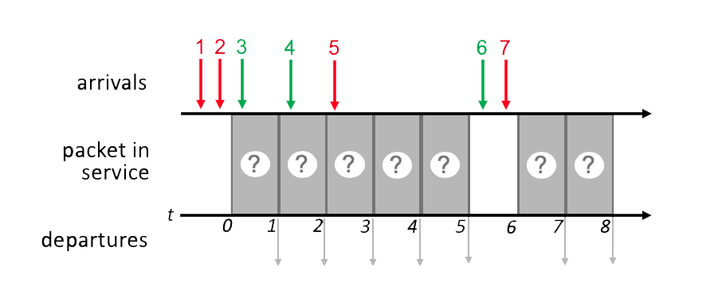

# 4.1-1 THE NETWORK LAYER - WHERE IS IT?

Check all of the statements below about where (in the network) the network layer is implemented that are true.

- The network layer is implemented in wired Internet-connected devices but not wireless Internet-connected devices.


- ```The network layer is implemented in routers in the network core.```


- The network layer is implemented in Ethernet switches in a local area network.


- ```The network layer is implemented in hosts at the network's edge.```

# 4.1-2 FORWARDING VERSUS ROUTING.

Consider the travel analogy discussed in the textbook - some actions we take on a trip correspond to forwarding and other actions we take on a trip correspond to routing.  Which of the following travel actions below correspond to forwarding? The other travel actions that you don't select below then correspond to routing.  

- A climber decides to take the South Col Route to the top of Mt Everest rather than the Northeast Ridge route.


- A traveler decides to fly to Sydney through Singapore rather that Dubai.


- ```A car takes the 3rd exit from a roundabout.```


- A car takes highway 80 between New York and Chicago, rather than highway 87 to Albany and from there take Interstate 90 to Chicago.


- ```A car stops at an intersection to “gas-up” and take a “bathroom break”```


- ```A car waits at light and then turns left at the intersection.```

# 4.1-3 THE CONTROL PLANE VERSUS THE DATA PLANE.

For each of the actions below, select those actions below that are primarily in the network-layer data plane. The other actions that you don't select below then correspond to control-plane actions. 

- ```Moving an arriving datagram from a router’s input port to output port```


- Monitoring and managing the configuration and performance of an network device.


- Computing the contents of the forwarding table.


- ```Dropping a datagram due to a congested (full) output buffer.```


- ```Looking up address bits in an arriving datagram header in the forwarding table.```

# 4.1-4 WHAT TYPE OF CONTROL PLANE?

We've seen that there are two approaches towards implementing the network control plane - a per-router control-plane approach and a software-defined networking (SDN) control-plane approach.  Which of the following actions occur in a per-router control-plane approach? The other actions that you don't select below then correspond to actions in an SDN control plane.  

- ```A router exchanges messages with another router, indicating the cost for it (the sending router) to reach a destination host.```


- ```Routers send information about their incoming and outgoing links to other routers in the network.```


- All routers in the network send information about their incoming and outgoing links to a logically centralized controller.


- A control agent in router receives a complete forwarding table, which it installs and
uses to locally control datagram forwarding.

# 4.1-5 BEST EFFORT SERVICE.

Which of the following quality-of-service guarantees are part of the Internet’s best-effort service model? Check all that apply.

- Guaranteed delivery time from sending host to receiving host.


- ```None of the other services listed here are part of the best-effort service model. Evidently, best-effort service really means no guarantees at all!```


- Guaranteed delivery from sending host to receiving host.


- A guaranteed minimum bandwidth is provided to a source-to-destination flow of packets


- In-order datagram payload delivery to the transport layer of those datagrams arriving to the receiving host

# 4.2-1 WHAT'S INSIDE A ROUTER?

Match the names of the principal router components (A,B,C,D below) with their function and whether they are in the network-layer data plane or control plane.


- (A) are
    - ```input ports, operating primarily in the data plane.```
- (B) is
    - ```the switching fabric, operating primarily in the data plane.```
- (C) are
    - ```output ports, operating primarily in the data plane.```
- (D) is
    - ```the routing processor, operating primarily in the control plane.```

# 4.2-2 WHERE DOES DESTINATION ADDRESS LOOKUP HAPPEN?

Where in a router is the destination IP address looked up in a forwarding table to determine the appropriate output port to which the datagram should be directed?

- Within the routing processor.


- Within the switching fabric.


- ```At the input port where a packet arrives.```


- At the output port leading to the next hop towards the destination.

# 4.2-3 WHERE DOES "MATCH+ACTION" HAPPEN?

Where in a router does "match plus action" happen to determine the appropriate output port to which the arriving datagram should be directed?

- Within the routing processor.


- Within the switching fabric.


- At the output port leading to the next hop towards the destination.


- ```At the input port where a packet arrives.```

# 4.2-4 LONGEST PREFIX MATCHING.

Consider the following forwarding table below. Indicate the output to link interface to which a datagram with the destination addresses below will be forwarded under longest prefix matching. (Note: The list of addresses is ordered below. If two addresses map to the same output link interface, map the first of these two addresses to the first  instance of that link interface.) [Note: You can find more examples of problems similar to this here.]


```
Note:
    Since this is in order, just set which ever come first at the top to be first destination.
```

- 11001000 00010111 00010010 10101101
    - ```This is the first destination address in the list that maps to output port 0 ```
- 11001000 00010111 00011000 00001101
    - ```This is the first destination address in the list that maps to output port 1. ```
- 11001000 00010111 00011001 11001101
    - ```This is the first destination address in the list that maps to output port 2. ```
- 10001000 11100000 00011000 00001101
    - ```This is the first destination address in the list that maps to output port 3. ```
- 11001000 00010111 00011000 11001111
    - ```This is the second destination address in the list that maps to output port 1. ```
- 11001000 00010111 00010001 01010101
    - ```This is the second destination address in the list that maps to output port 0. ```
- 11001000 00010111 00011101 01101101
    - ```This is the second destination address in the list that maps to output port 2. ```

# 4.2-5 PACKET DROPPING.

Suppose a datagram is switched through the switching fabric and arrives to its appropriate output to find that there are no free buffers.  In this case:

- The packet will be sent back to the input port.


- The packet will be dropped (lost).


- ```The packet will either be dropped or another packet will be removed (lost) from the buffer to make room for this packet, depending on policy.  But the packet will definitely not be be sent back to the input port.```


- Another packet will be removed (lost) from the buffer to make room for this packet.

# 4.2-6 HOL BLOCKING.

What is meant by Head of the Line (HOL) blocking?

- ```A queued datagram waiting for service at the front of a queue prevents other datagrams in queue from moving forward in the queue.```


- In a block error code, the first bytes of the code indicate the type of coding being used.


- A queued datagram receiving service at the front of a queue prevents other datagrams in queue from receiving service.

# 4.2-7 SCHEDULING.

Consider the pattern of red and green packet arrivals to a router’s output port queue, shown below. Suppose each packet takes one time slot to be transmitted, and can only begin transmission at the beginning of a time slot after its arrival.  Indicate the sequence of departing packet numbers (at t = 1, 2, 3, 4, 5, 7, 8) under FCFS scheduling. Give your answer as 7 ordered digits (each corresponding to the packet number of a departing packet), with a single space between each digit, and no spaces before the first or after the last digit, e.g., in a form like 7 6 5 4 3 2 1).
[Note: You can find more examples of problems similar to this here.]



```
Note:
    First come first serve
```

- ``` 1 2 3 4 5 6 7 ```

# 4.2-8 SCHEDULING.

Consider the pattern of red and green packet arrivals to a router’s output port queue, shown below. Suppose each packet takes one time slot to be transmitted, and can only begin transmission at the beginning of a time slot after its arrival.  Indicate the sequence of departing packet numbers (at t = 1, 2, 3, 4, 5, 7, 8) under priority scheduling, where red packets have higher priority.
Give your answer as 7 ordered digits (each corresponding to the packet number of a departing packet), with a single space between each digit, and no spaces before the first or after the last digit, e.g., in a form like 7 6 5 4 3 2 1).


```
Note:
    Red has more priority than green
```

- ``` 1 2 3 5 4 7 6 ```

# 4.2-9 SCHEDULING.

Consider the pattern of red and green packet arrivals to a router’s output port queue, shown below. Suppose each packet takes one time slot to be transmitted, and can only begin transmission at the beginning of a time slot after its arrival.  Indicate the sequence of departing packet numbers (at t = 1, 2, 3, 4, 5, 7, 8) under round robin scheduling, where red starts a round if there are both red and green packets ready to transmit after an empty slot.
Give your answer as 7 ordered digits (each corresponding to the packet number of a departing packet), with a single space between each digit, and no spaces before the first or after the last digit, e.g., in a form like 7 6 5 4 3 2 1).


```
Note:
    Alternate between red and green
```

- ``` 1 3 2 4 5 7 6 ```

# 4.2-10 PACKET SCHEDULING.

Consider the pattern of red and green packet arrivals to a router’s output port queue, shown below. Suppose each packet takes one time slot to be transmitted, and can only begin transmission at the beginning of a time slot after its arrival.  Indicate the sequence of departing packet numbers (at t = 1, 2, 3, 4, 5, 7, 8) under FCFS scheduling. Give your answer as 7 ordered digits (each corresponding to the packet number of a departing packet), with a single space between each digit, and no spaces before the first or after the last digit, e.g., in a form like 7 6 5 4 3 2 1).


- ``` 1 2 3 4 5 6 7 ```

# 4.2-11 PACKET SCHEDULING.

Consider the pattern of red and green packet arrivals to a router’s output port queue, shown below. Suppose each packet takes one time slot to be transmitted, and can only begin transmission at the beginning of a time slot after its arrival.  Indicate the sequence of departing packet numbers (at t = 1, 2, 3, 4, 5, 7, 8) under priority scheduling, where red packets have higher priority.
Give your answer as 7 ordered digits (each corresponding to the packet number of a departing packet), with a single space between each digit, and no spaces before the first or after the last digit, e.g., in a form like 7 6 5 4 3 2 1).


- ``` 1 2 4 3 5 6 7 ```

# 4.2-12 PACKET SCHEDULING.

Consider the pattern of red and green packet arrivals to a router’s output port queue, shown below. Suppose each packet takes one time slot to be transmitted, and can only begin transmission at the beginning of a time slot after its arrival.  Indicate the sequence of departing packet numbers (at t = 1, 2, 3, 4, 5, 7, 8) under round robin scheduling, where red starts a round if there are both red and green packets ready to transmit after an empty slot.
Give your answer as 7 ordered digits (each corresponding to the packet number of a departing packet), with a single space between each digit, and no spaces before the first or after the last digit, e.g., in a form like 7 6 5 4 3 2 1).


- ``` 1 2 4 3 5 6 7 ```

# 4.3-1 WHAT IS THE INTERNET PROTOCOL?

What are the principal components of the IPv4 protocol (check all that apply)?

- Routing algorithms and protocols like OSPF and BGP.


- ```IPv4 datagram format.```


- ICMP (Internet Control Message Protocol)


- SDN controller protocols.


- ```Packet handling conventions at routers (e.g., segmentation/reassembly)```


- ```IPv4 addressing conventions```

# 4.3-2 THE IPV4 HEADER.

Match each of the following fields in the IP header with its description, function or use.

- Version field
    - ``` This field contains the IP protocol version number. ```
- Type-of-service field
    - ``` This field contains ECN and differentiated service bits. ```
- Fragmentation offset field
    - ``` This field is used for datagram fragmentation/reassembly. ```
- Time-to-live field
    - ``` The value in this field is decremented at each router; when it reaches zero, the packet must be dropped. ```
- Header checksum field
    - ``` This field contains the Internet checksum of this datagram's header fields. ```
- Upper layer field
    - ``` This field contains the "protocol number" for the transport-layer protocol to which this datagram's payload will be demultiplexed - UDP or TCP, for example ```
- Payload/data field
    - ``` This field _contains_ a UDP or TCP segment, for example ```
- Datagram length field.
    - ``` This field indicates the total number of bytes in datagram. ```

# 4.3-3 WHAT IS AN IP ADDRESS ACTUALLY ASSOCIATED WITH?

Which of the following statements is true regarding an IP address? (Zero, one or more of the following statements is true).

- It is not necessary for a device using the IP protocol to actually have an IP address associated with it.


- ```If a router has more than one interface, then it has more that one IP address at which it can be reached.```


- ```An IP address is associated with an interface.```


- ```If a host has more than one interface, then it has more that one IP address at which it can be reached```

# 4.3-4 WHAT IS A SUBNET?

What is meant by an IP subnet? (Check zero, one or more of the following characteristics of an IP subnet).

- A set of devices that always have a common first 16 bits in their IP address.


- ```A set of devices that have a common set of leading high order bits in their IP address.```


- A set of devices all manufactured by the same equipment maker/vendor.


- ```A set of device interfaces that can physically reach each other without passing through an intervening router.```

# 4.3-5 SUBNETTING.

Consider the three subnets in the diagram below.


What is the maximum # of interfaces in the 223.1.2/24 network?

- 128


- 2**32


- Two hosts, as shown in the figure.


- ```256```


- There's no a priori limit on the number of interfaces in this subnet.

# 4.3-6 SUBNETTING.

Consider the three subnets in the diagram below.


What is the maximum # of interfaces in the 223.1.3/29 network?

- Three hosts, as shown in the figure.


- There's no a priori limit on the number of interfaces in this subnet.


- ```8```


- 2**32


- 128

# 4.3-7 SUBNETTING.

Consider the three subnets in the diagram below.


Which of the following addresses can not be used by an interface in the 223.1.3/29 network? Check all that apply.

- ```223.1.2.6```


- 223.1.3.6


- 223.1.3.2


- ```223.1.3.16```


- ```223.1.3.28```

# 4.3-8 PLUG-AND-PLAY.

What is meant by saying that DHCP is a "plug and play" protocol?

- ```No manual configuration is needed for the host to join the network.```


- The host needs to “plug” (by wire or wirelessly) into the local network in order to access (“play” in) the Internet


- The network provides an Ethernet jack for a host’s Ethernet adapter.

# 4.3-9 DHCP REQUEST MESSAGE.

Which of the following statements about a DHCP request message are true (check all that are true). Hint: check out Figure 4.24 in the 7th and 8th edition of our textbook.

- ```The transaction ID in a DHCP request message will be used to associate this message with future DHCP messages sent from, or to, this client.```


- ```A DHCP request message may contain the IP address that the client will use.```


- The transaction ID in a DCHP request message is used to associate this message with previous messages sent by this client.


- ```A DHCP request message is sent broadcast, using the 255.255.255.255 IP destination address.```


- A DHCP request message is sent from a DHCP server to a DHCP client.


- A DHCP request message is optional in the DHCP protocol.

# 4.3-10 IPV4 VERSUS IPV6. 

Which of the following fields occur ONLY in the IPv6 datagram header (i.e., appear in the IPv6 header but not in the IPv4 header)?  Check all that apply.

- The time-to-live (or hop limit) field.


- The header length field.


- The options field.


- ```The flow label field.```


- ```128-bit source and destination IP addresses.```


- The header checksum field.


- The IP version number field.


- The upper layer protocol (or next header) field.


# 4.3-11 PURPOSE OF DHCP. 

What is the purpose of the Dynamic Host Configuration Protocol?

- ```To obtain an IP address for a host attaching to an IP network.```


- To configure the interface speed to be used, for hardware like Ethernet, which can be used at different speeds.


- To get the 48-bit link-layer MAC address associated with a network-layer IP address.


- To configure the set of available open ports (and hence well-known services) for a server.

