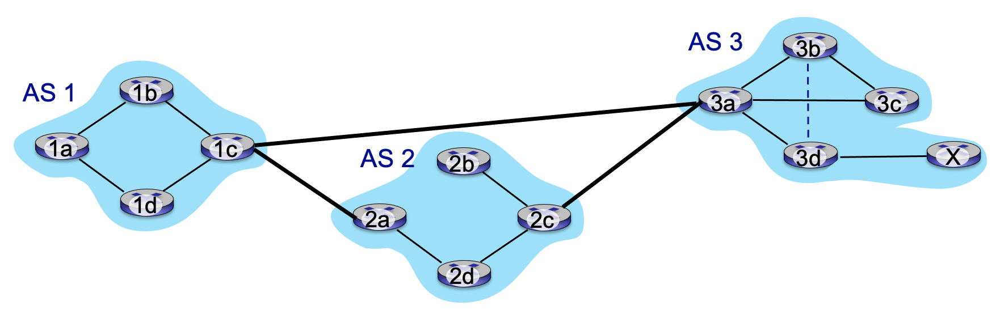

# 5.1-1 ROUTING VERSUS FORWARDING.

  Which of the following statements correctly identify the differences between routing and forwarding. Select one or more statements.

  
- ```Forwarding refers to moving packets from a router’s input to appropriate router output, and is implemented in the data plane.    ```


- Forwarding refers to determining the route taken by packets from source to destination, and is implemented in the control plane.  


- Routing refers to determining the route taken by packets from source to destination, and is implemented in the data plane.  


- Routing refers to moving packets from a router’s input to appropriate router output, and is implemented in the control plane.  


- ```Routing refers to determining the route taken by packets from source to destination, and is implemented in the control plane.  ```


- Forwarding refers to moving packets from a router’s input to appropriate router output, and is implemented in the control plane.  


- Forwarding refers to determining the route taken by packets from source to destination, and is implemented in the data plane.  


- Routing refers to moving packets from a router’s input to appropriate router output, and is implemented in the data plane.  

# 5.1-2 APPROACHES TOWARDS IMPLEMENTING THE CONTROL PLANE.

Match the name of the approach towards implementing a control plane with a description of how this approach works.

- Per-router control plane.
    - ```Individual routing algorithm components - with a component operating in each and every router - interact with each  other in the control plane.  The individual routing algorithm component executing in a given router computes the local fowarding table fir that router.```
- Software-defined networking (SDN).
    - ```A (typically) remote controller gathers information from routers, and then computes and installs the forwarding tables in routers.```

# 5.2-1 WHAT’S A “GOOD” PATH?

What is the definition of a “good” path for a routing protocol? Chose the best single answer.


- ```Routing algorithms typically work with abstract link weights that could represent any of, or combinations of, all of the other answers.```


- A high bandwidth path.


- A low delay path.


- A path that has little or no congestion.


- A path that has a minimum number of hops.

# 5.2-2 DIJKSTRA’S LINK-STATE ROUTING ALGORITHM.

Consider Dijkstra’s link-state routing algorithm that is computing a least-cost path from node a to other nodes b, c, d, e,  f.  Which of the following statements is true.  (Refer to Section 5.2 in the text for notation.)

- ```The values computed in the vector D(v), the currently known least cost of a path from a to any node v, will never increase following an iteration.```


- ```In the initialization step, the initial cost from a to each of these destinations is initialized to either the cost of a link directly connecting a to a direct neighbor, or infinity otherwise.```


- The values computed in the vector D(v), the currently known least cost of a path from a to any node v, will always decrease following an iteration.


- ```Suppose nodes b, c, and d are in the set N’.  These nodes will remain in N’ for the rest of the algorithm, since the least-cost paths from a to b, c, and d are known.```


- Following the initialization step, if nodes b and c are directly connected to a, then the least cost path to b and c will never change from this initial cost.

# 5.2-3 WHAT TYPE OF ROUTING?

Match the name of a general approach to routing with characteristics of that approach.

- Centralized, global routing.
    - ```All routers have complete topology, and link cost information.```
- Decentralized routing.
    - ```An iterative process of computation, exchange of informatoin with neighbors. Routers may initially only know link costs to directly-attached neighbors.```
- Static routing.
    - ```Routes change slowly over time.```
- Dynamic routing.
    - ```Routing changes quickly over time.```

# 5.2-4 DIJKSTRA’S LINK-STATE ROUTING ALGORITHM (PART 1).

Consider the graph shown below and the use of Dijkstra’s algorithm to compute a least cost path from a to all destinations.  Suppose that nodes b and d have already been added to N’. What is the next node to be added to N' (refer to the text for an explanation of notation).


- c

- ```e```

- f

# 5.2-5 DIJKSTRA’S LINK-STATE ROUTING ALGORITHM (PART 2).

Consider the graph shown below and the use of Dijkstra’s algorithm to compute a least cost path from a to all destinations.  Suppose that nodes b and d have already been added to N’. What is the path cost to the next node to be added to N' (refer to the text for an explanation of notation).


- 5

- 6

- 7

- ```4```

# 5.3-1 ROUTING WITHIN OR AMONG NETWORKS.

Match the terms "interdomain routing" and intradomain routing" with their definitions. Recall that in Internet parlance, an “AS” refers to “Autonomous System” – a network under the control of a single organization.

- Interdomain routing.
    - ```Routing among different ASes (“networks”).```
- Intradomain routing.
    - ```Routing among routers within same AS (“network”).```

# 5.3-2 OPEN SHORTEST PATH FIRST (OSPF).

Check the one or more of the following statements about the OSPF protocol that are true.

- The Open Shortest Path First (OSPF) Internet routing protocol implements a Bellman-Ford distance-vector routing algorithm.


- ```OSPF implements hierarchical routing```


- OSPF is an interdomain routing protocol.


- ```OSFP uses a Dijkstra-like algorithm to implement least cost path routing.```


- ```OSPF is an intra-domain routing protocol.```

# 5.3-3 OPEN SHORTEST PATH FIRST (OSPF).

Consider the OSPF routing protocol.  Which of the following characteristics are associated with OSPF (as opposed to BGP)?

- Is an inter-domain routing protocol.


- Policy, rather than performance (e.g., least cost path), determines paths that used.


- ```Finds a least cost path from source to destination.```


- ```Is an intra-domain routing protocol.```


- ```Floods link state control information.```

# 5.4-1 ROUTING WITHIN NETWORKS?

Among the following protocols, terminology or considerations, indicate those that are associated with "routing within a single network (typically owned and operated by one organization)."  

- ```intra-AS routing```


- Driven more by routing policy than end-end routing performance


- inter-domain routing


- ```intra-domain routing```


- ```OSPF```


- BGP


- ```Driven more by performance than by routing policy```


- inter-AS routing

# 5.4-2 PATH ADVERTISEMENT AND POLICY (PART 1).

Suppose a provider network only wants to carry traffic to/from its customer networks (i.e., to provide no transit service), and customer networks only want to carry traffic to/from itself. Consider the figure below. To implement this policy, to which of the following networks would network C advertise the path Cy?


- w

- ```B```

- ```A```

- ```x```

# 5.4-3 PATH ADVERTISEMENT AND POLICY (PART 2).

Again, suppose a provider network only wants to carry traffic to/from its customer networks (i.e., to provide no transit service), and customer networks only want to carry traffic to/from itself.  Suppose C has advertised path Cy to A. To implement this policy, to which of the following networks would network A advertise the path ACy?


- x

- C

- ```w```

- B

# 5.4-4 PATH ADVERTISEMENT AND POLICY (PART 3).

Again, suppose a provider network only wants to carry traffic to/from its customer networks (i.e., to provide no transit service), and customer networks only want to carry traffic to/from itself.  Suppose C has advertised path Cy to x. To implement this policy, to which of the following networks would network x advertise the path xCy?


- B


- ```None of these other networks```


- C


- w


- A

# 5.4-5 EBGP OR IBGP?

Consider routers 2c and 2d in Autonomous System AS2 in the figure below. Indicate the flavor of BGP and the router from which each of 2c and 2d learns about the path to destination x



- How does router 2c learn of the path AS3, X to destination network X?
    - ```From 3a via eBGP.```

- How does router 2d learn of the path AS3, X to destination network X?
    - ```From 2c via iBGP.```

# 5.5-1 SDN LAYERS.

Consider the SDN layering shown below.  Match each layer name below with a layer label (a), (b) or (c) as shown in the diagram


- SDN Controller (network operating system)
    - ```(b)```

- SDN-controlled switches
    - ```(c)```

- Network-control applications
    - ```(a)```


# 5.5-2 INTERNAL STRUCTURE OF THE SDN CONTROLLER (1).

Which of the functions below belong in the controller layer labeled "Interface, abstractions for network control apps"?  Check all below that apply.


- Statistics


- ```Network graph```


- Link-state information


- OpenFlow protocol


- ```Intent```


- Flow tables


- Switch information


- Host information

# 5.5-3 INTERNAL STRUCTURE OF THE SDN CONTROLLER (2).

Which of the functions below belong in the controller layer labeled "Network-wide distributed, robust state management"?  Check all below that apply


- Intent


-  Link-state information

-  Host information


-  Flow tables


-  Switch information


-  OpenFlow protocol


-  Statistics


-  Network graph

# 5.5-4 INTERNAL STRUCTURE OF THE SDN CONTROLLER (3).

Which of the functions below belong in the controller layer labeled "Communication to/from controlled device"?  Check all below that apply.


- Intent


-  Link-state information

-  Host information


-  Flow tables


-  Switch information


-  OpenFlow protocol


-  Statistics


-  Network graph

# 5.6-1 ICMP: INTERNET CONTROL MESSAGE PROTOCOL.


Which of the statements below about ICMP are true?

- ICMP communicates information between hosts and routers by marking bits in the IP header.


- ```ICMP is used by hosts and routers to communicate network-level information.```


- ICMP messages are carried in UDP segments using port number 86.


- ```The TTL-expired message type in ICMP is used by the traceroute program.```


- ```ICMP messages are carried directly in IP datagrams rather than as payload in UDP or TCP segments.```

