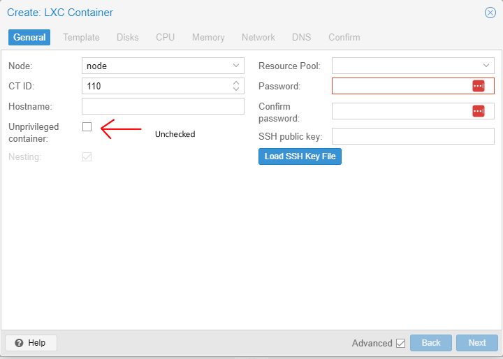
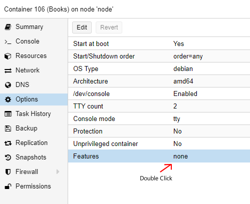
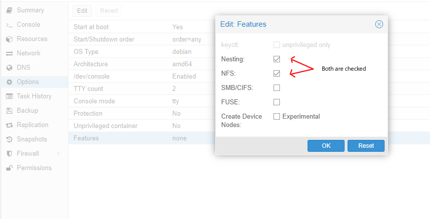

# Setting up NFS for proxmox container Debian 11

reference from

[Mount NFS inside LXC containers](https://theorangeone.net/posts/mount-nfs-inside-lxc/)

## Important parts when creating LXC




## Install nfs-common library
```
apt install nfs-common
```

- for quick test to see if it mounts correctly
  - ```
    mount -t nfs 192.168.1.1:/data /mnt/data
    ```


## Mount on boot
- Use vim to open /etc/fstab
- add line
  ```
  192.168.x.x:/{nftsServerDirectory}   /mnt/{MountPointDirectory}   nfs   defaults	0 0
  ```
  ```
  Note:
  - To add space inside fstabe add \040
  ```
- Restart the Container
